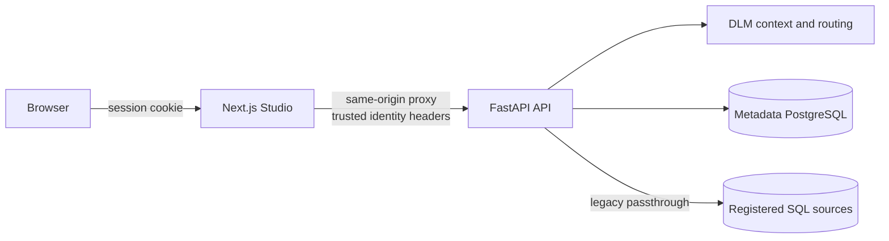
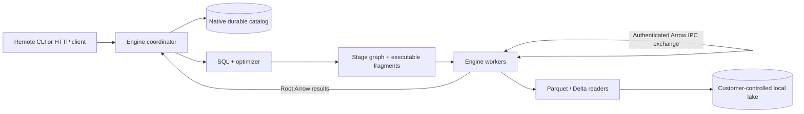
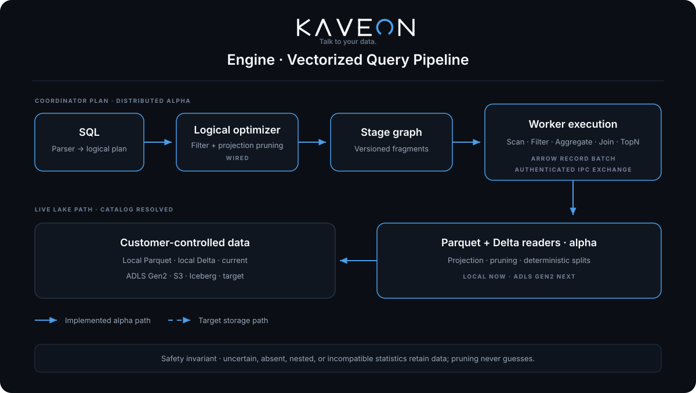
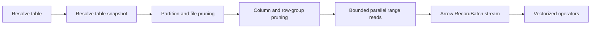
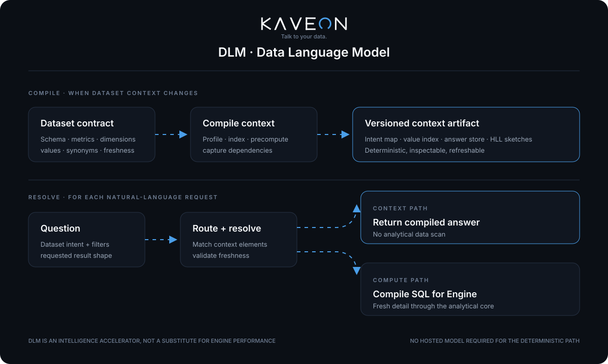
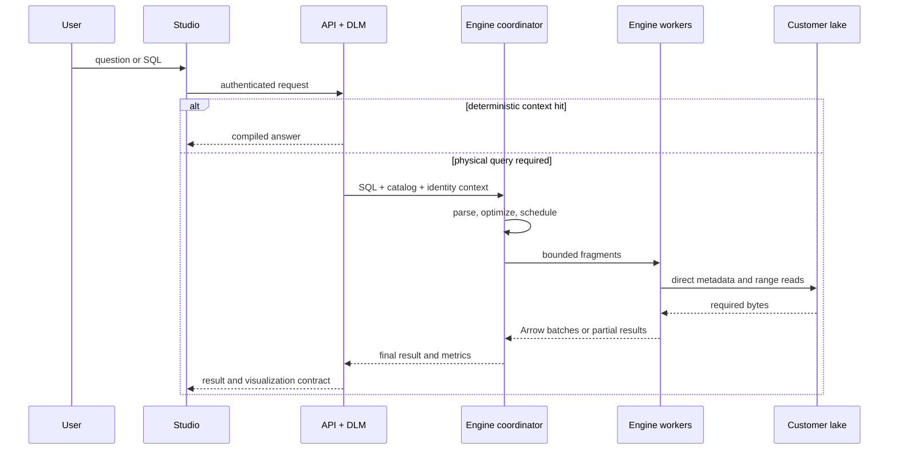
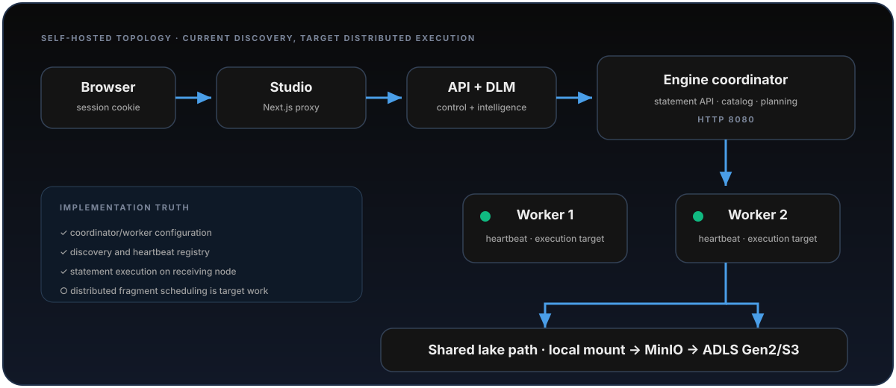

# Kaveon Architecture

> **Talk to your data.** A unified data intelligence platform built around Kaveon Studio, the deterministic Data Language Model, and Kaveon Engine.

This is the architectural contract for the repository. It separates verified runtime behavior from target design so roadmap intent is never mistaken for a shipped capability.

| Marker | Meaning |
|---|---|
| **Implemented** | Present in the current `dev` runtime |
| **Alpha** | Implemented but incomplete, unintegrated, or not production-ready |
| **Target** | Approved direction, not a current runtime capability |
| **Legacy** | A migration path intended for retirement |

See [STATUS.md](STATUS.md) and [HANDSHAKE.md](HANDSHAKE.md) for volatile delivery status and interface ownership.

## Platform at a glance

<div align="center">
  
</div>

| Pillar | Responsibility |
|---|---|
| **Kaveon Studio** | Dashboards, chart construction, SQL Lab, datasets, and administration |
| **Kaveon DLM** | Deterministic dataset routing, intent resolution, compiled answers, and SQL generation without a hosted LLM |
| **Kaveon Engine** | Rust catalog resolution, SQL optimization, vectorized operators, and distributed stage execution over local Parquet and Delta; direct cloud lake reads remain target capabilities |

The defining data model is the **Live Lake Path**: Kaveon reads data in the customer’s storage without mandatory import. **Optimized ingest** is an explicit target mode that writes sorted, partitioned, compressed data back into customer-controlled storage. The current internal enum still calls this access pattern `Shortcut`; that implementation name is not the product concept.

### Non-goals

- Kaveon is not an LLM wrapper.
- Kaveon Engine does not embed DuckDB, Trino, Spark, or another query engine.
- The Live Lake Path does not require Kaveon to own or duplicate customer data.
- Dashboards are one surface over the platform, not the product boundary.

## What runs today

Two execution paths coexist on `dev`; they are not yet integrated.

### Shipping application path — implemented



The browser calls the Next.js proxy rather than constructing trusted API identity headers. FastAPI owns product services, metadata, DLM compilation and serving, and the legacy live-query path.

### Rust Engine path — distributed alpha



Today the Engine queries local Parquet and multi-file Delta tables, plus individual Parquet objects in ADLS Gen2 through ranged object-store reads. The coordinator builds validated stage DAGs and versioned fragments for scan/filter/project, partial/final aggregates, Sort/TopN/limit, and repartitioned or broadcast joins. Workers execute deterministic partitions, exchange Arrow IPC payloads, and support bounded retry/cancellation lifecycle behavior. Delta snapshot resolution still requires complete local JSON commit history from version 0; cloud Delta checkpoints are unsupported. Studio and FastAPI do not yet route user queries to the Engine, and Python bindings remain a scaffold. S3 and Iceberg remain non-executable target paths.

HTTP query records are inserted at submission and retain measured analysis, physical-planning, execution, and result-serialization durations. Completed storage scans report files opened, row groups considered/read/pruned, selected compressed Parquet bytes, emitted rows and batches, Delta snapshot time, footer time, read time, and throughput. Completed distributed stages report their worker tasks, partitions, elapsed time, output rows, Arrow batches, and transport bytes. The shared telemetry types distinguish a measured zero from an unavailable value. Physical operator CPU/memory, blocked time, spill, and live task updates are not yet emitted.

## Engine architecture

<div align="center">
  
</div>

### Crate boundaries

```text
kaveon-cli ─────> kaveon-server ──> kaveon-sql ──> kaveon-optim
                       │                                │
                       ├──> kaveon-catalog              v
                       ├──> stage / fragment planner -> kaveon-exec
                       └──> scheduler / exchange         │
                                                          v
                                                   kaveon-storage
                                                          │
                                                          v
                                                Arrow / Parquet / Delta

kaveon-core: shared errors, expressions, catalog, fragment, exchange, memory, and telemetry contracts
kaveon-catalog: SQLite/WAL metadata authority for one coordinator
kaveon-optim: wired logical filter pushdown and predicate conversion
kaveon-python: Python boundary (scaffold)
```

Storage does not import SQL or execution abstractions. Shared boundaries live in `kaveon-core`:

```rust
pub trait BatchSource {
    fn schema(&self) -> &SchemaRef;
    fn next_batch(&mut self) -> Result<Option<RecordBatch>>;
}

pub trait BatchOperator {
    fn schema(&self) -> &SchemaRef;
    fn next_batch(&mut self) -> Result<Option<RecordBatch>>;
}
```

`RecordBatch` is the unit of execution. Storage produces batches; execution operators pull and transform them.

### Capability truth

| Capability | State | Notes |
|---|---|---|
| Local Parquet scan | **Implemented** | Streaming batches, metadata, strict projection |
| Local Delta scan | **Alpha** | JSON-log snapshot replay and streaming across active Parquet files; complete history from version 0 required, checkpoints unsupported |
| Row-group pruning | **Implemented** | Conservative statistics pruning; planner supplies pushed filters and retains residual evaluation |
| Filter and projection | **Implemented** | Batch operators |
| Hash aggregate | **Alpha** | Local and distributed partial/final COUNT/SUM/MIN/MAX/weighted AVG/exact DISTINCT; opt-in group/distinct-state accounting fails closed at the query limit; aggregate spill absent |
| Limit | **Implemented** | Physical operator |
| Sort / TopN | **Alpha** | Vectorized local execution, distributed partial/final TopN, and fixed-fan-in external merge |
| Filter pushdown | **Implemented** | Wired optimizer pass converts safe predicates while retaining the row filter |
| Distributed execution | **Alpha** | General fragments cover scans, aggregates, Sort/TopN, and hash/cross joins with retry and cancellation |
| Exchange foundation | **Alpha** | Authenticated Arrow IPC v2 endpoints, deterministic partitioning, byte bounds, idempotency, and cleanup; streaming flow control absent |
| Native durable catalog | **Alpha** | SQLite/WAL transactions, revisions, lifecycle, audit, Arrow schemas, and restart reconstruction for one coordinator |

### Catalog identity

```text
Catalog
└── Schema
    └── Table
        ├── location
        ├── format: Parquet | Delta | Iceberg
        └── access: Shortcut | Optimized
```

The catalog separates logical `catalog.schema.table` identity from physical location. SQLite/WAL is the durable authority for the current single coordinator; `CatalogManager` is its process-local planning snapshot. Executable fragment version 2 carries the resolved source URI and data format, so workers do not depend on divergent local catalog state. External Hive Metastore, Glue, Unity Catalog, and Iceberg REST adapters are contracts—not implemented connectivity. See [Engine catalog architecture](engine/CATALOG.md).

### Target lake-read path



Correctness dominates pruning aggression. Missing, nested, inexact, incompatible, or incomparable statistics must retain data. Unsupported table-protocol features must fail closed rather than return incomplete results.

## Query lifecycles

### DLM context hit — implemented

<div align="center">
  
</div>

1. Studio sends a question or chart intent through its authenticated proxy.
2. FastAPI resolves and normalizes the dataset request.
3. DLM checks compiled-context coverage and freshness.
4. A covered request returns a deterministic answer without scanning the source.
5. An uncovered request falls through to one live semantic query.

### Engine statement — alpha

1. `POST /v1/statement` accepts SQL.
2. `kaveon-sql` creates a logical plan.
3. The optimizer applies safe filter/projection pruning and the coordinator creates a stage graph plus versioned executable fragments.
4. Workers scan deterministic Parquet row-group or Delta-file partitions and execute vectorized operators.
5. Intermediate stages move authenticated Arrow IPC partitions through hash, single, round-robin, or broadcast exchanges.
6. The root stage returns Arrow results to the coordinator; cells are converted to JSON and the completed result is retained in process memory.

The retained record includes structured logical, optimized, and physical plan trees, optional client session context, and completed stage/task telemetry. The Engine UI renders these structures directly rather than exposing Rust debug text. Per-operator live CPU, memory, blocked, and spill measurements remain incomplete.

The statement response remains synchronous, while internal worker tasks have explicit attempts, waiting, replay, cancellation, and cleanup. Coordinator cancellation propagates to workers; query-history persistence and asynchronous result retrieval remain incomplete.

### Target integrated query



API-to-Engine identity and Studio routing remain target integration. Distributed scheduling, exchanges, and worker fragment execution are implemented alpha capabilities.

## Trust boundaries

| Boundary | Current enforcement | Required direction |
|---|---|---|
| Browser → Studio | Auth.js session and same-origin routes | Maintain CSRF and session controls |
| Studio → FastAPI | Proxy secret and server-created identity headers | Strip client identity headers; TLS/private ingress |
| API → databases | Configured credentials and workload identity | Least privilege and auditable rotation |
| Client → Engine HTTP | Catalog mutations and internal exchanges have bearer tokens; statements lack end-user auth/TLS | Service identity, query authorization, TLS, quotas |
| Engine coordinator → workers | Shared bearer token on internal exchange/task control | Workload identity, rotation, TLS, network policy |
| Engine → storage | Local filesystem access | Scoped managed/workload identity and snapshot consistency |

The metadata plane stores product configuration, semantic definitions, DLM artifacts, and operational records. The customer data plane contains analytical rows. The Live Lake Path must not silently copy customer data into Kaveon-owned persistence.

## State, memory, and consistency

| State | Scope today | Requirement |
|---|---|---|
| Session | Cookie and Studio runtime | Identity remains server asserted |
| DLM context | Metadata DB and process-local compiled contexts | Coverage and freshness are observable |
| Database pools | FastAPI process | Bounded pools and stale-connection recovery |
| Engine catalog | SQLite/WAL authority plus coordinator planning snapshot | External transactional service for multi-coordinator consistency |
| Engine results | Bounded process-local query registry | Expiry, pagination, persistence policy, asynchronous retrieval |
| Parquet batches | Pull-based storage boundary | Preserve bounded execution end to end |
| Object metadata | Not implemented | Cache by object identity/eTag; never mix snapshots |

The Engine still collects root results for synchronous response materialization. A thread-safe admission controller reserves query budgets at coordinator submission, and local plans plus worker fragments propagate query/operator reservations into hash aggregate and hash join. Production integration still requires queued admission/resource groups, aggregate/join spill, paged/streaming delivery, and exchange streaming flow control.

## Deployment and startup

<div align="center">
  
</div>

### Engine CLI

```text
kaveon --server http://coordinator:8080 --catalog kaveon --schema default
kaveon --server http://coordinator:8080 --execute "SELECT COUNT(*) FROM orders"
kaveon --local --data-dir <path>
kaveon --local --config <catalog-config>
```

The CLI is a thin coordinator client by default. It supports interactive and one-shot execution, request-scoped catalog/schema/user context, client source and tags, configurable timeout, and table/CSV/TSV/JSON output. HTTPS uses Rustls. Local embedded execution is available only with explicit `--local`; in that mode auto-discovery scans immediate `*.parquet` files and immediate child directories containing `_delta_log`, where one Parquet file or one Delta directory becomes one table.

### Engine server

```text
kaveon-server [config.toml]
```

1. Load `/etc/kaveon/config.toml` by default.
2. Overlay `KAVEON_*` environment variables.
3. Open/migrate the durable native catalog, idempotently bootstrap configured discovery, and reconstruct the active planning snapshot.
4. Initialize node and cluster state.
5. Workers start heartbeats to the coordinator.
6. Bind Axum to `0.0.0.0:<http_port>`; default `8080`.

Docker declares one coordinator and two workers. Workers advertise routable service URIs, receive versioned fragment tasks, and exchange typed Arrow IPC partitions after scanning disjoint Parquet row groups or Delta active files. The coordinator schedules partial/final aggregates, distributed Sort/TopN, and repartitioned/broadcast joins. The catalog database uses a persistent coordinator volume; customer data is bind-mounted separately and starts empty unless explicitly provided.

## Quality invariants

| Attribute | Invariant |
|---|---|
| Correctness | Optimization may read extra data but never omit valid rows |
| Determinism | A DLM context hit is traceable and uses no hosted model |
| Memory | Execution is batch-at-a-time and every buffering layer acquires explicit bounds |
| Security | Browsers cannot assert trusted identity; unsupported storage features fail closed |
| Portability | Local, MinIO, ADLS Gen2, and S3 share logical query and result contracts |
| Observability | Query IDs connect planning, scan, execution, and response metrics |
| Reproducibility | Benchmarks pin dependencies, checksums, resources, SQL, cache state, and result hashes |

Performance claims must name dataset, hardware, version, cache state, concurrency, and date. A local bind mount proves semantics, not cloud I/O performance.

## Delivery topology

| Horizon | Engine capability |
|---|---|
| **Delivered alpha** | Local Parquet/Delta, optimizer, analytical operators, native catalog, remote CLI, distributed fragments/exchanges/retry/cancellation |
| **Next** | ADLS Gen2 range reads, API/Studio identity bridge, catalog synchronization, admission control, aggregate/join spill |
| **Then** | Delta checkpoints, schema evolution, deletion vectors, time travel, cost/statistics planning, dynamic filtering |
| **Scale qualification** | Exchange flow control, worker-loss/concurrency/skew tests, operator telemetry, five-worker AKS evidence, comparative benchmarks |
| **Post-launch** | Iceberg, optimized ingest, SIMD/JIT candidates, cost-based optimization |

## Architectural decisions

| Decision | Reason |
|---|---|
| Own the Rust Engine | Control the hot path, roadmap, performance, and intellectual property |
| Arrow `RecordBatch` boundary | Standard columnar memory and vectorized batch execution |
| Live Lake Path by default | Query customer-owned lake data without mandatory movement |
| Optimized ingest opt-in | Rewriting is explicit and remains in customer storage |
| Deterministic DLM | No hallucination, hosted-model dependency, or per-question model cost |
| Catalog/schema/table hierarchy | Multi-source identity independent of physical location |
| Modular monorepo | Three pillars evolve independently but ship as one product |

## Known architectural debt

- Engine query execution is not integrated with Studio/FastAPI identity, and Python bindings remain a scaffold.
- The platform PostgreSQL source registry and Engine native catalog need a revision-aware synchronization bridge.
- ADLS Gen2/S3 readers and broader Delta/Iceberg protocol semantics are not executable.
- Aggregate/join spill, coordinator-wired admission, exchange streaming flow control, dynamic filtering, and cost-based optimization are absent. The admission and aggregate/join accounting foundations are opt-in and fail closed when enabled.
- Engine statement HTTP lacks end-user authentication, TLS, authorization, resource groups, and quotas.
- Query responses still materialize root results synchronously; retained history is process-local.
- Multi-coordinator metadata requires an external transactional catalog service; SQLite is intentionally single-coordinator.
- Docker data mounts must be configured explicitly, and readiness does not validate every registered table snapshot.
- The shipping application uses legacy SQL passthrough during Engine integration.

## Repository topology

```text
Kaveon/
├── studio/                  Kaveon Studio · Next.js
├── api/                     FastAPI services and Kaveon DLM
├── engine/                  Rust workspace, CLI, server, Docker topology
│   ├── crates/core/         shared contracts and catalog
│   ├── crates/storage/      physical lake and file reads
│   ├── crates/sql/          SQL → logical plan
│   ├── crates/optim/        logical rewrites
│   ├── crates/exec/         vectorized operators
│   ├── crates/server/       HTTP and node discovery
│   ├── crates/cli/          interactive SQL shell
│   └── crates/python/       Python binding scaffold
├── packages/                shared packages
├── docs/                    guides, diagrams, papers, and decisions
├── infra/                   deployment infrastructure
├── scripts/                 repository and operational automation
└── demo/                    reproducible demonstration assets
```

Root files are reserved for cross-cutting entry points: README, architecture, status, contribution/license policy, workspace manifests, and top-level orchestration. Component-specific configuration and documentation belong beside their component or under `docs/`. Files must not be moved or removed until references, build manifests, CI workflows, deployment configuration, and runtime entry points prove the change safe.

## Related documents

- [Product strategy](docs/product-strategy.md)
- [Current status](STATUS.md)
- [Engineering contracts](HANDSHAKE.md)
- [DLM white paper](docs/whitepaper-dlm.md)
- [Deployment guide](DEPLOYMENT.md)
- [Data-source guide](docs/guides/data-sources.md)
