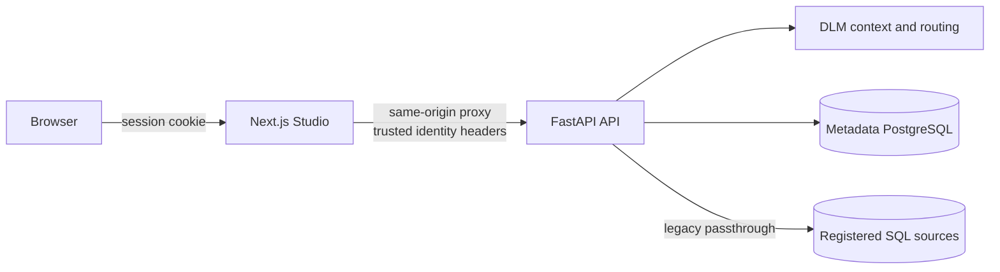
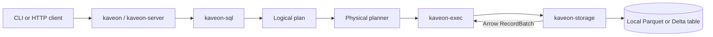
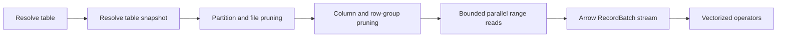
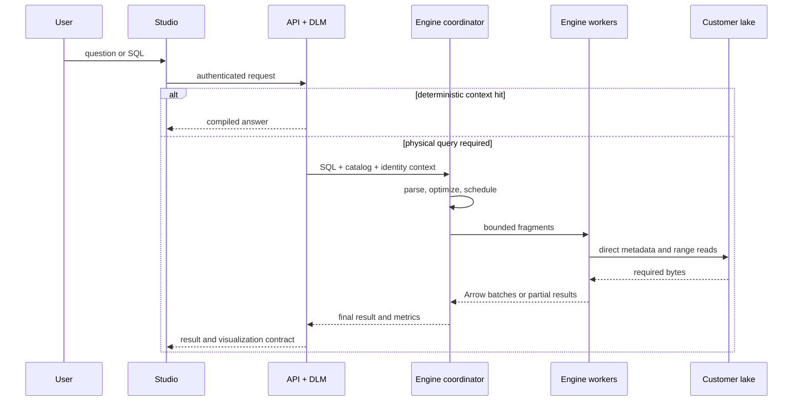

# Kaveon Architecture

> **Talk to your data.** A unified data intelligence platform built around Kaveon Studio, the deterministic Data Language Model, and Kaveon Engine.

This is the architectural contract for the repository. It separates verified runtime behavior from target design so roadmap intent is never mistaken for a shipped capability.

| Marker | Meaning |
|---|---|
| **Implemented** | Present in the current `dev` runtime |
| **Alpha** | Implemented but incomplete, unintegrated, or not production-ready |
| **Target** | Approved direction, not a current runtime capability |
| **Legacy** | A migration path intended for retirement |

See [STATUS.md](STATUS.md) and [HANDSHAKE.md](HANDSHAKE.md) for volatile delivery status and interface ownership.

## Platform at a glance

<div align="center">
  
</div>

| Pillar | Responsibility |
|---|---|
| **Kaveon Studio** | Dashboards, chart construction, SQL Lab, datasets, and administration |
| **Kaveon DLM** | Deterministic dataset routing, intent resolution, compiled answers, and SQL generation without a hosted LLM |
| **Kaveon Engine** | Rust catalog resolution, SQL planning, and vectorized execution over local Parquet and local Delta today; optimization and direct cloud lake reads are target capabilities |

The defining data model is the **Live Lake Path**: Kaveon reads data in the customer’s storage without mandatory import. **Optimized ingest** is an explicit target mode that writes sorted, partitioned, compressed data back into customer-controlled storage. The current internal enum still calls this access pattern `Shortcut`; that implementation name is not the product concept.

### Non-goals

- Kaveon is not an LLM wrapper.
- Kaveon Engine does not embed DuckDB, Trino, Spark, or another query engine.
- The Live Lake Path does not require Kaveon to own or duplicate customer data.
- Dashboards are one surface over the platform, not the product boundary.

## What runs today

Two execution paths coexist on `dev`; they are not yet integrated.

### Shipping application path — implemented



The browser calls the Next.js proxy rather than constructing trusted API identity headers. FastAPI owns product services, metadata, DLM compilation and serving, and the legacy live-query path.

### Rust Engine path — alpha



Today the Engine queries local single-file Parquet tables and local multi-file Delta tables. Delta snapshot resolution replays a complete JSON commit history from version 0; checkpoint replay is not supported. Studio and FastAPI do not route queries to the Engine, and Python bindings are a scaffold. ADLS Gen2, S3, and Iceberg remain non-executable target paths.

HTTP query records are inserted at submission and retain measured analysis, physical-planning, execution, and result-serialization durations. Completed storage scans report files opened, row groups considered/read/pruned, selected compressed Parquet bytes, emitted rows and batches, Delta snapshot time, footer time, read time, and throughput. The shared telemetry types distinguish a measured zero from an unavailable value. Physical operator CPU/memory and distributed stage/task telemetry are not yet emitted.

## Engine architecture

<div align="center">
  
</div>

### Crate boundaries

```text
kaveon-cli ─────┐
kaveon-server ──┼──> kaveon-sql ──> logical plan ──> physical planner
                │                                      │
                └──────────────────────────────────> kaveon-exec
                                                       │
                                                       v
                                                kaveon-storage
                                                       │
                                                       v
                                                Arrow / Parquet

kaveon-core: shared errors, expressions, catalog types and operator contracts
kaveon-optim: logical rewrites (target; current pass is not wired)
kaveon-python: Python boundary (scaffold)
```

Storage does not import SQL or execution abstractions. Shared boundaries live in `kaveon-core`:

```rust
pub trait BatchSource {
    fn schema(&self) -> &SchemaRef;
    fn next_batch(&mut self) -> Result<Option<RecordBatch>>;
}

pub trait BatchOperator {
    fn schema(&self) -> &SchemaRef;
    fn next_batch(&mut self) -> Result<Option<RecordBatch>>;
}
```

`RecordBatch` is the unit of execution. Storage produces batches; execution operators pull and transform them.

### Capability truth

| Capability | State | Notes |
|---|---|---|
| Local Parquet scan | **Implemented** | Streaming batches, metadata, strict projection |
| Local Delta scan | **Alpha** | JSON-log snapshot replay and streaming across active Parquet files; complete history from version 0 required, checkpoints unsupported |
| Row-group pruning | **Implemented** | Available in storage; planners do not yet supply the predicate |
| Filter and projection | **Implemented** | Batch operators |
| Hash aggregate | **Implemented** | In-memory and blocking; no spill or shuffle |
| Limit | **Implemented** | Physical operator |
| Sort / TopN | **Target** | `ORDER BY` is parsed but currently passed through |
| Filter pushdown | **Target** | Optimizer pass is a no-op and is not wired |
| Distributed execution | **Target** | Node discovery exists; fragments and exchanges do not |

### Catalog identity

```text
Catalog
└── Schema
    └── Table
        ├── location
        ├── format: Parquet | Delta | Iceberg
        └── access: Shortcut | Optimized
```

The catalog separates logical `catalog.schema.table` identity from physical location. A resolved table combines metadata with local, ADLS Gen2, or S3 storage. Local Parquet and local Delta are executable today; ADLS Gen2, S3, and Iceberg are targets.

### Target lake-read path



Correctness dominates pruning aggression. Missing, nested, inexact, incompatible, or incomparable statistics must retain data. Unsupported table-protocol features must fail closed rather than return incomplete results.

## Query lifecycles

### DLM context hit — implemented

<div align="center">
  
</div>

1. Studio sends a question or chart intent through its authenticated proxy.
2. FastAPI resolves and normalizes the dataset request.
3. DLM checks compiled-context coverage and freshness.
4. A covered request returns a deterministic answer without scanning the source.
5. An uncovered request falls through to one live semantic query.

### Engine statement — alpha

1. `POST /v1/statement` accepts SQL.
2. `kaveon-sql` creates a logical plan.
3. The server recursively constructs the physical operator tree.
4. `ParquetReader` streams a resolved local Parquet file, or `DeltaTableReader` resolves the JSON-log snapshot and streams its active Parquet files.
5. Operators pull batches; the server collects all results.
6. Cells are converted to JSON and the completed result is retained in process memory.

Submission is currently synchronous despite query IDs and query-state types. Deleting a stored query removes its retained result; it does not cancel running computation.

### Target integrated query



This sequence is a target. API-to-Engine identity, distributed scheduling, exchanges, and worker fragment execution are not implemented.

## Trust boundaries

| Boundary | Current enforcement | Required direction |
|---|---|---|
| Browser → Studio | Auth.js session and same-origin routes | Maintain CSRF and session controls |
| Studio → FastAPI | Proxy secret and server-created identity headers | Strip client identity headers; TLS/private ingress |
| API → databases | Configured credentials and workload identity | Least privilege and auditable rotation |
| Client → Engine HTTP | **No authentication, TLS, or authorization** | Service identity, query authorization, TLS, quotas |
| Engine → storage | Local filesystem access | Scoped managed/workload identity and snapshot consistency |

The metadata plane stores product configuration, semantic definitions, DLM artifacts, and operational records. The customer data plane contains analytical rows. The Live Lake Path must not silently copy customer data into Kaveon-owned persistence.

## State, memory, and consistency

| State | Scope today | Requirement |
|---|---|---|
| Session | Cookie and Studio runtime | Identity remains server asserted |
| DLM context | Metadata DB and process-local compiled contexts | Coverage and freshness are observable |
| Database pools | FastAPI process | Bounded pools and stale-connection recovery |
| Engine catalog | Per Engine process | Versioned configuration and consistent snapshots |
| Engine results | Process-global unbounded map | Limits, expiry, pagination, persistence policy, cancellation |
| Parquet batches | Pull-based storage boundary | Preserve bounded execution end to end |
| Object metadata | Not implemented | Cache by object identity/eTag; never mix snapshots |

The Engine server currently performs blocking file and CPU work in an async handler and collects full results. Production integration requires bounded materialization, backpressure, concurrency limits, timeouts, cancellation, and isolation from the async reactor.

## Deployment and startup

<div align="center">
  
</div>

### Engine CLI

```text
kaveon [DATA_DIR]
kaveon --data-dir <path>
kaveon --config <catalog-config>
```

The CLI builds an in-memory catalog and starts a synchronous SQL REPL. Auto-discovery scans immediate `*.parquet` files and immediate child directories containing `_delta_log`; one Parquet file or one Delta directory becomes one table.

### Engine server

```text
kaveon-server [config.toml]
```

1. Load `/etc/kaveon/config.toml` by default.
2. Overlay `KAVEON_*` environment variables.
3. Build in-memory catalogs and local schemas.
4. Initialize node and cluster state.
5. Workers start heartbeats to the coordinator.
6. Bind Axum to `0.0.0.0:<http_port>`; default `8080`.

Docker declares one coordinator and two workers. This is discovery scaffolding, not Trino-equivalent distributed execution: statements execute on the receiving node. The shared data volume starts empty unless populated externally.

## Quality invariants

| Attribute | Invariant |
|---|---|
| Correctness | Optimization may read extra data but never omit valid rows |
| Determinism | A DLM context hit is traceable and uses no hosted model |
| Memory | Execution is batch-at-a-time and every buffering layer acquires explicit bounds |
| Security | Browsers cannot assert trusted identity; unsupported storage features fail closed |
| Portability | Local, MinIO, ADLS Gen2, and S3 share logical query and result contracts |
| Observability | Query IDs connect planning, scan, execution, and response metrics |
| Reproducibility | Benchmarks pin dependencies, checksums, resources, SQL, cache state, and result hashes |

Performance claims must name dataset, hardware, version, cache state, concurrency, and date. A local bind mount proves semantics, not cloud I/O performance.

## Delivery topology

| Horizon | Engine capability |
|---|---|
| **M1 in progress** | Delivered: local Parquet reads, local Delta JSON-log snapshots, `GROUP BY`, storage benchmarks. In progress: sort, TopN, filter pushdown |
| **Next** | ADLS Gen2 range reads, bounded concurrency, metrics, API integration, comparative benchmarks |
| **Then** | Delta checkpoint replay, schema evolution, deletion vectors, time travel |
| **Scale-out** | Fragments, exchanges, shuffle, retries, cancellation, spill, admission control |
| **Post-launch** | Iceberg, optimized ingest, SIMD/JIT candidates, cost-based optimization |

## Architectural decisions

| Decision | Reason |
|---|---|
| Own the Rust Engine | Control the hot path, roadmap, performance, and intellectual property |
| Arrow `RecordBatch` boundary | Standard columnar memory and vectorized batch execution |
| Live Lake Path by default | Query customer-owned lake data without mandatory movement |
| Optimized ingest opt-in | Rewriting is explicit and remains in customer storage |
| Deterministic DLM | No hallucination, hosted-model dependency, or per-question model cost |
| Catalog/schema/table hierarchy | Multi-source identity independent of physical location |
| Modular monorepo | Three pillars evolve independently but ship as one product |

## Known architectural debt

- Engine is not integrated with Studio, FastAPI, or functional Python bindings.
- Coordinator/worker discovery does not schedule distributed work.
- `ORDER BY` is ignored by physical planners; sort and TopN are incomplete.
- Predicate pushdown is not implemented end to end.
- Storage pruning needs safe handling for nested columns and incomparable float statistics.
- Engine HTTP lacks authentication, TLS, authorization, quotas, and admission control.
- Query execution is synchronous and retains full results in an unbounded map.
- Docker starts with an empty named data volume, and readiness checks catalog presence rather than validating that a table is readable.
- The shipping application uses legacy SQL passthrough during Engine integration.

## Repository topology

```text
Kaveon/
├── studio/                  Kaveon Studio · Next.js
├── api/                     FastAPI services and Kaveon DLM
├── engine/                  Rust workspace, CLI, server, Docker topology
│   ├── crates/core/         shared contracts and catalog
│   ├── crates/storage/      physical lake and file reads
│   ├── crates/sql/          SQL → logical plan
│   ├── crates/optim/        logical rewrites
│   ├── crates/exec/         vectorized operators
│   ├── crates/server/       HTTP and node discovery
│   ├── crates/cli/          interactive SQL shell
│   └── crates/python/       Python binding scaffold
├── packages/                shared packages
├── docs/                    guides, diagrams, papers, and decisions
├── infra/                   deployment infrastructure
├── scripts/                 repository and operational automation
└── demo/                    reproducible demonstration assets
```

Root files are reserved for cross-cutting entry points: README, architecture, status, contribution/license policy, workspace manifests, and top-level orchestration. Component-specific configuration and documentation belong beside their component or under `docs/`. Files must not be moved or removed until references, build manifests, CI workflows, deployment configuration, and runtime entry points prove the change safe.

## Related documents

- [Product strategy](docs/product-strategy.md)
- [Current status](STATUS.md)
- [Engineering contracts](HANDSHAKE.md)
- [DLM white paper](docs/whitepaper-dlm.md)
- [Deployment guide](DEPLOYMENT.md)
- [Data-source guide](docs/guides/data-sources.md)
