# Kaveon Architecture

**Talk to your data.**

> Comprehensive technical architecture documentation for the Kaveon platform

---

## Table of Contents

1. [System Overview](#system-overview)
2. [Configuration Architecture](#configuration-architecture)
3. [Architecture Layers](#architecture-layers)
4. [Data Flow](#data-flow)
5. [Authentication](#authentication)
6. [Authorization / RBAC](#authorization--role-based-access-control-rbac)
7. [Middleware](#middleware)
8. [Database](#database)
9. [Feature Architecture](#feature-architecture)
   - [Datasets: The Semantic Layer](#1-datasets-the-semantic-layer)
   - [Charts: Visualization Engine](#2-charts-visualization-engine)
   - [Dashboards: Multi-Chart Composition](#3-dashboards-multi-chart-composition)
   - [SQL Lab: Direct Query Interface](#4-sql-lab-direct-query-interface)
   - [How Everything Connects](#how-everything-connects)
10. [DLM — Data Language Model](#dlm--data-language-model)
11. [Caching Strategy](#caching-strategy)
12. [Component Architecture](#component-architecture)
13. [API Design](#api-design)
14. [Frontend Architecture](#frontend-architecture)
15. [Deployment](#deployment)

---

## System Overview

Kaveon is a modern data exploration platform built with a clean, two-tier service architecture. The browser talks only to the Next.js app; the API is never exposed to the browser directly.

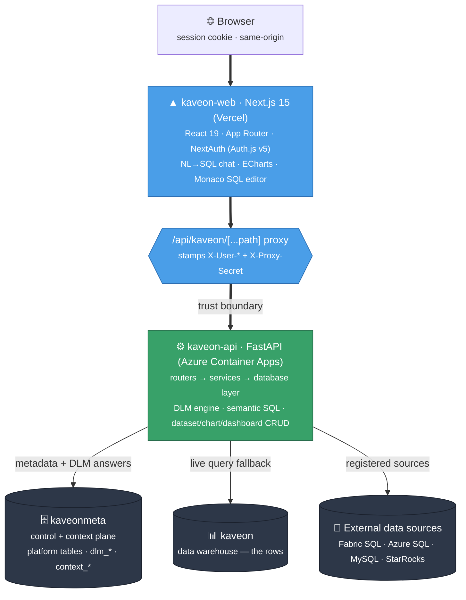

### Why Python/FastAPI?

Python supports ODBC (`pyodbc`), native PostgreSQL (`psycopg2`), and MySQL (`pymysql`) drivers — covering every database Kaveon connects to. The single-process FastAPI architecture eliminates the inter-service HTTP hop from the former Node.js + Flask design.

---

## Configuration Architecture

### Single Root `.env` File Pattern

Kaveon uses a **centralized configuration approach** with a single `.env` file at the repository root. Both services load their configuration from this shared file.

```
Kaveon/
├── .env                           ← Single configuration file
├── apps/
│   ├── kaveon-api/
│   │   └── config.py              → Loads ../../.env via python-dotenv
│   └── kaveon-web/
│       └── auth.ts / next.config  → Reads AUTH_* + NEXT_PUBLIC_* env vars
```

### Environment Variable Ownership

| Variable | Read by | Purpose |
|---|---|---|
| `AUTH_SECRET` | Web | NextAuth session encryption |
| `GITHUB_ID` / `GITHUB_SECRET` | Web | GitHub OAuth provider (activates when set) |
| `GOOGLE_ID` / `GOOGLE_SECRET` | Web | Google OAuth provider (activates when set) |
| `AUTH_MICROSOFT_ENTRA_ID_ID` / `_SECRET` / `_ISSUER` | Web | Microsoft Entra ID OAuth provider |
| `AUTH_ADMIN_EMAILS` | Web | Comma-separated emails granted the Admin role |
| `KAVEON_PROXY_SECRET` | Web + API | Shared secret signing `X-User-*` proxy headers |
| `API_URL` | Web | Base URL the proxy forwards to |
| `METADATA_HOST` / `METADATA_PORT` / `METADATA_SSLMODE` | API | Azure PG connection |
| `METADATA_DATABASE` | API | Control + context DB (`kaveonmeta`) |
| `AAD_DATABASES` | API | Databases (e.g. `kaveon`) routed through Managed-Identity token auth |
| `METADATA_DB_TYPE` | API | `postgresql` |
| `WEB_URL` | API | CORS allowed origin |

`KAVEON_PROXY_SECRET` **must match** on web and api. In production `METADATA_USER`/`METADATA_PASSWORD` are unset — Postgres auth is via Managed Identity.

---

## Architecture Layers

### Backend Layers

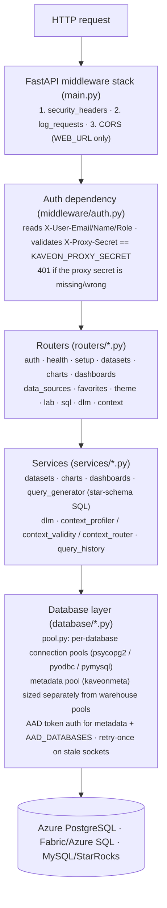

### Frontend Layers

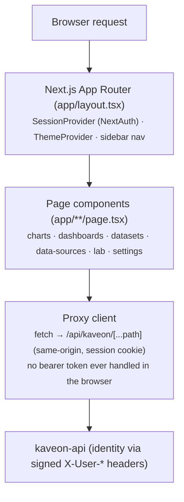

The browser never holds an API token. All API calls go same-origin to the Next.js proxy route, which attaches identity server-side.

---

## Data Flow

### Query Execution Flow (SQL Lab)

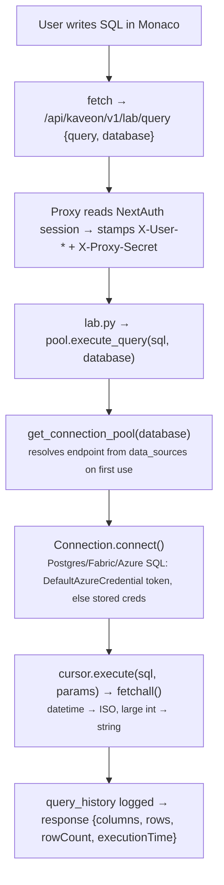

### Chart Render Flow (Dashboard — Context-Powered)

Dashboard charts try the DLM first. Only if the precomputed context can't answer does the frontend fall through to SQL.

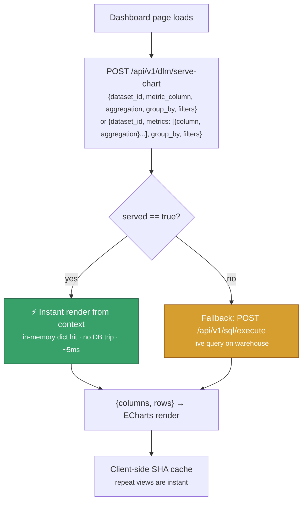

Multi-metric charts (stacked bar, combo) send a `metrics` array. `serve_chart_multi` resolves each metric independently, merges rows by group key, and returns a unified result — only when ALL metrics can be answered from context.

### Chart Render Flow (Standalone)

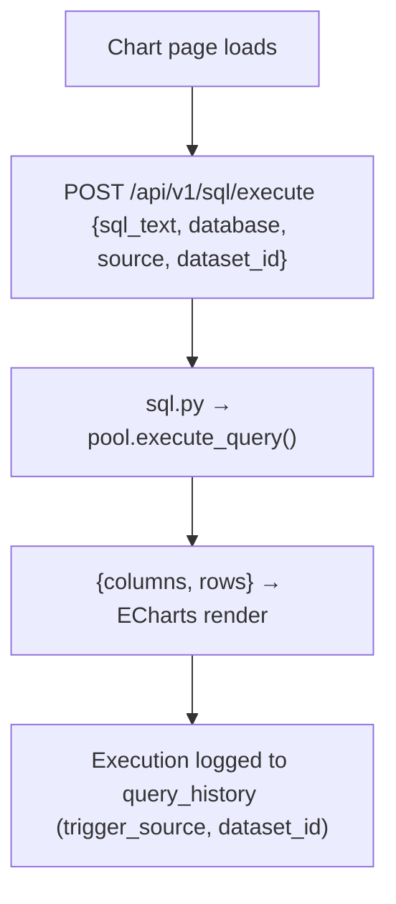

### Dashboard Filter Values Flow

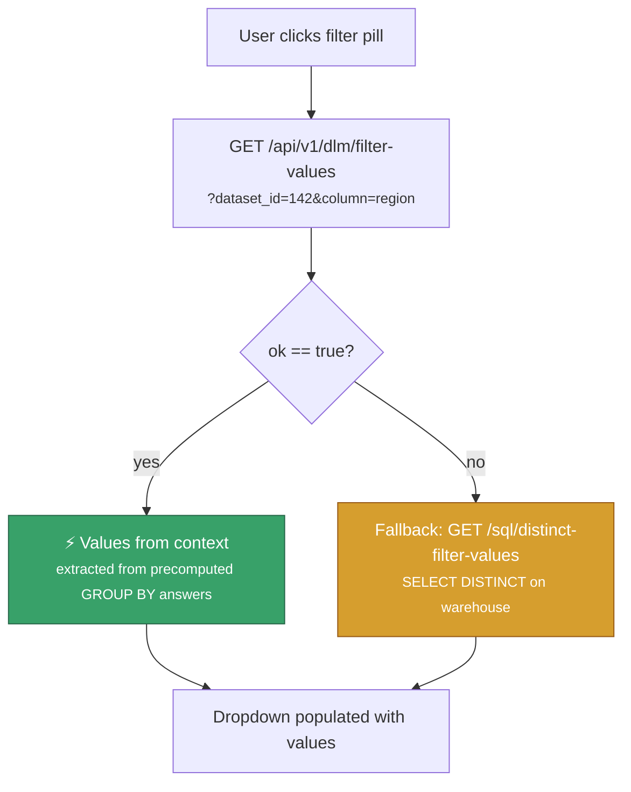

### Semantic SQL Generation Flow

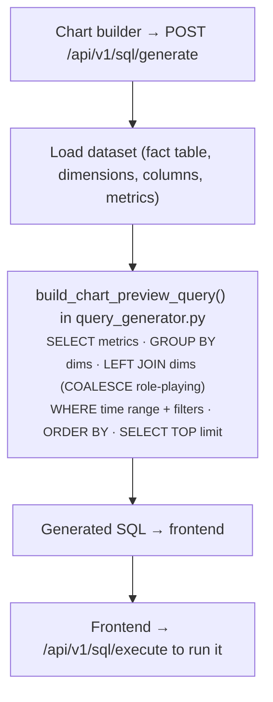

---

## Authentication

Kaveon is **OAuth-only** via **NextAuth (Auth.js v5)** — there are no local passwords, no MSAL, and no in-browser token handling. Each provider activates when its env vars are set: **GitHub**, **Google**, **Microsoft Entra ID**.

### Proxy identity model (the trust boundary)

The Next.js proxy route (`/api/kaveon/[...path]/route.ts`) is where identity is established. The browser cannot forge it because it cannot produce the proxy secret.

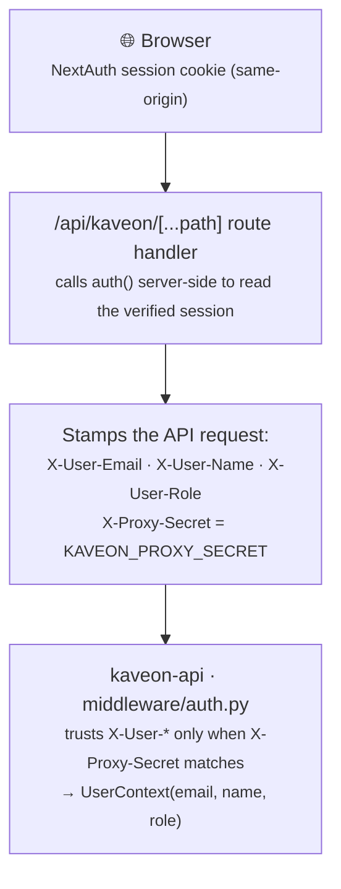

The API rejects any request whose `X-Proxy-Secret` is missing or wrong, so no identity is spoofable and no token is ever exposed to the browser.

### Authorization — Role-Based Access Control (RBAC)

Through sign-in, a user resolves to **Admin or Viewer**: emails listed in `AUTH_ADMIN_EMAILS` (comma-separated) get `Admin`; everyone else gets `Viewer`. The API's role ladder (`require_min_role`) still defines four levels for finer server-side gating:

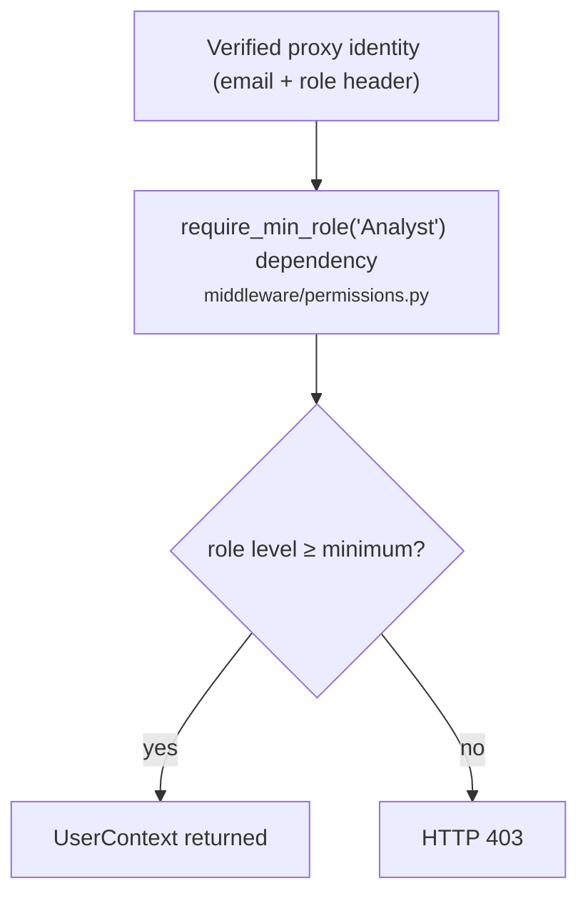

#### Role levels

| Role | Level | Capabilities |
|---|---|---|
| Viewer | 0 | Read published content, view dashboards (SQL executes from dashboard context only) |
| Analyst | 1 | SQL Lab, build charts and datasets, view internal content |
| Editor | 2 | All Analyst + publish content (set visibility = published) |
| Admin | 3 | All Editor + manage data sources, manage user role assignments, invalidate query cache |

#### Content visibility model

Each dataset, chart, and dashboard has a `visibility` column:

| Value | Who can read |
|---|---|
| `private` | Owner only |
| `internal` | All Analyst+ users |
| `published` | All authenticated users (including Viewers) |

`middleware/permissions.py` exposes helper functions used in all service calls:
- `can_read(visibility, owner_email, ctx)` — read access check
- `can_write(owner_email, ctx)` — write/delete check (owner or Admin)
- `can_publish(ctx)` — Editor+ check
- `can_admin(ctx)` — Admin check

### Managed Identity — database & Fabric SQL access

In production the Container App's Managed Identity authenticates to Postgres (both `kaveonmeta` and `kaveon`) and to Fabric/Azure SQL — **no SQL username/password is stored**.

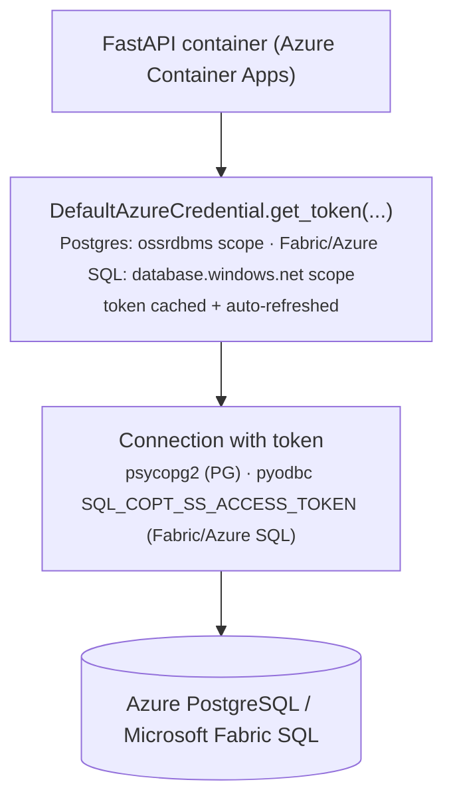

`database/pool.py` routes the metadata DB and any database named in `AAD_DATABASES` (e.g. `kaveon`) through this token path.

---

## Middleware

### Security Headers (main.py)

Applied to every response via `@app.middleware("http")`:

| Header | Value | Protection |
|---|---|---|
| `X-Content-Type-Options` | `nosniff` | Prevents MIME-type sniffing |
| `X-Frame-Options` | `DENY` | Prevents clickjacking |
| `Strict-Transport-Security` | `max-age=31536000; includeSubDomains` | Forces HTTPS |
| `Referrer-Policy` | `strict-origin-when-cross-origin` | Controls referrer exposure |
| `X-Permitted-Cross-Domain-Policies` | `none` | Blocks Flash/PDF cross-domain |

### CORS (main.py)

```python
CORSMiddleware(
    allow_origins=[settings.WEB_URL],        # exact origin only, no wildcard
    allow_credentials=True,
    allow_methods=["GET", "POST", "PUT", "PATCH", "DELETE", "OPTIONS"],
    allow_headers=["Content-Type", "X-User-Email", "X-User-Name", "X-User-Role", "X-Proxy-Secret", "Cache-Control"],
)
```

### Rate Limiting (middleware/rate_limit.py)

Per-user sliding-window limit (120 SQL executions/min per user), keyed on the authenticated email. Requests over the limit get HTTP 429. In-memory by default; **Redis-backed when `REDIS_URL` is set** (shared across replicas). Unauthenticated setup/health endpoints are excluded.

### Error Handling (middleware/errors.py)

- `AppError` / subclasses (`ValidationError`, `NotFoundError`, etc.) → structured JSON error with appropriate status code
- All unhandled exceptions → HTTP 500 with generic message; full traceback printed to server logs; **no** exception details returned to clients

---

## Database

Kaveon runs on **Azure Database for PostgreSQL Flexible Server (PG 18)**, split into two databases on the same server:

| Database | Plane | Contents |
|----------|-------|----------|
| `kaveonmeta` | **control + context** | `datasets`, `dataset_columns/dimensions/metrics`, `charts`, `dashboards`, `saved_queries`, `query_history`, `favorites`, `activity`, `user_themes`, `user_recents`, `local_users`, `data_sources`, **and** the DLM tables (`dlm_artifact`, `dlm_value_index`, `dlm_router`, `dlm_answers`, `context_snapshots`) |
| `kaveon` | **data warehouse** | the actual rows (`kaveon_usage_daily`, `climate_energy.*`, `ai_benchmarks.*`, `covid_global`, …) |

Splitting the planes means DLM/context answers are served from a small, fast store that never contends with a multi-million-row scan. Primary schema is `apps/kaveon-api/schema_postgresql.sql` (`schema.sql` / `schema_mysql.sql` are legacy SQL Server / MySQL variants).

### Core platform tables

| Table | Key Columns | Purpose |
|---|---|---|
| `datasets` | `id`, `name`, `table_name`, `schema_name`, `database_name`, `created_by` | Semantic layer definitions |
| `dataset_dimensions` | `dataset_id`, `dimension_table`, `fact_key`, `join_key` | Star-schema JOIN relationships |
| `dataset_columns` | `dataset_id`, `column_name`, `display_name`, `data_type`, `role` | Column metadata (dimensions, metrics, filters) |
| `charts` | `id`, `name`, `dataset_id`, `chart_type`, `config_json`, `created_by` | Chart configurations |
| `dashboards` | `id`, `name`, `layout_json`, `filter_config`, `created_by` | Dashboard layouts |
| `saved_queries` | `id`, `name`, `sql_text`, `database`, `user_id` | User-saved SQL queries |
| `query_history` | `id`, `sql_text`, `duration_ms`, `status`, `trigger_source`, `executed_by` | Full execution audit log |
| `favorites` | `id`, `user_email`, `object_type`, `object_id`, `object_name` | Per-user favourites |
| `data_sources` | `id`, `name`, `type`, `connection_string`, `database_name`, `region`, `is_active` | Registered data sources |
| `user_themes` | `id`, `user_email`, `primary_color`, `theme_config` | Per-user colour themes |

> `visibility` (`private`/`internal`/`published`, default `internal`) is present on `datasets`, `charts`, and `dashboards`.

> `connection_string` in `data_sources` is never returned in API responses — excluded via the `_PUBLIC_FIELDS` constant in `routers/data_sources.py`.

See [DLM — Data Language Model](#dlm--data-language-model) for the `dlm_*` / `context_*` tables.

---

## Feature Architecture

### 1. Datasets: The Semantic Layer

Datasets are the core abstraction. They define:
- **Fact table**: the primary table (e.g., `dbo.SalesOrders`)
- **Dimensions**: related lookup tables with JOIN configuration (`dimension_table`, `fact_key`, `join_key`)
- **Columns**: all queryable columns with roles (`dimension`, `metric`, `filter`)
- **Metrics**: aggregation definitions (SUM, AVG, COUNT, etc.)

#### Role-Playing Dimensions

A "role-playing dimension" is when two different foreign keys in the fact table both reference the same dimension table (e.g., `order_date_key` and `ship_date_key` both reference `dim_date`). Kaveon handles this via `COALESCE` in JOIN conditions:

```sql
LEFT JOIN [dim_date] AS [dim_date_1]
  ON COALESCE([fact].[order_date_key], [fact].[ship_date_key]) = [dim_date_1].[date_key]
```

#### Dimension Expansion

`services/datasets.py:_expand_columns_from_dimensions()` creates column entries for each dimension registered to the dataset, linking dimension table columns back through the JOIN path. This allows the chart builder to know which dimension table to JOIN for any selected column.

---

### 2. Charts: Visualization Engine

Kaveon ships **37 chart types** (ECharts 5 + echarts-gl, including a 3D WebGL globe).

#### Query Generation (`services/query_generator.py`)

`build_chart_preview_query(params)` accepts:
- `datasource`: fact table (schema.table)
- `dimensions`: list of dimension JOIN specs
- `columns`: dataset column metadata
- `xAxis`, `yAxis`: selected axis columns
- `filters`: active filter values
- `timeRange`, `timeColumn`: optional date range
- `limit`: row cap (default 500)

Output: a complete SELECT statement with:
- `SELECT TOP <limit>` with `[bracket-quoted]` identifiers (translated for Postgres/MySQL by `adapt_sql()`)
- Star-schema LEFT JOINs per dimension
- Date formatting for Month/Quarter/Year/Week time columns
- WHERE clause from time range + filter values
- GROUP BY the x-axis column
- ORDER BY the metric column

#### Filter Value Generation (`build_distinct_filter_values_query`)

Three-tier optimization:
- **Tier 1** — Fact key column → no JOIN needed, query the fact table directly
- **Tier 2** — Dimension key column → JOIN dimension, filter on key
- **Tier 3** — Dimension display column → JOIN dimension, filter on display value

Returns `{sql, keyColumn, filteringTier}`. The frontend always sends the `keyColumn` value as the filter parameter, ensuring consistent filter behavior regardless of display values.

---

### 3. Dashboards: Multi-Chart Composition

#### Layout Model

Dashboards store a **flat layout array** (serialised as `layout_json`) where each item is a `DashboardLayoutItem`:

```typescript
interface DashboardLayoutItem {
  i: string;          // unique id
  type: ComponentType; // 'chart' | 'text' | 'header' | 'divider' | 'row' | 'column' | 'tabs'
  x, y, w, h: number; // react-grid-layout grid position/size
  parentId?: string;   // set when item is nested inside a row/column
  children?: DashboardLayoutItem[]; // for row/column containers
  chartId?: number;
  textConfig?: { content, alignment, fontSize, color };
  headerConfig?: { content, size, alignment, color };
  dividerConfig?: { style, color, thickness };
}
```

Root items (no `parentId`) sit on the main react-grid-layout canvas. Container items (`row`, `column`) own their children via the `children` array — children are sized and positioned by the container, not by react-grid-layout.

#### State Management — `DashboardContext`

All dashboard state lives in `DashboardContext` (React context + `useState`):

| State / method | Purpose |
|---|---|
| `layout` / `setLayout` | The flat layout array; drives react-grid-layout |
| `addLayoutItem` | Appends a new root item |
| `updateLayoutItem` | Patches any item by id (config changes, resize) |
| `removeLayoutItem` | Removes a root item |
| `addItemToContainer` | Appends a child to a row/column's `children` array |
| `removeItemFromContainer` | Removes a child from a container |
| `moveItemToRoot` | Lifts a nested item out to the root canvas |
| `duplicateLayoutItem` | Deep-clones an item with fresh ids |
| `crossFilters` | Map of `itemId → {column, value}` for cross-filtering |
| `setCrossFilter / clearCrossFilter` | Update/remove a cross-filter entry |
| `getCrossFilterFilters` | Returns filters from other charts applicable to a given chart |
| `dashboardFilters` | Dashboard-level shared filters (filter bar) |
| `getEffectiveFilters` | Merges dashboard filters + cross-filters for a chart |
| `preloadAllCharts` | Fetches all chart configs in parallel and caches them |
| `getChartConfig` | Returns a cached chart config from the preload cache |

#### Component Types and Rendering

`DashboardItem` is the type router — it receives a `DashboardLayoutItem` and delegates rendering:

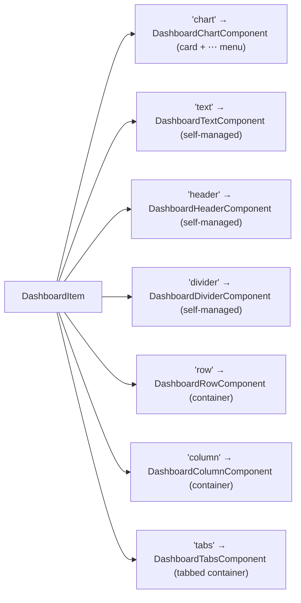

**Self-managed components** (`text`, `header`, `divider`, `row`, `column`) bypass the default card wrapper — they render borderless with their own hover toolbars, inline editing, and confirm dialogs. They receive `onRemove` as a **direct removal function** (not a re-open-confirm wrapper) because they own their own confirm modals.

**Chart cards** (`chart` type) get a card wrapper (border, shadow) and are rendered via:

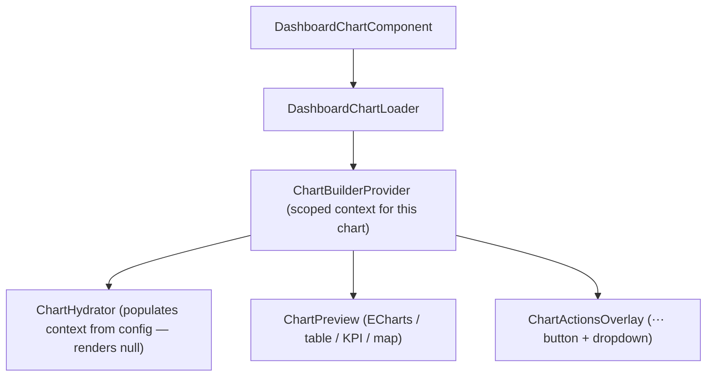

`ChartBuilderProvider` is scoped **per chart card** so `ChartActionsOverlay` can access `useChartBuilder()` for the "View Query" and "View as Table" features.

#### Chart Actions Overlay (`ChartActionsOverlay`)

The always-visible `⋯` button on each chart card opens a dropdown with:

| Action | Notes |
|---|---|
| Refresh | Increments `refreshKey` → forces `ChartHydrator` remount |
| Full screen | Portal modal (ReactDOM.createPortal) over the page |
| Edit chart | Navigate to `/charts/:id` (edit mode only) |
| View query | Shows last executed SQL in a portal modal |
| View as table | Shows raw data rows/columns in a portal modal |
| Download CSV | Calls `exportsRef.current.downloadCsv()` registered by `ChartPreview` |
| Download PNG | Calls `exportsRef.current.downloadPng()` registered by `ChartPreview` |
| Share dashboard | Copies dashboard URL to clipboard |
| Duplicate | Calls `duplicateLayoutItem` (edit mode only) |
| Remove | Portal confirm modal → `directRemove` (edit mode only) |

`ChartPreview` registers its download functions via the `onRegisterExports` callback pattern:
```typescript
// ChartPreview calls this once, passing download functions to the parent
onRegisterExports?.({ downloadPng, downloadCsv })
```

#### Cross-Filter System

Clicking a chart element (bar, pie slice, etc.) in view mode emits a cross-filter:

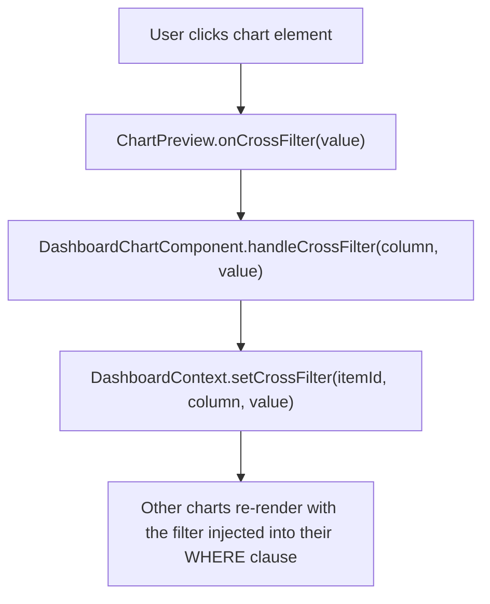

Each chart uses `getCrossFilterFilters(itemId)` to get filters emitted by **other** charts. Only filters whose column matches this chart's time column or groupby columns are applied — preventing nonsensical filter application across unrelated charts.

#### Parallel Chart Preloading

On dashboard open, `preloadAllCharts(apiBase, fetchFn)` fetches all chart configs in parallel:

```typescript
await Promise.all(chartIds.map(id => fetch(`/api/v1/charts/${id}`)))
// Results stored in chartConfigCache: Map<number, ChartConfig>
```

Each `DashboardChartLoader` checks `getChartConfig(chartId)` first — if cached, no network call is made. This means all charts render immediately from cache without any sequential waterfall.

---

### 4. SQL Lab: Direct Query Interface

SQL Lab is a developer-focused interface:
- Monaco Editor with SQL syntax highlighting and auto-complete
- Multi-tab editing; database selector (populated from `data_sources`)
- Synchronous execution (`POST /api/v1/lab/execute`) and cancellable execution (`POST /api/v1/lab/query`) for interactive queries
- **Detached async jobs** for long-running queries: `POST /api/v1/sql/execute-async` → poll `GET /api/v1/sql/async/{job_id}`; backs the SHA-256 result cache and CTAS (`CREATE TABLE AS`)
- Results grid with column sorting, search, and CSV export
- Save queries → `saved_queries`; every execution logged to `query_history` (duration, row count, status, trigger source)

All Lab endpoints enforce authenticated identity. SQL size is capped at 64 KB.

---

### How Everything Connects

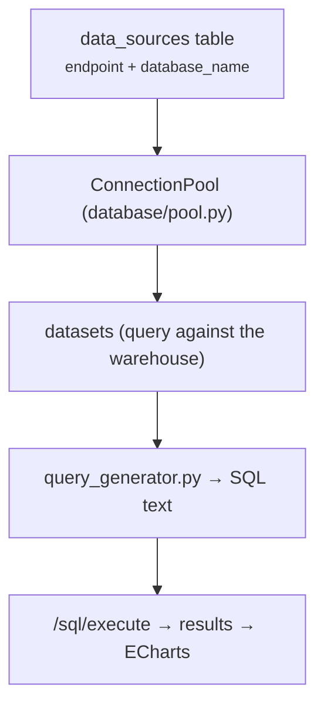

---

## DLM — Data Language Model

> **Patent-pending** — see `docs/patent-adaptive-context-routing.md` for the full claim set, `docs/whitepaper-dlm.md` for the DLM deep dive, and `docs/whitepaper-dlm-curation.md` for curation at scale.

The **DLM** is Kaveon's core differentiator and the **primary** NL→SQL path on the homepage: a per-dataset compiled context artifact that answers natural-language questions **with no hosted LLM**, and — for the common cases — **with no database scan at all**. The in-browser template parser (`utils/nlToSql.ts`) is the fallback for shapes the DLM can't yet build (mainly time-series trends).

### How It Works

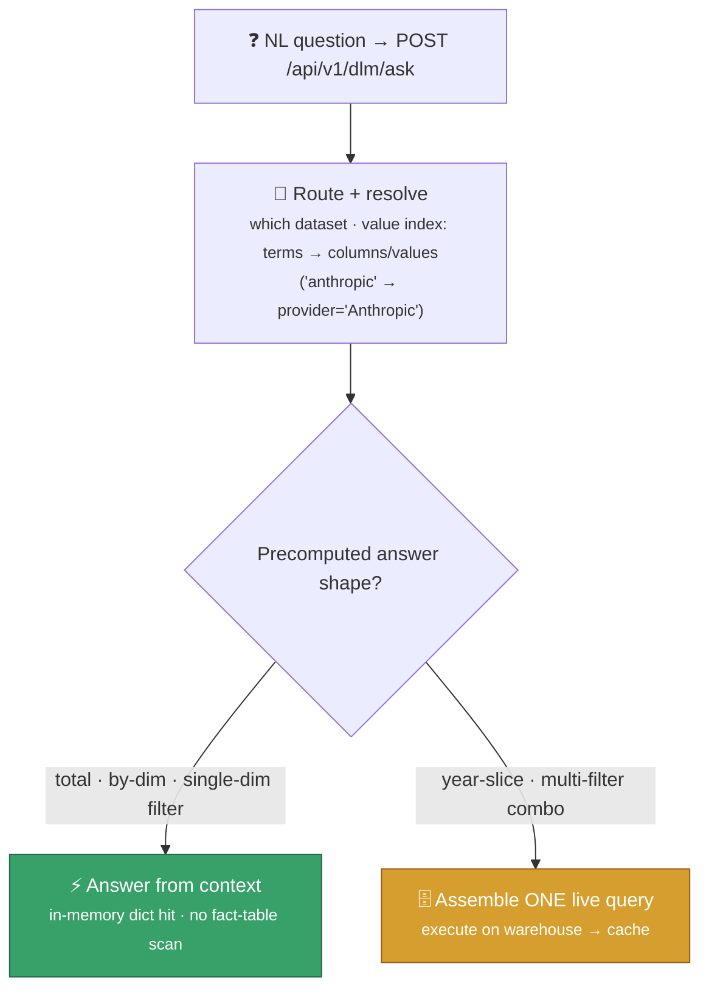

The DLM is built **on top of** the statistics-based context engine (`context_profiler` reads `pg_stats` / `pg_stat_user_tables` / `pg_constraint` / `query_history` — no data scan). Self-migrating tables in `kaveonmeta`:

| Table | Holds |
|-------|-------|
| `dlm_artifact` | per-dataset compiled manifest + stats/usage rollups (generation timing) |
| `dlm_value_index` | value → column/filter resolution |
| `dlm_router` | cross-dataset routing summary/terms |
| `dlm_answers` | **precomputed answers** — each metric's grand total + per-dimension breakdown + 2-dim combos |
| `dlm_sketch` | **HLL sketch cuboids** — mergeable COUNT(DISTINCT) registers at arbitrary dimension slices |
| `context_snapshots` | per-element profile + captured change counters (staleness signal) |

`generate_dlm()` precomputes all answers at build time (one scan for totals, one per dimension, common 2-dim combos). `ask()` serves totals, per-dimension breakdowns, and single-dimension equality filters from an in-memory cache warmed once per dataset — microsecond dict hits, no scan. `serve_chart()` and `serve_chart_multi()` power dashboard charts entirely from context. `filter_values()` extracts dimension dropdown values from precomputed GROUP BY answers. Every answer is badged **"⚡ From context · no DB scan"** or **"Live query · Xs"** with real timing. Non-additive metrics (`COUNT DISTINCT`, `AVG`) are exact because each shape is computed independently at build time; HLL sketch cuboids enable mergeable approximate COUNT(DISTINCT) at arbitrary dimension slices when exact answers are unavailable.

**Measured:** over a 10.1M-row usage dataset, "current usage" drops from **~15 s live to ~1.5 s from context** (the scan is eliminated; the residual is routing). Dashboard charts render from context in **~5 ms** end-to-end on Azure B1ms — no warehouse load.

### Key Design Decisions

| Decision | Rationale |
|---|---|
| No LLM anywhere in the routing path | Deterministic, zero-cost, no API keys, no latency, patentable |
| Precompute answers at build time | Compute-once/answer-many — the common question needs no scan |
| Staleness from DBMS counters, not re-query | `n_mod_since_analyze` is free; re-querying defeats the purpose |
| Per-element, not per-dataset | Table A fresh + Table B stale → only re-query Table B's data |
| Physical control/context vs. warehouse split | Context answers never contend with a 10M-row scan |

### API Endpoints

| Endpoint | Purpose |
|---|---|
| `POST /api/v1/dlm/ask` | Route a NL question → context answer or one live query |
| `GET /api/v1/dlm/route` | Which dataset(s) a question routes to |
| `GET /api/v1/dlm/coverage` | What a dataset's DLM can answer (dims, metrics, sample values) |
| `POST /api/v1/dlm/serve-chart` | Dashboard chart from precomputed context — single or multi-metric |
| `GET /api/v1/dlm/filter-values` | Dimension dropdown values from precomputed answers (no SQL scan) |
| `POST /api/v1/datasets/{id}/dlm/generate` | (Re)compile the DLM + precompute answers |
| `GET /api/v1/datasets/{id}/dlm` | DLM status: last generated, duration, indexed dims/metrics |
| `GET /api/v1/datasets/{id}/columns` | Column metadata for a dataset (filter builders, chart config) |
| `POST /api/v1/context/build` · `GET /context/validity` · `POST /context/ask` | Lower-level context engine (staleness scoring) |

### Implementation Status

| Component | Status | Files |
|---|---|---|
| Context profiler (pg_stats reader) | Complete | `services/context_profiler.py` |
| Validity scorer (3-factor decay) | Complete | `services/context_validity.py` |
| Question router (deterministic, weighted) | Complete | `services/context_router.py`, `services/dlm.py` |
| Precomputed answer store (`dlm_answers`) | Complete | `services/dlm.py` |
| Answer-from-context (in-memory cache) | Complete | `services/dlm.py` |
| Profile-synthesized answers | Complete | `context_router.py` |
| Frontend integration (homepage) | **Complete — DLM is the primary path** | `app/page.tsx`, `ContextBanner.tsx`, `DatasetContextPanel.tsx` |
| Context-powered dashboard charts | **Complete — serve-chart (single + multi-metric)** | `services/dlm.py`, `ChartBuilderContext.tsx` |
| DLM filter values | **Complete — dimension dropdowns from context** | `services/dlm.py`, `DashboardFilterBarReadOnly.tsx` |
| HLL sketch cuboids | **Complete — mergeable COUNT(DISTINCT) at arbitrary grain** | `services/dlm.py` (`dlm_sketch` table) |
| Hybrid path (partial decomposition) | Single-dim filters served from breakdown; deeper decomposition open | `services/dlm.py` |

---

## Caching Strategy

Warehouse queries are **live by default** — Kaveon does not cache arbitrary result sets server-side, so users see current data. The exceptions are deliberate:

- **DLM answer cache**: precomputed metric totals + per-dimension breakdowns (`dlm_answers`) served from an in-memory cache (`_ANSWER_CACHE`, warmed once per dataset) — the answer-from-context path, no scan.
- **Client-side query cache**: dashboard chart results cached in-browser by SHA key (`dataset:metric:groupby:filters`), so tab switches and filter toggles are instant.
- **SQL Lab result cache**: async-job results keyed by SHA-256 of the query, with a TTL.
- **Managed Identity tokens**: `DefaultAzureCredential` caches tokens with automatic refresh.
- **Connection pools**: each `(endpoint, database)` pair keeps a persistent pool of reusable connections — avoids per-request TLS handshakes and auth overhead.

Mutable API responses include:
```
Cache-Control: no-cache, no-store, must-revalidate
Pragma: no-cache
Expires: 0
```

---

## Component Architecture

### Key Backend Components

| Component | File | Responsibility |
|---|---|---|
| `ConnectionPool` | `database/pool.py` | Thread-safe pool per `(endpoint, database)`; separate sizing for metadata vs warehouse |
| `PostgreSQLConnection` | `database/pool.py` | psycopg2 connection; password or Managed-Identity token auth |
| `FabricSQLConnection` | `database/pool.py` | pyodbc connection with Azure AD token (`SQL_COPT_SS_ACCESS_TOKEN`) |
| `MySQLConnection` | `database/pool.py` | pymysql connection (MySQL / StarRocks) |
| `LargeIntResponse` | `database/pool.py` | FastAPI response class: `datetime→ISO`, large `int→str` |
| proxy-identity auth | `middleware/auth.py` | Reads `X-User-*`, validates `X-Proxy-Secret`; returns `UserContext(email, name, role)` |
| `require_min_role` | `middleware/permissions.py` | Dependency factory for role-gated endpoints |
| `resolve_role` | `services/users.py` | Admin if email ∈ `AUTH_ADMIN_EMAILS`, else Viewer |
| `RateLimitMiddleware` | `middleware/rate_limit.py` | Per-user sliding-window limiter (Redis-backed if `REDIS_URL`) |
| DLM engine | `services/dlm.py` | Value index, router, precompute, answer cache, live assembler |
| context engine | `services/context_profiler.py` · `context_validity.py` · `context_router.py` | Statistics profile, staleness scoring, routing |
| `build_chart_preview_query` | `services/query_generator.py` | Star-schema SQL generation |
| `adapt_sql` | `database/pool.py` | T-SQL → Postgres/MySQL dialect translation |
| `start_warmup_and_heartbeat` | `database/warmup.py` | Background warmup + 5-min keepalive |

### Key Frontend Components

| Component | File | Responsibility |
|---|---|---|
| `SessionProvider` (NextAuth) | `app/layout.tsx` | Auth session context |
| proxy `fetch` | `app/api/kaveon/[...path]/route.ts` | Same-origin API proxy; stamps `X-User-*` server-side |
| `ContextBanner` | `components/ContextBanner.tsx` | Homepage banner: DLM coverage + hover detail |
| `DatasetContextPanel` | `components/DatasetContextPanel.tsx` | Dataset page: last-generated, duration, indexed dims/metrics, Regenerate |
| `ThemeContext` | `contexts/` | Per-user colour theme state |
| `ConfirmModal` | `components/ConfirmModal.tsx` | Portal-based confirm dialog (`ReactDOM.createPortal`) |
| `ChartPreview` | `components/charts/ChartPreview.tsx` | Renders ECharts, table, KPI, world map; `onRegisterExports` |
| `ChartBuilderProvider` | `components/charts/ChartBuilderContext.tsx` | Per-chart scoped context — runs query, holds results, `sqlPreview` |
| `DashboardCanvas` | `components/dashboards/DashboardCanvas.tsx` | react-grid-layout grid with row drag handles |
| `DashboardContext` | `components/dashboards/DashboardContext.tsx` | Flat layout state, cross-filter map, preload cache |
| `DashboardItem` | `components/dashboards/DashboardItem.tsx` | Routes each layout item to the correct component |
| `ChartActionsOverlay` | `components/dashboards/components/ChartActionsOverlay.tsx` | ⋯ button + dropdown; `useChartBuilder()` for query/table modals |
| `DashboardTextComponent` | `components/dashboards/components/DashboardTextComponent.tsx` | Markdown renderer + formatting toolbar + `react-colorful` colour picker |
| `useRole` | `hooks/useRole.ts` | `{role, isViewer, isAnalyst, isEditor, isAdmin, canCreate, canPublish}` |
| `RoleGate` | `components/RoleGate.tsx` | Conditionally renders children based on `minRole` |

---

## API Design

### URL Structure

```
/api/health                         — health check (unauthenticated)
/api/v1/setup/*                     — first-run setup wizard (setup mode only)
/api/v1/datasets                    — datasets CRUD
/api/v1/charts                      — charts CRUD
/api/v1/dashboards                  — dashboards CRUD
/api/v1/data-sources                — data sources CRUD
/api/v1/favorites                   — user favourites
/api/v1/theme                       — user colour theme
/api/v1/lab/*                       — SQL Lab (execute, query, history, tables)
/api/v1/sql/generate                — semantic SQL generation
/api/v1/sql/distinct-filter-values  — filter dropdown values
/api/v1/sql/execute                 — SQL execution with history logging
/api/v1/sql/execute-async · /sql/async/{job_id} — detached async jobs + result cache
/api/v1/dlm/*                       — DLM: ask, route, coverage, generate, serve-chart, filter-values
/api/v1/context/*                   — context engine: build, validity, ask
/api/v1/metadata/summary            — parallel metadata summary
/api/v1/users/me                    — current user's email + resolved role
/api/v1/users                       — list role assignments (Admin only)
/api/v1/users/{email}/role          — assign / remove role (Admin only)
```

### Response Conventions

- All success responses: `{"success": true, ...data}` or direct object
- All error responses: `{"error": {"code": "...", "message": "...", "details": ...}}`
- No-cache headers on all mutable GET endpoints
- `connection_string` never included in any data-source response

### Parameterized Query Convention

Metadata DB queries use `@param0`, `@param1`, ... placeholders which are replaced with `%s`/`?` by `database/metadata.py` before execution:

```python
db.query("SELECT * FROM datasets WHERE created_by = @param0", [user_email])
```

Direct pool queries use native placeholders:

```python
conn.execute_query("SELECT * FROM table WHERE id = ?", [record_id])
```

---

## Frontend Architecture

### Next.js App Router

Kaveon uses the **Next.js 15 App Router** with interactive pages rendered client-side (data comes from the authenticated proxy API).

```
app/
├── layout.tsx              — Root: SessionProvider (NextAuth) + ThemeProvider + sidebar
├── page.tsx                — Home: DLM chat (NL→SQL) + context banner + quick links
├── charts/
│   ├── page.tsx            — Charts list
│   ├── [id]/page.tsx       — Chart detail / inline rename
│   └── new/page.tsx        — Chart builder (drag-drop config + live preview)
├── dashboards/
│   ├── page.tsx            — Dashboards list
│   ├── [id]/edit/page.tsx  — Dashboard editor (react-grid-layout)
│   └── [id]/view/page.tsx  — Dashboard viewer (read-only, filter bar, publish)
├── datasets/
│   ├── page.tsx            — Datasets list
│   └── [id]/page.tsx       — Dataset detail + DLM context panel
├── data-sources/page.tsx   — Data source registration
├── lab/
│   ├── page.tsx            — SQL Lab (Monaco + multi-tab + results grid)
│   └── queries/page.tsx    — Saved queries + query history
├── settings/users/page.tsx — User role management (Admin only)
├── login/page.tsx          — Sign-in (OAuth providers)
└── api/
    ├── kaveon/[...path]/    — API proxy (stamps X-User-*)
    └── auth/               — NextAuth (Auth.js v5) handlers
```

### Sign-in Flow (NextAuth + proxy)

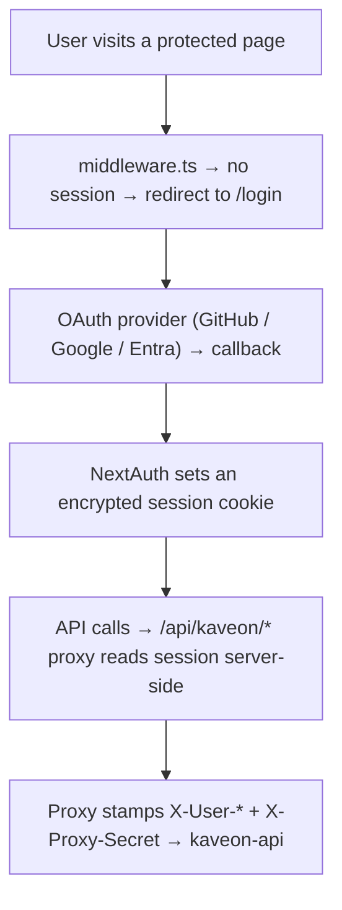

---

## Deployment

See [DEPLOYMENT.md](./DEPLOYMENT.md) for the deployment guide.

### Summary

| Concern | Approach |
|---|---|
| Frontend hosting | Vercel — auto-deploy from `dev` branch; `npm install --legacy-peer-deps` (pnpm fails in Vercel's sandbox) |
| API hosting | Azure Container Apps — image from `kaveonacr.azurecr.io`, IaC in `infra/bicep/` |
| Database | Azure PostgreSQL Flexible Server (PG 18): `kaveonmeta` (metadata + context) + `kaveon` (warehouse) — Managed Identity auth |
| Auth | NextAuth (GitHub / Google / Microsoft Entra ID) |
| API auth | Proxy secret (`KAVEON_PROXY_SECRET`) — the Next.js proxy injects `X-User-*` headers |
| API runtime | Gunicorn + Uvicorn workers |
| Cold starts | Connection pool warmup at startup; 5-min heartbeat |
| First run | Setup wizard at `/api/v1/setup/*` — disabled once configured |
