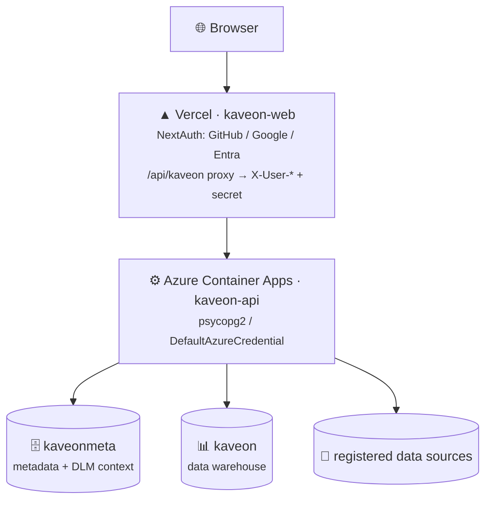

# Kaveon — Deployment Guide

> **Stack:** Vercel (kaveon-web) + Azure Container Apps (kaveon-api) + Azure PostgreSQL (`kaveonmeta` + `kaveon`)
> **Live:** [kaveon.vercel.app](https://kaveon.vercel.app)

---

## Architecture

Vercel hosts the Next.js frontend. Azure Container Apps hosts the FastAPI backend (persistent process + connection pool). **Azure Database for PostgreSQL Flexible Server (PG 18)** holds both `kaveonmeta` (metadata + DLM/context) and `kaveon` (the data warehouse), authenticated via Managed Identity. IaC for Azure resources lives in `infra/bicep/`.

## Full Walkthrough

See **[docs/guides/deploy-vercel-azure-postgres.md](docs/guides/deploy-vercel-azure-postgres.md)** for the complete step-by-step setup guide covering:

1. **Azure PostgreSQL** — create the server + `kaveonmeta`/`kaveon` databases, apply the schema
2. **Azure Container Registry** — build and push the API image
3. **Azure Container Apps** — deploy kaveon-api via Bicep
4. **Vercel** — deploy kaveon-web, configure NextAuth providers + env vars
5. **Wire together** — back-fill CORS, callback URLs, secrets
6. **Verify** — sign in, add a data source, build a chart

## Auth Flow

The browser only talks to Vercel. `kaveon-web`'s `/api/kaveon/*` route reads the NextAuth session server-side and forwards `X-User-*` headers to the Container App, stamped with `KAVEON_PROXY_SECRET`. `kaveon-api` trusts those headers only when the secret matches. No token is handled in the browser.

---

*See also: [ARCHITECTURE.md](ARCHITECTURE.md) · [infra/bicep/](infra/bicep/) · [apps/kaveon-web/vercel.json](apps/kaveon-web/vercel.json)*
