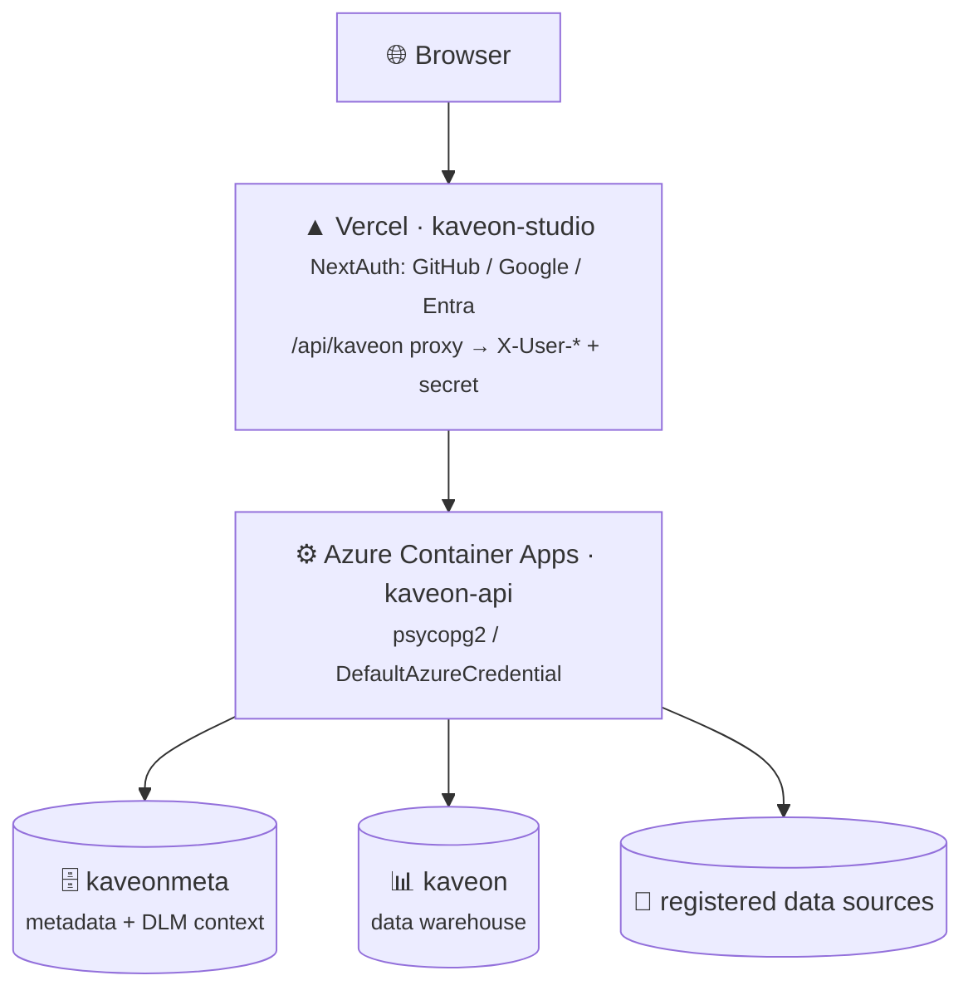

# Kaveon — Deployment Guide

> **Stack:** Vercel (kaveon-studio) + Azure Container Apps (kaveon-api) + Azure PostgreSQL (`kaveonmeta` + `kaveon`)
> **Live:** [kaveon.vercel.app](https://kaveon.vercel.app)

---

## Shipping Studio + API deployment



Vercel hosts the Next.js frontend. Azure Container Apps hosts the FastAPI backend (persistent process + connection pool). Azure Database for PostgreSQL Flexible Server holds `kaveonmeta` (metadata + DLM context) and the default/demo `kaveon` warehouse, authenticated via Managed Identity. Analytical data may instead remain in a registered external SQL source. IaC lives in `infra/bicep/`.

## Full Walkthrough

See **[docs/guides/deploy-vercel-azure-postgres.md](docs/guides/deploy-vercel-azure-postgres.md)** for the complete step-by-step setup guide covering:

1. **Azure PostgreSQL** — create the server + `kaveonmeta`/`kaveon` databases, apply the schema
2. **Azure Container Registry** — build and push the API image
3. **Azure Container Apps** — deploy kaveon-api via Bicep
4. **Vercel** — deploy kaveon-studio, configure NextAuth providers + env vars
5. **Wire together** — configure callback URLs, proxy identity, allowed origins, and secrets
6. **Verify** — sign in, add a data source, build a chart

## Auth Flow

The recommended production path sends browser traffic through Vercel. `kaveon-studio`'s `/api/kaveon/*` route reads the NextAuth session server-side and forwards `X-User-*` headers to the Container App, stamped with `KAVEON_PROXY_SECRET`. See [SECURITY.md](SECURITY.md) for additional local and direct-API authentication paths and current hardening gaps.

## Engine alpha deployment

`engine/docker-compose.yml` starts one coordinator and two workers against a shared local volume. It validates packaging, node discovery, heartbeats, and node-local Parquet queries.

It is **not** a production distributed query cluster yet: there is no fragment scheduler, exchange/shuffle layer, cross-worker retry, Engine HTTP authentication, or TLS termination. Populate the shared data volume before starting the stack; the repository does not ship production data.

```bash
cd engine
docker compose up --build
```

See [ARCHITECTURE.md](ARCHITECTURE.md#deployment-topology) for current-versus-target behavior.

---

*See also: [ARCHITECTURE.md](ARCHITECTURE.md) · [infra/bicep/](infra/bicep/) · [studio/vercel.json](studio/vercel.json)*
