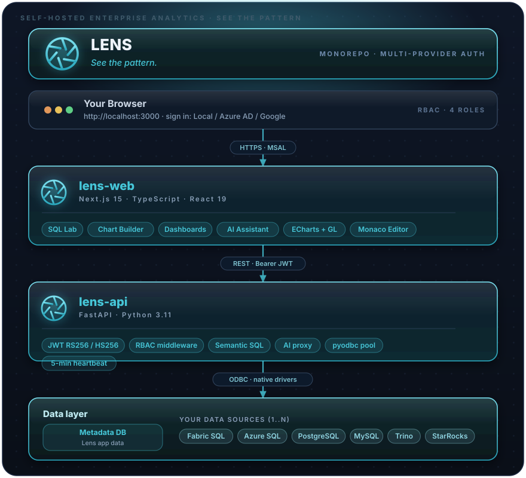

<div align="center">

<picture>
  <source media="(prefers-color-scheme: dark)" srcset="docs/reference/kaveon-logo-dark.svg?v=15">
  
</picture>

### **Talk to your data.**

*Query, explore, and visualize your data — with a plain-English front door. Self-hosted. Open source.*

<br>

[](https://github.com/PruthviProdduturi/Kaveon/actions/workflows/ci.yml) [](LICENSE) [](https://kaveon.vercel.app)

<br>

[](https://nextjs.org/)
[](https://www.typescriptlang.org/)
[](https://www.python.org/)
[](https://fastapi.tiangolo.com/)
[](https://authjs.dev/)
[](https://learn.microsoft.com/en-us/fabric/)
[](./LICENSE)


[**Quick Start**](#-quick-start) · [**Architecture**](#-architecture) · [**Features**](#-features) · [**Setup Guide**](#-step-by-step-setup) · [**API Reference**](#-api-reference) · [**Troubleshooting**](#-troubleshooting)

</div>

---

## 🌟 What is Kaveon?

Kaveon is a **self-hosted analytics platform** built on **Microsoft Fabric SQL**, Azure SQL, PostgreSQL, MySQL, and StarRocks. Think of it as your own data command centre — query live data, build charts, assemble dashboards, and use AI to accelerate analysis — secured through **your choice of OAuth provider**.

Sign-in is OAuth-only via NextAuth (Auth.js v5). Configure one or more OAuth providers (GitHub, Google, Microsoft Entra) via env vars; a provider's button appears when its id/secret are set.

> *Kaveon sits between your team and your data — making it fast to explore, easy to visualise, and safe to share.*

---

## ⚡ Features

<table>
<tr>
<td width="50%">

### 🔐 Security
- **OAuth sign-in via NextAuth (Auth.js v5)** — GitHub, Google, Microsoft Entra ID; each provider activates when its id/secret env vars are set
- Admins are configured via `AUTH_ADMIN_EMAILS`; everyone else signs in as Viewer
- NextAuth sessions signed with `AUTH_SECRET`; the web proxy forwards a trusted identity to the API, stamped with `KAVEON_PROXY_SECRET`
- **Role-Based Access Control:** the API layer defines Viewer < Analyst < Editor < Admin
- Content visibility model: private / internal / published per dataset, chart, and dashboard
- AI provider keys and stored secrets encrypted at rest with Fernet/AES
- Security headers, hardened CORS, parameterised queries throughout

</td>
<td width="50%">

### 🚀 SQL Lab
- Monaco Editor (VS Code-grade) with SQL syntax highlighting
- Multi-tab query sessions with per-tab history
- Real-time results with column sorting and search
- Save queries, browse full history with source tracking
- **Inline AI bar** — press the ✦ wand button, type a prompt, get generated SQL injected straight into the active tab

</td>
</tr>
<tr>
<td width="50%">

### 🤖 AI Assistant
- Natural language → SQL via `/ai` page with full conversation history
- Context-aware: pass current SQL + data source into every prompt
- Multi-provider: Anthropic (Claude), OpenAI (GPT-4o), GitHub Models (Copilot)
- Global keys (admin-managed) + personal keys (per-user override)
- Keys encrypted at rest with AES-256 before storage
- Inline AI bar in SQL Lab for instant query generation

</td>
<td width="50%">

### 📊 Chart Builder
- 20+ chart types: bar, line, area, pie, scatter, heatmap, funnel, gauge, treemap, waterfall, calendar, world map globe (3D WebGL), and more
- Drag-and-drop metric and dimension configuration
- Smart JOIN generation from your semantic dataset definition
- Live filter dropdowns sourced directly from your data
- Advanced options: annotations, reference lines, goal markers, colour schemes

</td>
</tr>
<tr>
<td width="50%">

### 🗂️ Semantic Datasets
- Define dimensions, metrics, and filter columns once
- Automatic SQL generation with multi-table JOIN support
- COALESCE-based role-playing dimension handling
- Reusable across unlimited charts and dashboards
- Visibility control: draft / internal / published

</td>
<td width="50%">

### 🖥️ Dashboards
- Drag-and-drop canvas with resizable chart tiles, row/column containers, and tab components
- Rich content blocks: **markdown text**, section headers (H1/H2/H3 with alignment + colour picker), styled dividers
- Per-chart **⋯ context menu**: refresh, full-screen, view query, view as table, download CSV/PNG, share, duplicate, remove
- **Cross-chart filtering** — click a bar/slice to instantly filter all related charts
- Dashboard-level filter bar — shared filters slice every chart simultaneously
- Parallel chart preloading on open — all charts fetch in one pass for instant rendering
- Publish, favourite, and inline-rename dashboards

</td>
</tr>
<tr>
<td width="50%">

### 🔌 Multi-Source Data
- **Microsoft Fabric SQL** (Analytics Endpoint & Data Warehouse)
- **Azure SQL Database**
- **PostgreSQL**
- **MySQL / MariaDB**
- **StarRocks** (FE host — speaks the MySQL protocol)
- **Trino** — *coming soon*
- Register sources through the UI — no `.env` changes needed
- Per-database connection pooling with startup warmup

</td>
<td width="50%">

### 🛠️ Admin Controls
- **User Roles:** Admins are those whose email is listed in `AUTH_ADMIN_EMAILS`; everyone else signs in as Viewer
- **Metadata Server:** view and reconfigure the Kaveon metadata database from the UI — supports all metadata DB types, live connection test, in-place API restart
- **Data Sources:** full CRUD with connection testing
- **AI Providers:** manage global and personal API keys

</td>
</tr>
<tr>
<td width="50%">

### 🎨 Personalisation
- Per-user colour theme (full palette picker, applies instantly)
- Favourites system for datasets, charts, and dashboards
- Query history per user with full audit trail
- Workspace activity feed on the home page

</td>
<td width="50%">

### ⚡ Performance
- Connection pool warming at API startup — sub-second queries after cold start
- Parallel metadata fetching on page load
- 5-minute heartbeat keeps Fabric serverless connections alive
- All data is live — no stale cache, ever

</td>
</tr>
</table>

---

## 🏛️ Architecture

Kaveon is a **monorepo** with two services:

<p align="center"></p>

### Two databases

| Database | Purpose | Configured via |
|---|---|---|
| **Metadata DB** | Stores Kaveon app data: datasets, charts, dashboards, query history, themes, roles | Setup wizard or **Settings → Metadata Server** (admin) |
| **Your Data Sources** | Your actual warehouses, lakehouses, databases | UI at `/data-sources` |

---

## 📋 Prerequisites

| Requirement | Version | Check | Install |
|---|---|---|---|
| **Python** | 3.11+ | `python --version` | [python.org](https://www.python.org/) |
| **ODBC Driver 18** | 18.x | See below | [Microsoft docs](https://learn.microsoft.com/sql/connect/odbc/download-odbc-driver-for-sql-server) |
| **Node.js** | 20.x+ | `node -v` | [nodejs.org](https://nodejs.org/) |
| **pnpm** | 9.x+ | `pnpm -v` | `npm install -g pnpm` |
| **Git** | Any | `git --version` | [git-scm.com](https://git-scm.com/) |
| **Fabric SQL access** | — | — | Contact your Fabric workspace admin |

#### Verify ODBC Driver 18

**Windows:** Start → `ODBC Data Sources (64-bit)` → **Drivers** tab → look for `ODBC Driver 18 for SQL Server`

**macOS / Linux:**
```bash
odbcinst -q -d -n "ODBC Driver 18 for SQL Server"
```

> ⚠️ ODBC Driver 18 is required for Fabric SQL and Azure SQL. PostgreSQL uses `psycopg2`, and MySQL / StarRocks use `PyMySQL` (StarRocks speaks the MySQL protocol) — both included in `requirements.txt`. Trino is *coming soon* (no driver yet).

---

## 🔑 OAuth Providers

Sign-in is OAuth-only via **NextAuth (Auth.js v5)**. Configure one or more providers by setting their env vars; a provider's sign-in button appears automatically when its id/secret are present.

- **GitHub** — set `GITHUB_ID` / `GITHUB_SECRET`
- **Google** — set `GOOGLE_ID` / `GOOGLE_SECRET`
- **Microsoft Entra ID** — see below

Everyone signs in as **Viewer** by default; add an email to `AUTH_ADMIN_EMAILS` (comma-separated) to grant **Admin**. Also set `AUTH_SECRET` (`openssl rand -base64 32`).

### Microsoft Entra ID (optional)

<details>
<summary><strong>Click to expand — App Registration steps</strong></summary>

<br>

1. Go to [portal.azure.com](https://portal.azure.com) → **Microsoft Entra ID** → **App registrations** → **New registration**

2. Fill in:
   - **Name:** `Kaveon`
   - **Redirect URI:** select **Web**, then `http://localhost:3000/api/auth/callback/microsoft-entra-id` (add your production origin's callback URL too)

3. Click **Register**, then create a **client secret** under **Certificates & secrets**.

4. Set the env vars:
   - `AUTH_MICROSOFT_ENTRA_ID_ID` → Application (client) ID
   - `AUTH_MICROSOFT_ENTRA_ID_SECRET` → the client secret value
   - `AUTH_MICROSOFT_ENTRA_ID_ISSUER` → e.g. `https://login.microsoftonline.com/<tenant-id>/v2.0`

</details>

---

## 🚀 Quick Start

```bash
# 1. Clone
git clone <your-repo-url>
cd Kaveon

# 2. Install Node.js dependencies (frontend only)
pnpm install

# 3. Configure environment — set AUTH_SECRET + at least one OAuth provider
cp .env.example .env
# → Set AUTH_SECRET (openssl rand -base64 32) and e.g. GITHUB_ID / GITHUB_SECRET

# 4. Set up Python API
cd apps/kaveon-api
python -m venv venv
venv\Scripts\activate        # Windows
# source venv/bin/activate   # macOS / Linux
pip install -r requirements.txt
cd ../..

# 5. Start both services — two terminals
python apps/kaveon-api/main.py    # Terminal 1 (API)
pnpm --filter kaveon-web dev      # Terminal 2 (Web)
```

Open **http://localhost:3000** and sign in with GitHub (or another configured provider). ✓

> Try the hosted demo at **[kaveon.vercel.app](https://kaveon.vercel.app)**.

---

## 📖 Step-by-Step Setup

### 1 · Clone the Repository

```bash
git clone <your-github-repo-url>
cd Kaveon
```

### 2 · Install Node.js Dependencies

```bash
pnpm install
```

### 3 · Configure Environment Variables

Kaveon uses a **single `.env` file at the repository root**. Both services read from it.

```bash
cp .env.example .env
```

```env
# ── Auth (NextAuth / Auth.js v5) ─────────────────────────────────────────────
AUTH_SECRET=your-generated-secret        # openssl rand -base64 32
AUTH_URL=http://localhost:3000
AUTH_ADMIN_EMAILS=you@example.com         # comma-separated → Admin role

# Configure at least one OAuth provider (button appears when id/secret are set):
GITHUB_ID=
GITHUB_SECRET=
# GOOGLE_ID=
# GOOGLE_SECRET=
# AUTH_MICROSOFT_ENTRA_ID_ID=
# AUTH_MICROSOFT_ENTRA_ID_SECRET=
# AUTH_MICROSOFT_ENTRA_ID_ISSUER=

# Shared secret the web proxy uses to stamp trusted identity headers to the API
KAVEON_PROXY_SECRET=your-proxy-secret

# ── Metadata Database (optional — setup wizard configures this on first login) ─
# METADATA_DB_TYPE=fabric_sql
# METADATA_ENDPOINT=your-workspace.msit-database.fabric.microsoft.com
# METADATA_DATABASE=YourMetadataDatabase

# ── Ports ─────────────────────────────────────────────────────────────────────
API_PORT=8080
WEB_PORT=3000

# ── Internal URLs ─────────────────────────────────────────────────────────────
API_URL=http://localhost:8080
WEB_URL=http://localhost:3000
```

> 💡 Leave `METADATA_*` variables commented out. The **setup wizard** will appear on first login and let you pick your DB type, enter connection details, and initialise the schema — all from the browser.

### 4 · Set Up the Python API

```bash
cd apps/kaveon-api

# Create virtual environment
python -m venv venv

# Activate (Windows)
venv\Scripts\activate

# Activate (macOS / Linux)
# source venv/bin/activate

# Install dependencies
pip install -r requirements.txt

cd ../..
```

### 5 · Apply the Database Schema

> The setup wizard applies the schema automatically (recommended). Manual steps are below.

**Option A — Setup Wizard (recommended):** Leave `METADATA_*` variables commented out. The wizard appears on first login and applies the schema for you.

**Option B — Manual apply:**

1. Open **Azure Data Studio** (or your DB client)
2. Connect to your metadata database
3. Open `apps/kaveon-api/schema.sql`
4. Run the file

**Tables created:**

| Table | Purpose |
|---|---|
| `datasets` | Semantic layer definitions |
| `dataset_dimensions` | Dimension tables + join keys for a dataset |
| `dataset_columns` | Column metadata for a dataset |
| `dataset_metrics` | Metric definitions for a dataset |
| `charts` | Chart configurations (query + visualisation settings) |
| `dashboards` | Dashboard layouts and filter settings |
| `saved_queries` | User-saved SQL queries from SQL Lab |
| `query_history` | Full audit log of every executed query |
| `activity` | Workspace activity feed entries |
| `favorites` | Per-user favourites for any object type |
| `data_sources` | Registered data warehouses and databases |
| `user_themes` | Per-user colour theme preferences |

> The `ai_providers` and `user_ai_keys` tables are created at runtime by the AI service (not in `schema.sql`). The `local_users` and `auth_config` tables are **legacy** — they are not used by the NextAuth OAuth flow.

### 6 · Start Both Services

**Terminal 1 — API (Python/FastAPI)**
```bash
cd apps/kaveon-api
venv\Scripts\activate   # Windows  |  source venv/bin/activate  (macOS/Linux)
python main.py
```
```
============================================
Kaveon API
============================================
Server: http://localhost:8080
Health: http://localhost:8080/api/health
Docs:   http://localhost:8080/docs
============================================
[API] Connection pool warmup started.
```

**Terminal 2 — Web (Next.js)**
```bash
pnpm --filter kaveon-web dev
```
```
▲ Next.js 15.x.x
  Local: http://localhost:3000
  Ready in 2s
```

### 7 · Verify

| Service | URL | Expected |
|---|---|---|
| API | http://localhost:8080/api/health | `{"status": "ok"}` |
| API Docs | http://localhost:8080/docs | Swagger UI |
| Web | http://localhost:3000 | Kaveon login page |

---

## 🎯 Your First 15 Minutes

```
A  Sign in               →  click your OAuth provider (GitHub / Google / Microsoft Entra)
B  Add a Data Source     →  /data-sources  →  + Add Data Source
C  Verify in SQL Lab       →  /lab  →  pick database  →  run SELECT TOP 10 *
D  Create a Dataset        →  /datasets  →  + New Dataset  →  set dimensions + metrics
E  Build a Chart           →  /charts  →  + New Chart  →  pick dataset + chart type
F  Assemble a Dashboard    →  /dashboards  →  + New Dashboard  →  drag charts
G  Try AI in SQL Lab       →  /lab  →  click ✦ AI  →  describe what you want
```

---

## 🗺️ Navigation Reference

| Page | URL | Access |
|---|---|---|
| **Home** | `/` | All |
| **SQL Lab** | `/lab` | Analyst+ |
| **Saved Queries** | `/lab/queries` | Analyst+ |
| **Query History** | `/lab/queries?view=history` | Analyst+ |
| **AI Assistant** | `/ai` | Analyst+ |
| **Datasets** | `/datasets` | Analyst+ |
| **Charts** | `/charts` | Analyst+ |
| **Dashboards** | `/dashboards` | All |
| **Favourites** | `/favorites` | All |
| **Data Sources** | `/data-sources` | All (Admin to edit) |
| **AI Providers** | `/settings/ai` | All (Admin for global keys) |
| **Metadata Server** | `/settings/metadata` | Admin |
| **System Settings** | `/settings/system` | Admin |
| **About / Features** | `/about` | All |

---

## 📡 API Reference

The FastAPI backend auto-generates Swagger UI at `http://localhost:8080/docs`. Key endpoint groups:

### Identity

> Sign-in happens in the Next.js app via NextAuth (Auth.js v5) — there is **no login endpoint on the API**. The web proxy at `/api/kaveon/[...path]` verifies the NextAuth session server-side and forwards trusted `X-User-*` identity headers (stamped with `KAVEON_PROXY_SECRET`) to the API.

| Method | Endpoint | Auth | Description |
|---|---|---|---|
| `GET` | `/api/v1/users/me` | User | Returns the current user's email and resolved role |

### Setup & Admin
| Method | Endpoint | Auth | Description |
|---|---|---|---|
| `GET` | `/api/v1/setup/status` | None | Check if metadata DB is configured |
| `POST` | `/api/v1/setup/test` | None | Test a metadata DB connection (setup mode only) |
| `POST` | `/api/v1/setup/initialize` | None | Initialise schema + write `.env` (setup mode only) |
| `GET` | `/api/v1/admin/metadata` | Admin | Get current metadata server config |
| `POST` | `/api/v1/admin/metadata/test` | Admin | Test a new metadata connection |
| `POST` | `/api/v1/admin/metadata/update` | Admin | Reconfigure metadata server + restart API |

### Data Sources
| Method | Endpoint | Auth | Description |
|---|---|---|---|
| `GET` | `/api/v1/data-sources` | User | List all data sources with favourite flag |
| `GET` | `/api/v1/data-sources/active` | User | List active data sources only |
| `GET` | `/api/v1/data-sources/{id}` | User | Get a single data source |
| `POST` | `/api/v1/data-sources` | Admin | Create data source |
| `PATCH` | `/api/v1/data-sources/{id}` | Admin | Update data source |
| `DELETE` | `/api/v1/data-sources/{id}` | Admin | Delete data source |
| `POST` | `/api/v1/data-sources/{id}/favorite` | User | Set as favourite |
| `DELETE` | `/api/v1/data-sources/{id}/favorite` | User | Remove favourite |

### Datasets
| Method | Endpoint | Auth | Description |
|---|---|---|---|
| `GET` | `/api/v1/datasets` | User | List datasets (filtered by visibility + role) |
| `GET` | `/api/v1/datasets/{id}` | User | Get dataset detail |
| `POST` | `/api/v1/datasets` | Analyst+ | Create dataset |
| `PUT` | `/api/v1/datasets/{id}` | Analyst+ | Update dataset |
| `DELETE` | `/api/v1/datasets/{id}` | Editor+ | Delete dataset |

### Charts
| Method | Endpoint | Auth | Description |
|---|---|---|---|
| `GET` | `/api/v1/charts` | User | List charts |
| `GET` | `/api/v1/charts/{id}` | User | Get chart config |
| `POST` | `/api/v1/charts` | Analyst+ | Create chart |
| `PUT` | `/api/v1/charts/{id}` | Analyst+ | Update chart |
| `DELETE` | `/api/v1/charts/{id}` | Editor+ | Delete chart |

### Dashboards
| Method | Endpoint | Auth | Description |
|---|---|---|---|
| `GET` | `/api/v1/dashboards` | User | List dashboards |
| `GET` | `/api/v1/dashboards/{id}` | User | Get dashboard with layout |
| `POST` | `/api/v1/dashboards` | Analyst+ | Create dashboard |
| `PUT` | `/api/v1/dashboards/{id}` | Analyst+ | Update dashboard |
| `DELETE` | `/api/v1/dashboards/{id}` | Editor+ | Delete dashboard |

### SQL Lab
| Method | Endpoint | Auth | Description |
|---|---|---|---|
| `POST` | `/api/v1/lab/execute` | Analyst+ | Execute a SQL query |
| `POST` | `/api/v1/sql/execute` | User* | Execute SQL + log to history (*Viewers limited to dashboard/filter context) |
| `GET` | `/api/v1/lab/saved-queries` | User | List saved queries |
| `POST` | `/api/v1/lab/saved-queries` | User | Save a query |
| `DELETE` | `/api/v1/lab/saved-queries/{id}` | User | Delete saved query |
| `GET` | `/api/v1/lab/query-history` | User | Full query history |
| `GET` | `/api/v1/lab/tables` | User | List tables in a database |
| `GET` | `/api/v1/lab/tables/{table_id}/columns` | User | List columns for a table |

### AI
| Method | Endpoint | Auth | Description |
|---|---|---|---|
| `POST` | `/api/v1/ai/chat` | Analyst+ | Send a message + optional SQL/data source context |
| `GET` | `/api/v1/ai/providers` | User | List configured global AI providers |
| `POST` | `/api/v1/ai/providers` | Admin | Add global AI provider key |
| `DELETE` | `/api/v1/ai/providers/{id}` | Admin | Remove global AI provider key |
| `GET` | `/api/v1/ai/my-keys` | User | List current user's personal keys |
| `PUT` | `/api/v1/ai/my-keys` | User | Set/update personal AI key |
| `DELETE` | `/api/v1/ai/my-keys/{provider}` | User | Remove personal AI key |

### Misc
| Method | Endpoint | Auth | Description |
|---|---|---|---|
| `GET` | `/api/health` | None | Health check |
| `GET` | `/api/v1/favorites` | User | List all favourites for current user |
| `GET` | `/api/v1/theme` | User | Get current user's theme |
| `PUT` | `/api/v1/theme` | User | Update current user's theme |
| `GET` | `/api/v1/metadata/summary` | User | Home page summary counts + recent activity |

---

## 📁 Project Structure

```
Kaveon/
├── .env.example                    ← Copy to .env and fill in your values
├── .env                            ← Your local config (gitignored)
├── pnpm-workspace.yaml             ← pnpm monorepo workspace config
│
├── apps/
│   │
│   ├── kaveon-web/                  ← Next.js 15 frontend (TypeScript)
│   │   ├── app/                    ← App Router pages
│   │   │   ├── about/              ← Feature showcase + API reference page
│   │   │   ├── ai/                 ← AI assistant (NL → SQL, chat)
│   │   │   ├── charts/             ← Chart builder and list
│   │   │   ├── dashboards/         ← Dashboard builder and viewer
│   │   │   ├── datasets/           ← Dataset configuration
│   │   │   ├── data-sources/       ← Data source registration
│   │   │   ├── favorites/          ← User favourites
│   │   │   ├── lab/                ← SQL Lab (Monaco editor + inline AI)
│   │   │   ├── settings/
│   │   │   │   ├── ai/             ← AI provider key management
│   │   │   │   ├── metadata/       ← Admin: metadata server configuration
│   │   │   │   └── auth/           ← (legacy) auth settings page
│   │   │   └── workspace-activity/ ← Activity feed
│   │   ├── app/api/kaveon/[...path]/route.ts ← Proxy: verifies NextAuth session, stamps X-User-* headers to the API
│   │   ├── auth.ts                 ← NextAuth (Auth.js v5) config — GitHub / Google / Microsoft Entra
│   │   ├── middleware.ts           ← Route protection (redirects to /login)
│   │   ├── auth/                   ← (legacy) MSAL auth hook — superseded by auth.ts
│   │   ├── components/             ← Reusable React components
│   │   │   ├── DataSourceIcons.tsx ← Brand SVG icons (Fabric, Azure, PG, MySQL, StarRocks)
│   │   │   ├── ListPageShell.tsx   ← Standard page shell (header + loading/error/empty)
│   │   │   ├── SetupModal.tsx      ← First-run metadata DB setup wizard
│   │   │   ├── charts/             ← Chart builder components
│   │   │   └── dashboards/         ← Dashboard canvas + item components
│   │   ├── contexts/               ← Theme, auth context providers
│   │   ├── hooks/                  ← useRole, useTheme, etc.
│   │   └── utils/                  ← colour utilities, etc. (msalFetch.ts is legacy)
│   │
│   └── kaveon-api/                  ← Python/FastAPI REST API
│       ├── main.py                 ← FastAPI entry point + router registration
│       ├── config.py               ← Pydantic settings (reads root .env)
│       ├── requirements.txt        ← Python dependencies
│       ├── schema.sql              ← Fabric SQL / Azure SQL schema
│       ├── schema_postgresql.sql   ← PostgreSQL schema
│       ├── schema_mysql.sql        ← MySQL schema
│       ├── database/               ← Connection pool + metadata queries
│       │   ├── pool.py             ← Connection pool (pyodbc / psycopg2 / PyMySQL)
│       │   ├── metadata.py         ← Parameterised metadata DB helpers
│       │   └── warmup.py           ← Startup warmup + 5-min heartbeat
│       ├── middleware/
│       │   ├── auth.py             ← Trusts proxy-stamped X-User-* headers (KAVEON_PROXY_SECRET); legacy JWT paths retained
│       │   ├── permissions.py      ← RBAC dependency: resolves role, enforces minimum
│       │   ├── rate_limit.py       ← Per-user in-memory rate limiter
│       │   └── errors.py           ← Exception handlers (no detail leakage)
│       ├── routers/                ← One file per domain
│       │   ├── auth.py             ← /connect, /disconnect
│       │   ├── local_auth.py       ← (legacy) local login endpoints
│       │   ├── auth_config.py      ← (legacy) auth provider config
│       │   ├── health.py           ← /health
│       │   ├── setup.py            ← /setup/*, /admin/metadata/*
│       │   ├── data_sources.py     ← /data-sources/*
│       │   ├── datasets.py         ← /datasets/*
│       │   ├── charts.py           ← /charts/*
│       │   ├── dashboards.py       ← /dashboards/*
│       │   ├── lab.py              ← /lab/* (execute, saved queries, tables, history)
│       │   ├── sql.py              ← /sql/* (generate, execute, cache)
│       │   ├── ai.py               ← /ai/* (chat, providers, personal keys)
│       │   ├── users.py            ← /users/me
│       │   ├── favorites.py        ← /favorites/*
│       │   ├── theme.py            ← /theme
│       │   └── metadata_summary.py ← /metadata/summary
│       └── services/               ← Business logic layer
│           ├── query_generator.py  ← Star-schema SQL builder
│           ├── ai_service.py       ← AI provider routing + key resolution
│           ├── auth_config.py      ← (legacy) provider cache + secret encryption
│           ├── local_auth.py       ← (legacy) bcrypt password hashing, user CRUD
│           └── ...
│
└── packages/
    └── types/                      ← Shared TypeScript type definitions
```

---

## ⚙️ Environment Variable Reference

| Variable | Required | Default | Description |
|---|---|---|---|
| `AUTH_SECRET` | ✅ | — | NextAuth session signing secret (`openssl rand -base64 32`) |
| `AUTH_URL` | ⬜ | — | Canonical app URL (set in production, e.g. `https://kaveon.vercel.app`) |
| `AUTH_ADMIN_EMAILS` | ⬜ | — | Comma-separated emails granted the Admin role; everyone else is Viewer |
| `GITHUB_ID` / `GITHUB_SECRET` | ⬜ | — | GitHub OAuth app — button appears when set |
| `GOOGLE_ID` / `GOOGLE_SECRET` | ⬜ | — | Google OAuth app — button appears when set |
| `AUTH_MICROSOFT_ENTRA_ID_ID` / `_SECRET` / `_ISSUER` | ⬜ | — | Microsoft Entra ID app — button appears when set |
| `KAVEON_PROXY_SECRET` | ✅ | — | Shared secret the web proxy uses to stamp trusted identity headers to the API (must match on both) |
| `AI_ENCRYPTION_SECRET` | ⬜ | auto-generated | Secret used to derive the Fernet key for encrypting AI provider keys at rest |
| `METADATA_DB_TYPE` | ⬜ | `fabric_sql` | Metadata DB type: `fabric_sql`, `azure_sql`, `postgresql`, `mysql` |
| `METADATA_ENDPOINT` | ⬜ | — | SQL endpoint for Fabric SQL or Azure SQL metadata database |
| `METADATA_DATABASE` | ⬜ | — | Database name in the metadata endpoint |
| `METADATA_HOST` | ⬜ | — | Host for PostgreSQL or MySQL metadata database |
| `METADATA_PORT` | ⬜ | — | Port for PostgreSQL (`5432`) or MySQL (`3306`) |
| `METADATA_USER` / `METADATA_PASSWORD` | ⬜ | — | Username/password for PostgreSQL / MySQL metadata DB (e.g. Neon, PlanetScale) |
| `METADATA_SSLMODE` | ⬜ | `require` | PostgreSQL `sslmode` (Neon needs `require`) |
| `API_PORT` | ⬜ | `8080` | Port for the FastAPI service |
| `API_URL` | ⬜ | `http://localhost:8080` | Full URL of the API, used by the web proxy |
| `WEB_URL` | ⬜ | `http://localhost:3000` | Full URL of the web app, used for CORS |
| `NODE_ENV` | ⬜ | `development` | Runtime environment |

> `METADATA_*` variables are written automatically through the setup wizard and admin settings pages. You rarely need to set them manually.

> Data warehouse endpoints are **never** configured here. Register them through the UI at `/data-sources`.

> NextAuth requires `AUTH_SECRET`. Set at least one OAuth provider's id/secret so a sign-in button appears.

---

## 🛠️ Available Scripts

Web scripts live in `apps/kaveon-web` — run them via `pnpm --filter kaveon-web <script>`:

| Command | Description |
|---|---|
| `pnpm --filter kaveon-web dev` | Start the Next.js frontend in development mode |
| `pnpm --filter kaveon-web build` | Build the frontend for production |
| `pnpm --filter kaveon-web start` | Start the production build |
| `pnpm --filter kaveon-web lint` | Run ESLint |
| `pnpm --filter kaveon-web type-check` | TypeScript type checking |

**Python API** (from `apps/kaveon-api/`):

| Command | Description |
|---|---|
| `python main.py` | Start API in development mode (uvicorn with reload) |
| `gunicorn main:app -w 4 -k uvicorn.workers.UvicornWorker` | Production start |

---

## 🔧 Troubleshooting

<details>
<summary><strong>🔴 A provider's sign-in button is missing</strong></summary>

- A button only appears when that provider's id/secret are set in `.env` (e.g. `GITHUB_ID` / `GITHUB_SECRET`)
- Restart the web app after editing `.env` — env vars are read at startup

</details>

<details>
<summary><strong>🔴 "redirect_uri is not associated with this application"</strong></summary>

- Add the callback URL to the provider's app registration: `http://<origin>/api/auth/callback/<provider>` (e.g. `http://localhost:3000/api/auth/callback/github`, or `.../callback/microsoft-entra-id`)
- Include both your local and production origins

</details>

<details>
<summary><strong>🔴 ODBC Driver not found / API fails to connect to Fabric / Azure SQL</strong></summary>

- Verify ODBC Driver 18 is installed (see [Prerequisites](#-prerequisites))
- Make sure the Python virtual environment is activated before starting the API
- On Windows, try running the terminal **as Administrator** during initial setup

</details>

<details>
<summary><strong>🔴 API returns 401 Unauthorized</strong></summary>

- Your NextAuth session may have expired — sign out and sign back in
- Confirm `KAVEON_PROXY_SECRET` is set to the **same value** for both the web app and the API — the API only trusts proxy-stamped identity headers when the secret matches
- If you changed `.env`, restart the API service (it does not hot-reload env vars)

</details>

<details>
<summary><strong>🔴 Cannot connect to metadata database</strong></summary>

- Check **Settings → Metadata Server** in the Kaveon UI (Admin) — use the built-in connection tester
- Confirm your Azure AD account (or Managed Identity in production) has `db_datareader` + `db_datawriter` + `db_ddladmin` on the metadata database
- Test the connection directly in Azure Data Studio to rule out network issues

</details>

<details>
<summary><strong>🔴 Queries time out on first run</strong></summary>

Fabric serverless endpoints have a cold start (~10s on first connection). Kaveon warms the connection pool at API startup. Wait a few seconds after seeing `[API] Connection pool warmup started.` in the API logs before running your first query.

</details>

<details>
<summary><strong>🔴 AI chat returns "No AI provider configured"</strong></summary>

- Go to **Settings (⚙) → AI Providers** in the Kaveon header
- Add a global key (Admin) or a personal key (any user)
- Supported: Anthropic (Claude), OpenAI (GPT-4o), GitHub Models

</details>

<details>
<summary><strong>🔴 Build errors after pulling new changes</strong></summary>

```bash
# Remove all node_modules and reinstall
rm -rf node_modules apps/*/node_modules packages/*/node_modules
pnpm install

# Clear Next.js cache
rm -rf apps/kaveon-web/.next

# Reinstall Python dependencies
cd apps/kaveon-api && pip install -r requirements.txt

# Re-check types
pnpm --filter kaveon-web type-check
```

</details>

<details>
<summary><strong>🔴 Port already in use</strong></summary>

**Windows:**
```bash
netstat -ano | findstr :8080
taskkill /PID <PID> /F
```

**macOS / Linux:**
```bash
lsof -ti :8080 | xargs kill -9
```

Or change `API_PORT` in `.env` and restart.

</details>

---

## 🧰 Tech Stack

### Frontend — `kaveon-web`

| Technology | Version | Role |
|---|---|---|
| [Next.js](https://nextjs.org/) | 15.x | React framework, App Router |
| [React](https://react.dev/) | 19.x | UI component library |
| [TypeScript](https://www.typescriptlang.org/) | 5.x | End-to-end type safety |
| [next-auth (Auth.js v5)](https://authjs.dev/) | 5.x (beta) | OAuth sign-in (GitHub / Google / Microsoft Entra) |
| [ECharts](https://echarts.apache.org/) | 5.x | Data visualisation (20+ chart types) |
| [ECharts-GL](https://github.com/ecomfe/echarts-gl) | 2.x | 3D WebGL charts (world map globe) |
| [Monaco Editor](https://microsoft.github.io/monaco-editor/) | 0.52.x | VS Code-grade SQL editor |
| [react-grid-layout](https://github.com/react-grid-layout/react-grid-layout) | 2.x | Drag-and-drop dashboard builder |
| [react-colorful](https://omgovich.github.io/react-colorful/) | 5.x | Colour picker for user themes |

### Backend — `kaveon-api`

| Technology | Version | Role |
|---|---|---|
| [FastAPI](https://fastapi.tiangolo.com/) | 0.115+ | ASGI HTTP framework |
| [Python](https://www.python.org/) | 3.11+ | Runtime |
| [Uvicorn](https://www.uvicorn.org/) | 0.30+ | ASGI server |
| [Gunicorn](https://gunicorn.org/) | 22+ | Production process manager |
| [pyodbc](https://github.com/mkleehammer/pyodbc) | 5.x | ODBC Driver 18 wrapper for Fabric / Azure SQL |
| [azure-identity](https://pypi.org/project/azure-identity/) | 1.x | DefaultAzureCredential for Managed Identity |
| [PyJWT](https://pyjwt.readthedocs.io/) | 2.x | JWT decoding and RS256 signature verification |
| [cryptography](https://cryptography.io/) | 42+ | AES-256 encryption for AI provider keys |
| [pydantic-settings](https://docs.pydantic.dev/latest/concepts/pydantic_settings/) | 2.x | Typed config from environment variables |
| [python-dotenv](https://pypi.org/project/python-dotenv/) | 1.x | Reads root `.env` file |

---

<div align="center">

**Built for Advanced Analytics. Multi-Provider Auth. Open Source.**

*Kaveon — Talk to your data.*

</div>
