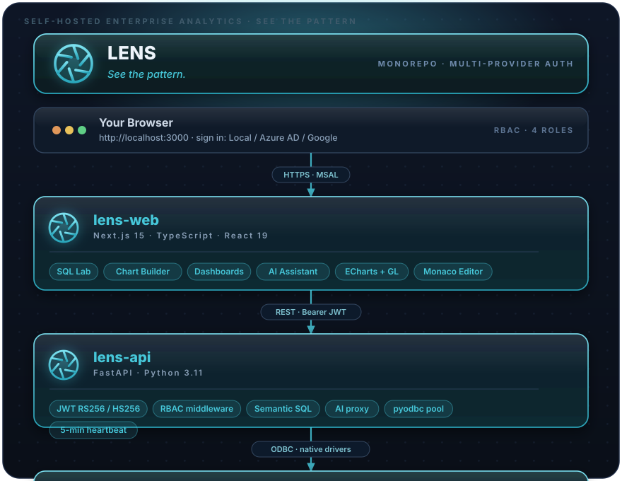

<div align="center">


### **See the pattern.**

*Built for Advanced Analytics. Multi-Provider Auth. Open Source.*

<br>

[](https://github.com/PruthviProdduturi/Lens/actions/workflows/ci.yml) [](LICENSE) [](https://lens-analytics.vercel.app)

<br>

[](https://nextjs.org/)
[](https://www.typescriptlang.org/)
[](https://www.python.org/)
[](https://fastapi.tiangolo.com/)
[](https://azure.microsoft.com/en-us/products/active-directory)
[](https://learn.microsoft.com/en-us/fabric/)
[](./LICENSE)


[**Quick Start**](#-quick-start) · [**Architecture**](#-architecture) · [**Features**](#-features) · [**Setup Guide**](#-step-by-step-setup) · [**API Reference**](#-api-reference) · [**Troubleshooting**](#-troubleshooting)

</div>

---

## 🌟 What is Lens?

Lens is a **self-hosted enterprise analytics platform** built for teams running on **Microsoft Fabric SQL**, Azure SQL, PostgreSQL, MySQL, Trino, and StarRocks. Think of it as your team's private data command centre — where everyone queries live data, builds charts, assembles dashboards, and uses AI to accelerate analysis — secured through **your choice of authentication provider**.

Everything is configurable from the UI. No config file changes, no restarts needed for auth setup. First-run deploys with **local login out of the box** — switch to Azure AD or Google OAuth any time from Settings.

> *Lens sits between your team and your data — making it fast to explore, easy to visualise, and safe to share.*

---

## ⚡ Features

<table>
<tr>
<td width="50%">

### 🔐 Enterprise Security
- **Multi-provider authentication** — Local login, Azure AD / Entra ID, Google OAuth2
- Provider switchable at runtime from **Settings → Authentication** (admin only) — no restart needed
- **Default first-run credentials:** `admin` / `admin` (local provider, change on first login)
- Full JWT verification: RS256 via JWKS (Azure AD & Google), HS256 (local)
- **Role-Based Access Control:** 4 roles — Viewer, Analyst, Editor, Admin
- Content visibility model: private / internal / published per dataset, chart, and dashboard
- Secrets (Google client secret, JWT signing key) encrypted at rest with Fernet/AES
- Security headers, hardened CORS, parameterised queries throughout

</td>
<td width="50%">

### 🚀 SQL Lab
- Monaco Editor (VS Code-grade) with SQL syntax highlighting
- Multi-tab query sessions with per-tab history
- Real-time results with column sorting and search
- Save queries, browse full history with source tracking
- **Inline AI bar** — press the ✦ wand button, type a prompt, get generated SQL injected straight into the active tab

</td>
</tr>
<tr>
<td width="50%">

### 🤖 AI Assistant
- Natural language → SQL via `/ai` page with full conversation history
- Context-aware: pass current SQL + data source into every prompt
- Multi-provider: Anthropic (Claude), OpenAI (GPT-4o), GitHub Models (Copilot)
- Global keys (admin-managed) + personal keys (per-user override)
- Keys encrypted at rest with AES-256 before storage
- Inline AI bar in SQL Lab for instant query generation

</td>
<td width="50%">

### 📊 Chart Builder
- 20+ chart types: bar, line, area, pie, scatter, heatmap, funnel, gauge, treemap, waterfall, calendar, world map globe (3D WebGL), and more
- Drag-and-drop metric and dimension configuration
- Smart JOIN generation from your semantic dataset definition
- Live filter dropdowns sourced directly from your data
- Advanced options: annotations, reference lines, goal markers, colour schemes

</td>
</tr>
<tr>
<td width="50%">

### 🗂️ Semantic Datasets
- Define dimensions, metrics, and filter columns once
- Automatic SQL generation with multi-table JOIN support
- COALESCE-based role-playing dimension handling
- Reusable across unlimited charts and dashboards
- Visibility control: draft / internal / published

</td>
<td width="50%">

### 🖥️ Dashboards
- Drag-and-drop canvas with resizable chart tiles, row/column containers, and tab components
- Rich content blocks: **markdown text**, section headers (H1/H2/H3 with alignment + colour picker), styled dividers
- Per-chart **⋯ context menu**: refresh, full-screen, view query, view as table, download CSV/PNG, share, duplicate, remove
- **Cross-chart filtering** — click a bar/slice to instantly filter all related charts
- Dashboard-level filter bar — shared filters slice every chart simultaneously
- Parallel chart preloading on open — all charts fetch in one pass for instant rendering
- Publish, favourite, and inline-rename dashboards

</td>
</tr>
<tr>
<td width="50%">

### 🔌 Multi-Source Data
- **Microsoft Fabric SQL** (Analytics Endpoint & Data Warehouse)
- **Azure SQL Database**
- **PostgreSQL**
- **MySQL / MariaDB**
- **Trino** (coordinator URL + catalog)
- **StarRocks** (FE host)
- Register sources through the UI — no `.env` changes needed
- Per-database connection pooling with startup warmup

</td>
<td width="50%">

### 🛠️ Admin Controls
- **Authentication:** switch provider (Local / Azure AD / Google) and configure credentials — all from the UI, no `.env` changes
- **Local Users:** create, deactivate, and reset passwords for local-auth users from the admin panel
- **User Management:** assign / revoke roles per user; Azure AD App Roles always take precedence
- **Metadata Server:** view and reconfigure the Lens metadata database from the UI — supports all six DB types, live connection test, in-place API restart
- **Data Sources:** full CRUD with connection testing
- **AI Providers:** manage global and personal API keys

</td>
</tr>
<tr>
<td width="50%">

### 🎨 Personalisation
- Per-user colour theme (full palette picker, applies instantly)
- Favourites system for datasets, charts, and dashboards
- Query history per user with full audit trail
- Workspace activity feed on the home page

</td>
<td width="50%">

### ⚡ Performance
- Connection pool warming at API startup — sub-second queries after cold start
- Parallel metadata fetching on page load
- 5-minute heartbeat keeps Fabric serverless connections alive
- All data is live — no stale cache, ever

</td>
</tr>
</table>

---

## 🏛️ Architecture

Lens is a **monorepo** with two services:

<p align="center"></p>

### Two databases

| Database | Purpose | Configured via |
|---|---|---|
| **Metadata DB** | Stores Lens app data: datasets, charts, dashboards, query history, themes, roles | Setup wizard or **Settings → Metadata Server** (admin) |
| **Your Data Sources** | Your actual warehouses, lakehouses, databases | UI at `/data-sources` |

---

## 📋 Prerequisites

| Requirement | Version | Check | Install |
|---|---|---|---|
| **Python** | 3.11+ | `python --version` | [python.org](https://www.python.org/) |
| **ODBC Driver 18** | 18.x | See below | [Microsoft docs](https://learn.microsoft.com/sql/connect/odbc/download-odbc-driver-for-sql-server) |
| **Node.js** | 20.x+ | `node -v` | [nodejs.org](https://nodejs.org/) |
| **pnpm** | 9.x+ | `pnpm -v` | `npm install -g pnpm` |
| **Git** | Any | `git --version` | [git-scm.com](https://git-scm.com/) |
| **Fabric SQL access** | — | — | Contact your Fabric workspace admin |

#### Verify ODBC Driver 18

**Windows:** Start → `ODBC Data Sources (64-bit)` → **Drivers** tab → look for `ODBC Driver 18 for SQL Server`

**macOS / Linux:**
```bash
odbcinst -q -d -n "ODBC Driver 18 for SQL Server"
```

> ⚠️ ODBC Driver 18 is required for Fabric SQL and Azure SQL. PostgreSQL, MySQL, Trino, and StarRocks use their own native drivers included in `requirements.txt`.

---

## 🔑 Azure AD App Registration

> **Optional** — Lens defaults to local login. Configure Azure AD only if your team uses Microsoft Entra ID. Skip this section to use local auth.

Lens supports Azure AD as an optional authentication provider. This is a **one-time setup** by your Azure admin.

<details>
<summary><strong>Click to expand — App Registration steps</strong></summary>

<br>

1. Go to [portal.azure.com](https://portal.azure.com) → **Microsoft Entra ID** → **App registrations** → **New registration**

2. Fill in:
   - **Name:** `Lens`
   - **Supported account types:** `Accounts in this organizational directory only`
   - **Redirect URI:** `Single-page application (SPA)` → `http://localhost:3000`

3. Click **Register**. Note down:
   - **Application (client) ID** → your `AZURE_CLIENT_ID`
   - **Directory (tenant) ID** → your `AZURE_TENANT_ID`

4. **API permissions** → **Add a permission** → **Azure SQL Database** → **Delegated** → `user_impersonation` → **Add permissions**

5. If you are an admin: **Grant admin consent for [your org]**

6. **Expose an API** → **Add a scope** → accept the default App ID URI → add scope `access_as_user`

7. **App roles** → **Create app role** → create all four roles below:

   | Display name | Value | Description |
   |---|---|---|
   | Lens Viewer | `Lens.Viewer` | Read-only access to published dashboards and charts |
   | Lens Analyst | `Lens.Analyst` | Run ad-hoc SQL, build charts and datasets |
   | Lens Editor | `Lens.Editor` | All Analyst permissions + publish content |
   | Lens Admin | `Lens.Admin` | Full access including user management, data source and metadata server configuration |

   > Any authenticated user without an assigned role defaults to **Viewer** automatically.

</details>

---

## 🚀 Quick Start

```bash
# 1. Clone
git clone <your-repo-url>
cd Lens

# 2. Install Node.js dependencies (frontend only)
pnpm install

# 3. Configure environment (Azure AD optional — local login works with no config)
cp .env.example .env
# → Edit .env if using Azure AD; leave AZURE_* blank for local login

# 4. Set up Python API
cd apps/lens-api
python -m venv venv
venv\Scripts\activate        # Windows
# source venv/bin/activate   # macOS / Linux
pip install -r requirements.txt
cd ../..

# 5. Start both services — two terminals
python apps/lens-api/main.py    # Terminal 1 (API)
pnpm --filter lens-web dev      # Terminal 2 (Web)
```

Open **http://localhost:3000**. Sign in with **username `admin`, password `admin`** (local login). You will be prompted to change the password on first login. ✓

> To switch to Azure AD or Google OAuth, go to **Settings → Authentication** (Admin) after setting up your metadata database.

---

## 📖 Step-by-Step Setup

### 1 · Clone the Repository

```bash
git clone <your-github-repo-url>
cd Lens
```

### 2 · Install Node.js Dependencies

```bash
pnpm install
```

### 3 · Configure Environment Variables

Lens uses a **single `.env` file at the repository root**. Both services read from it.

```bash
cp .env.example .env
```

```env
# ── Azure AD ─────────────────────────────────────────────────────────────────
# Shared by both the API (JWT verification) and the Next.js frontend (MSAL)
AZURE_TENANT_ID=xxxxxxxx-xxxx-xxxx-xxxx-xxxxxxxxxxxx
AZURE_CLIENT_ID=xxxxxxxx-xxxx-xxxx-xxxx-xxxxxxxxxxxx

# ── Metadata Database (optional — setup wizard configures this on first login) ─
# METADATA_DB_TYPE=fabric_sql
# METADATA_ENDPOINT=your-workspace.msit-database.fabric.microsoft.com
# METADATA_DATABASE=YourMetadataDatabase

# ── Ports ─────────────────────────────────────────────────────────────────────
API_PORT=8080
WEB_PORT=3000

# ── Internal URLs ─────────────────────────────────────────────────────────────
API_URL=http://localhost:8080
WEB_URL=http://localhost:3000
```

> 💡 Leave `METADATA_*` variables commented out. The **setup wizard** will appear on first login and let you pick your DB type, enter connection details, and initialise the schema — all from the browser.

### 4 · Set Up the Python API

```bash
cd apps/lens-api

# Create virtual environment
python -m venv venv

# Activate (Windows)
venv\Scripts\activate

# Activate (macOS / Linux)
# source venv/bin/activate

# Install dependencies
pip install -r requirements.txt

cd ../..
```

### 5 · Apply the Database Schema

> The setup wizard applies the schema automatically (recommended). Manual steps are below.

**Option A — Setup Wizard (recommended):** Leave `METADATA_*` variables commented out. The wizard appears on first login and applies the schema for you.

**Option B — Manual apply:**

1. Open **Azure Data Studio** (or your DB client)
2. Connect to your metadata database
3. Open `apps/lens-api/schema.sql`
4. Run the file

**Tables created:**

| Table | Purpose |
|---|---|
| `datasets` | Semantic layer definitions — dimensions, metrics, filters |
| `charts` | Chart configurations (query + visualisation settings) |
| `dashboards` | Dashboard layouts and filter settings |
| `saved_queries` | User-saved SQL queries from SQL Lab |
| `query_history` | Full audit log of every executed query |
| `favorites` | Per-user favourites for any object type |
| `data_sources` | Registered data warehouses and databases |
| `user_themes` | Per-user colour theme preferences |
| `local_users` | Local-auth accounts with role column (dev/bootstrap only) |
| `ai_providers` | Global AI provider API keys (admin-managed) |
| `user_ai_keys` | Per-user AI provider keys (personal override) |
| `auth_config` | Singleton row: active provider, Azure/Google fields, encrypted JWT secret |

### 6 · Start Both Services

**Terminal 1 — API (Python/FastAPI)**
```bash
cd apps/lens-api
venv\Scripts\activate   # Windows  |  source venv/bin/activate  (macOS/Linux)
python main.py
```
```
============================================
Lens API
============================================
Server: http://localhost:8080
Health: http://localhost:8080/api/health
Docs:   http://localhost:8080/docs
============================================
[API] Connection pool warmup started.
```

**Terminal 2 — Web (Next.js)**
```bash
pnpm --filter lens-web dev
```
```
▲ Next.js 15.x.x
  Local: http://localhost:3000
  Ready in 2s
```

### 7 · Verify

| Service | URL | Expected |
|---|---|---|
| API | http://localhost:8080/api/health | `{"status": "ok"}` |
| API Docs | http://localhost:8080/docs | Swagger UI |
| Web | http://localhost:3000 | Lens login page |

---

## 🎯 Your First 15 Minutes

```
A  Sign in               →  admin / admin (local) — or Azure AD / Google if configured
B  Add a Data Source     →  /data-sources  →  + Add Data Source
C  Verify in SQL Lab       →  /lab  →  pick database  →  run SELECT TOP 10 *
D  Create a Dataset        →  /datasets  →  + New Dataset  →  set dimensions + metrics
E  Build a Chart           →  /charts  →  + New Chart  →  pick dataset + chart type
F  Assemble a Dashboard    →  /dashboards  →  + New Dashboard  →  drag charts
G  Try AI in SQL Lab       →  /lab  →  click ✦ AI  →  describe what you want
```

---

## 🗺️ Navigation Reference

| Page | URL | Access |
|---|---|---|
| **Home** | `/` | All |
| **SQL Lab** | `/lab` | Analyst+ |
| **Saved Queries** | `/lab/queries` | Analyst+ |
| **Query History** | `/lab/queries?view=history` | Analyst+ |
| **AI Assistant** | `/ai` | Analyst+ |
| **Datasets** | `/datasets` | Analyst+ |
| **Charts** | `/charts` | Analyst+ |
| **Dashboards** | `/dashboards` | All |
| **Favourites** | `/favorites` | All |
| **Data Sources** | `/data-sources` | All (Admin to edit) |
| **AI Providers** | `/settings/ai` | All (Admin for global keys) |
| **Metadata Server** | `/settings/metadata` | Admin |
| **Authentication** | `/settings/auth` | Admin |
| **About / Features** | `/about` | All |

---

## 📡 API Reference

The FastAPI backend auto-generates Swagger UI at `http://localhost:8080/docs`. Key endpoint groups:

### Authentication
| Method | Endpoint | Auth | Description |
|---|---|---|---|
| `GET` | `/api/auth/provider` | None | Returns the active auth provider (`local`, `azure_ad`, `google`) |
| `POST` | `/api/auth/login` | None | Local login — body `{username, password}` → returns JWT |
| `POST` | `/api/auth/change-password` | Bearer | Local auth password change |
| `GET` | `/api/v1/auth/me` | Bearer | Returns the current user's email and resolved role |
| `GET` | `/api/v1/auth/roles` | Bearer | Returns all valid roles |
| `GET` | `/api/v1/admin/auth` | Admin | Get current auth provider config (secrets masked) |
| `POST` | `/api/v1/admin/auth` | Admin | Update auth provider config |
| `GET` | `/api/v1/admin/local-users` | Admin | List local users |
| `POST` | `/api/v1/admin/local-users` | Admin | Create a local user |
| `DELETE` | `/api/v1/admin/local-users/{id}` | Admin | Deactivate a local user |
| `POST` | `/api/v1/admin/local-users/{id}/reset-password` | Admin | Reset a local user's password |

### Setup & Admin
| Method | Endpoint | Auth | Description |
|---|---|---|---|
| `GET` | `/api/v1/setup/status` | None | Check if metadata DB is configured |
| `POST` | `/api/v1/setup/test` | None | Test a metadata DB connection (setup mode only) |
| `POST` | `/api/v1/setup/initialize` | None | Initialise schema + write `.env` (setup mode only) |
| `GET` | `/api/v1/admin/metadata` | Admin | Get current metadata server config |
| `POST` | `/api/v1/admin/metadata/test` | Admin | Test a new metadata connection |
| `POST` | `/api/v1/admin/metadata/update` | Admin | Reconfigure metadata server + restart API |

### Data Sources
| Method | Endpoint | Auth | Description |
|---|---|---|---|
| `GET` | `/api/v1/data-sources` | User | List all data sources with favourite flag |
| `GET` | `/api/v1/data-sources/active` | User | List active data sources only |
| `GET` | `/api/v1/data-sources/{id}` | User | Get a single data source |
| `POST` | `/api/v1/data-sources` | Admin | Create data source |
| `PATCH` | `/api/v1/data-sources/{id}` | Admin | Update data source |
| `DELETE` | `/api/v1/data-sources/{id}` | Admin | Delete data source |
| `POST` | `/api/v1/data-sources/{id}/favorite` | User | Set as favourite |
| `DELETE` | `/api/v1/data-sources/{id}/favorite` | User | Remove favourite |

### Datasets
| Method | Endpoint | Auth | Description |
|---|---|---|---|
| `GET` | `/api/v1/datasets` | User | List datasets (filtered by visibility + role) |
| `GET` | `/api/v1/datasets/{id}` | User | Get dataset detail |
| `POST` | `/api/v1/datasets` | Analyst+ | Create dataset |
| `PUT` | `/api/v1/datasets/{id}` | Analyst+ | Update dataset |
| `DELETE` | `/api/v1/datasets/{id}` | Editor+ | Delete dataset |
| `POST` | `/api/v1/datasets/{id}/preview` | Analyst+ | Run dataset preview query |
| `GET` | `/api/v1/datasets/{id}/columns` | Analyst+ | Get column list for a dataset |

### Charts
| Method | Endpoint | Auth | Description |
|---|---|---|---|
| `GET` | `/api/v1/charts` | User | List charts |
| `GET` | `/api/v1/charts/{id}` | User | Get chart config |
| `POST` | `/api/v1/charts` | Analyst+ | Create chart |
| `PUT` | `/api/v1/charts/{id}` | Analyst+ | Update chart |
| `DELETE` | `/api/v1/charts/{id}` | Editor+ | Delete chart |
| `POST` | `/api/v1/charts/{id}/data` | User | Run chart query and return data |

### Dashboards
| Method | Endpoint | Auth | Description |
|---|---|---|---|
| `GET` | `/api/v1/dashboards` | User | List dashboards |
| `GET` | `/api/v1/dashboards/{id}` | User | Get dashboard with layout |
| `POST` | `/api/v1/dashboards` | Analyst+ | Create dashboard |
| `PUT` | `/api/v1/dashboards/{id}` | Analyst+ | Update dashboard |
| `DELETE` | `/api/v1/dashboards/{id}` | Editor+ | Delete dashboard |

### SQL Lab
| Method | Endpoint | Auth | Description |
|---|---|---|---|
| `POST` | `/api/v1/lab/execute` | Analyst+ | Execute a SQL query, log to history |
| `GET` | `/api/v1/lab/saved-queries` | Analyst+ | List saved queries |
| `POST` | `/api/v1/lab/saved-queries` | Analyst+ | Save a query |
| `DELETE` | `/api/v1/lab/saved-queries/{id}` | Analyst+ | Delete saved query |
| `GET` | `/api/v1/lab/history` | Analyst+ | Full query history for current user |
| `GET` | `/api/v1/sql/tables` | Analyst+ | List tables in a database |
| `GET` | `/api/v1/sql/columns` | Analyst+ | List columns for a table |

### AI
| Method | Endpoint | Auth | Description |
|---|---|---|---|
| `POST` | `/api/v1/ai/chat` | Analyst+ | Send a message + optional SQL/data source context |
| `GET` | `/api/v1/ai/providers` | User | List configured global AI providers |
| `POST` | `/api/v1/ai/providers` | Admin | Add global AI provider key |
| `DELETE` | `/api/v1/ai/providers/{id}` | Admin | Remove global AI provider key |
| `GET` | `/api/v1/ai/my-keys` | User | List current user's personal keys |
| `PUT` | `/api/v1/ai/my-keys` | User | Set/update personal AI key |
| `DELETE` | `/api/v1/ai/my-keys/{provider}` | User | Remove personal AI key |

### Users (Admin)
| Method | Endpoint | Auth | Description |
|---|---|---|---|
| `GET` | `/api/v1/users` | Admin | List all role assignments |
| `PUT` | `/api/v1/users/{email}/role` | Admin | Assign or update a user role |
| `DELETE` | `/api/v1/users/{email}/role` | Admin | Revoke a user role (falls back to Viewer) |

### Misc
| Method | Endpoint | Auth | Description |
|---|---|---|---|
| `GET` | `/api/health` | None | Health check |
| `GET` | `/api/v1/favorites` | User | List all favourites for current user |
| `GET` | `/api/v1/theme` | User | Get current user's theme |
| `PUT` | `/api/v1/theme` | User | Update current user's theme |
| `GET` | `/api/v1/metadata/summary` | User | Home page summary counts |
| `GET` | `/api/v1/workspace/activity` | User | Recent activity feed |

---

## 📁 Project Structure

```
Lens/
├── .env.example                    ← Copy to .env and fill in your values
├── .env                            ← Your local config (gitignored)
├── pnpm-workspace.yaml             ← pnpm monorepo workspace config
│
├── apps/
│   │
│   ├── lens-web/                  ← Next.js 15 frontend (TypeScript)
│   │   ├── app/                    ← App Router pages
│   │   │   ├── about/              ← Feature showcase + API reference page
│   │   │   ├── ai/                 ← AI assistant (NL → SQL, chat)
│   │   │   ├── charts/             ← Chart builder and list
│   │   │   ├── dashboards/         ← Dashboard builder and viewer
│   │   │   ├── datasets/           ← Dataset configuration
│   │   │   ├── data-sources/       ← Data source registration
│   │   │   ├── favorites/          ← User favourites
│   │   │   ├── lab/                ← SQL Lab (Monaco editor + inline AI)
│   │   │   ├── settings/
│   │   │   │   ├── ai/             ← AI provider key management
│   │   │   │   ├── users/          ← Admin: user role management
│   │   │   │   ├── metadata/       ← Admin: metadata server configuration
│   │   │   │   └── auth/           ← Admin: auth provider + local user management
│   │   │   └── workspace-activity/ ← Activity feed
│   │   ├── auth/                   ← Multi-provider auth hook (local / Azure AD / Google)
│   │   ├── components/             ← Reusable React components
│   │   │   ├── DataSourceIcons.tsx ← Brand SVG icons (Fabric, Azure, PG, MySQL, Trino, StarRocks)
│   │   │   ├── ListPageShell.tsx   ← Standard admin page shell (header + loading/error/empty)
│   │   │   ├── SetupModal.tsx      ← First-run metadata DB setup wizard
│   │   │   ├── charts/             ← Chart builder components
│   │   │   └── dashboards/         ← Dashboard canvas + item components
│   │   ├── contexts/               ← Theme, auth context providers
│   │   ├── hooks/                  ← useRole, useTheme, etc.
│   │   └── utils/                  ← MSAL fetch, colour utilities
│   │
│   └── lens-api/                  ← Python/FastAPI REST API
│       ├── main.py                 ← FastAPI entry point + router registration
│       ├── config.py               ← Pydantic settings (reads root .env)
│       ├── requirements.txt        ← Python dependencies
│       ├── schema.sql              ← Fabric SQL / Azure SQL schema
│       ├── schema_postgresql.sql   ← PostgreSQL schema
│       ├── schema_mysql.sql        ← MySQL schema
│       ├── database/               ← Connection pool + metadata queries
│       │   ├── pool.py             ← pyodbc pool with Azure AD token auth
│       │   ├── metadata.py         ← Parameterised metadata DB helpers
│       │   └── warmup.py           ← Startup warmup + 5-min heartbeat
│       ├── middleware/
│       │   ├── auth.py             ← JWT verification: RS256/JWKS (Azure AD, Google) + HS256 (local)
│       │   ├── permissions.py      ← RBAC dependency: resolves role, enforces minimum
│       │   ├── rate_limit.py       ← Per-user in-memory rate limiter
│       │   └── errors.py           ← Exception handlers (no detail leakage)
│       ├── routers/                ← One file per domain
│       │   ├── auth.py             ← /auth/me, /auth/roles
│       │   ├── local_auth.py       ← /auth/login, /auth/change-password (local provider)
│       │   ├── auth_config.py      ← /auth/provider (public) + /admin/auth + /admin/local-users
│       │   ├── health.py           ← /health
│       │   ├── setup.py            ← /setup/*, /admin/metadata/*
│       │   ├── data_sources.py     ← /data-sources/*
│       │   ├── datasets.py         ← /datasets/*
│       │   ├── charts.py           ← /charts/*
│       │   ├── dashboards.py       ← /dashboards/*
│       │   ├── lab.py              ← /lab/* (SQL execute, saved queries, history)
│       │   ├── sql.py              ← /sql/* (tables, columns)
│       │   ├── ai.py               ← /ai/* (chat, providers, personal keys)
│       │   ├── users.py            ← /users/* (role management)
│       │   ├── favorites.py        ← /favorites/*
│       │   ├── theme.py            ← /theme
│       │   └── metadata_summary.py ← /metadata/summary, /workspace/activity
│       └── services/               ← Business logic layer
│           ├── query_generator.py  ← Star-schema SQL builder
│           ├── ai_service.py       ← AI provider routing + key resolution
│           ├── auth_config.py      ← Active provider cache, config upsert, secret encryption
│           ├── local_auth.py       ← bcrypt password hashing, bootstrap admin/admin, user CRUD
│           └── ...
│
└── packages/
    └── types/                      ← Shared TypeScript type definitions
```

---

## ⚙️ Environment Variable Reference

| Variable | Required | Default | Description |
|---|---|---|---|
| `AZURE_TENANT_ID` | ⬜ | — | Azure AD tenant ID — required only when using Azure AD provider |
| `AZURE_CLIENT_ID` | ⬜ | — | App Registration client ID — required only when using Azure AD provider |
| `AI_ENCRYPTION_SECRET` | ⬜ | auto-generated | Secret used to derive the Fernet key for encrypting AI keys and auth secrets at rest |
| `METADATA_DB_TYPE` | ⬜ | `fabric_sql` | Metadata DB type: `fabric_sql`, `azure_sql`, `postgresql`, `mysql` |
| `METADATA_ENDPOINT` | ⬜ | — | SQL endpoint for Fabric SQL or Azure SQL metadata database |
| `METADATA_DATABASE` | ⬜ | — | Database name in the metadata endpoint |
| `METADATA_HOST` | ⬜ | — | Host for PostgreSQL or MySQL metadata database |
| `METADATA_PORT` | ⬜ | — | Port for PostgreSQL (`5432`) or MySQL (`3306`) |
| `API_PORT` | ⬜ | `8080` | Port for the FastAPI service |
| `WEB_PORT` | ⬜ | `3000` | Port for the Next.js web app |
| `API_URL` | ✅ | `http://localhost:8080` | Full URL of the API, used by the web app |
| `WEB_URL` | ✅ | `http://localhost:3000` | Full URL of the web app, used for CORS |

> `METADATA_*` and `AZURE_*` variables are written automatically through the setup wizard and admin settings pages. You rarely need to set them manually.

> Data warehouse endpoints are **never** configured here. Register them through the UI at `/data-sources`.

> **Local auth requires no environment variables at all.** The JWT signing key is auto-generated on first run and stored encrypted in the `auth_config` table.

---

## 🛠️ Available Scripts

Run from the **repository root**:

| Command | Description |
|---|---|
| `pnpm dev` | Start Next.js frontend in development mode |
| `pnpm build` | Build the frontend for production |
| `pnpm check-types` | TypeScript type checking |
| `pnpm clean` | Delete all build artifacts |

**Python API** (from `apps/lens-api/`):

| Command | Description |
|---|---|
| `python main.py` | Start API in development mode (uvicorn with reload) |
| `gunicorn main:app -w 4 -k uvicorn.workers.UvicornWorker` | Production start |

---

## 🔧 Troubleshooting

<details>
<summary><strong>🔴 Local login fails — "Invalid credentials"</strong></summary>

- On first run, use **username: `admin`** / **password: `admin`**
- If the metadata DB has not been configured yet, local auth uses an in-memory bootstrap check — you must sign in as admin to configure the metadata server first
- After configuring the metadata DB, the `local_users` table is created and the admin account is seeded automatically on the next API start
- If you reset the admin password via **Settings → Authentication → Local Users**, the new password takes effect immediately

</details>

<details>
<summary><strong>🔴 Auth provider shows "azure_ad" but I only have local setup</strong></summary>

- Go to **Settings → Authentication** and confirm the active provider is set to **Local Login**
- If you cannot log in at all (Azure AD misconfigured), temporarily set `AZURE_TENANT_ID=` and `AZURE_CLIENT_ID=` to empty in `.env` and restart — the API falls back to local
- Clear `lens_auth_provider` from `localStorage` in DevTools → Application → Local Storage

</details>

<details>
<summary><strong>🔴 ODBC Driver not found / API fails to connect to Fabric / Azure SQL</strong></summary>

- Verify ODBC Driver 18 is installed (see [Prerequisites](#-prerequisites))
- Make sure the Python virtual environment is activated before starting the API
- On Windows, try running the terminal **as Administrator** during initial setup

</details>

<details>
<summary><strong>🔴 Login redirects to error or blank screen</strong></summary>

- Confirm `http://localhost:3000` is registered as a redirect URI in your App Registration under **Authentication → Single-page application**
- Clear browser cookies and localStorage for `localhost:3000`
- Double-check `AZURE_CLIENT_ID` and `AZURE_TENANT_ID` in `.env`

</details>

<details>
<summary><strong>🔴 API returns 401 Unauthorized</strong></summary>

- Your Azure AD token may have expired — sign out and sign back in
- If `AZURE_CLIENT_ID` / `AZURE_TENANT_ID` are not set, the API falls back to unverified JWT decode (setup mode only)
- If you changed `.env`, restart the API service (it does not hot-reload env vars)

</details>

<details>
<summary><strong>🔴 Cannot connect to metadata database</strong></summary>

- Check **Settings → Metadata Server** in the Lens UI (Admin) — use the built-in connection tester
- Confirm your Azure AD account (or Managed Identity in production) has `db_datareader` + `db_datawriter` + `db_ddladmin` on the metadata database
- Test the connection directly in Azure Data Studio to rule out network issues

</details>

<details>
<summary><strong>🔴 Queries time out on first run</strong></summary>

Fabric serverless endpoints have a cold start (~10s on first connection). Lens warms the connection pool at API startup. Wait a few seconds after seeing `[API] Connection pool warmup started.` in the API logs before running your first query.

</details>

<details>
<summary><strong>🔴 AI chat returns "No AI provider configured"</strong></summary>

- Go to **Settings (⚙) → AI Providers** in the Lens header
- Add a global key (Admin) or a personal key (any user)
- Supported: Anthropic (Claude), OpenAI (GPT-4o), GitHub Models

</details>

<details>
<summary><strong>🔴 Build errors after pulling new changes</strong></summary>

```bash
# Remove all node_modules and reinstall
rm -rf node_modules apps/*/node_modules packages/*/node_modules
pnpm install

# Clear Next.js cache
rm -rf apps/lens-web/.next

# Reinstall Python dependencies
cd apps/lens-api && pip install -r requirements.txt

# Re-check types
pnpm check-types
```

</details>

<details>
<summary><strong>🔴 Port already in use</strong></summary>

**Windows:**
```bash
netstat -ano | findstr :8080
taskkill /PID <PID> /F
```

**macOS / Linux:**
```bash
lsof -ti :8080 | xargs kill -9
```

Or change `API_PORT` in `.env` and restart.

</details>

---

## 🧰 Tech Stack

### Frontend — `lens-web`

| Technology | Version | Role |
|---|---|---|
| [Next.js](https://nextjs.org/) | 15.x | React framework, App Router |
| [React](https://react.dev/) | 19.x | UI component library |
| [TypeScript](https://www.typescriptlang.org/) | 5.x | End-to-end type safety |
| [@azure/msal-browser](https://github.com/AzureAD/microsoft-authentication-library-for-js) | 5.x | Azure AD authentication |
| [ECharts](https://echarts.apache.org/) | 5.x | Data visualisation (20+ chart types) |
| [ECharts-GL](https://github.com/ecomfe/echarts-gl) | 2.x | 3D WebGL charts (world map globe) |
| [Monaco Editor](https://microsoft.github.io/monaco-editor/) | 0.52.x | VS Code-grade SQL editor |
| [react-grid-layout](https://github.com/react-grid-layout/react-grid-layout) | 2.x | Drag-and-drop dashboard builder |
| [react-colorful](https://omgovich.github.io/react-colorful/) | 5.x | Colour picker for user themes |

### Backend — `lens-api`

| Technology | Version | Role |
|---|---|---|
| [FastAPI](https://fastapi.tiangolo.com/) | 0.115+ | ASGI HTTP framework |
| [Python](https://www.python.org/) | 3.11+ | Runtime |
| [Uvicorn](https://www.uvicorn.org/) | 0.30+ | ASGI server |
| [Gunicorn](https://gunicorn.org/) | 22+ | Production process manager |
| [pyodbc](https://github.com/mkleehammer/pyodbc) | 5.x | ODBC Driver 18 wrapper for Fabric / Azure SQL |
| [azure-identity](https://pypi.org/project/azure-identity/) | 1.x | DefaultAzureCredential for Managed Identity |
| [PyJWT](https://pyjwt.readthedocs.io/) | 2.x | JWT decoding and RS256 signature verification |
| [cryptography](https://cryptography.io/) | 42+ | AES-256 encryption for AI provider keys |
| [pydantic-settings](https://docs.pydantic.dev/latest/concepts/pydantic_settings/) | 2.x | Typed config from environment variables |
| [python-dotenv](https://pypi.org/project/python-dotenv/) | 1.x | Reads root `.env` file |

---

<div align="center">

**Built for Advanced Analytics. Multi-Provider Auth. Open Source.**

*Lens — See the pattern.*

</div>
