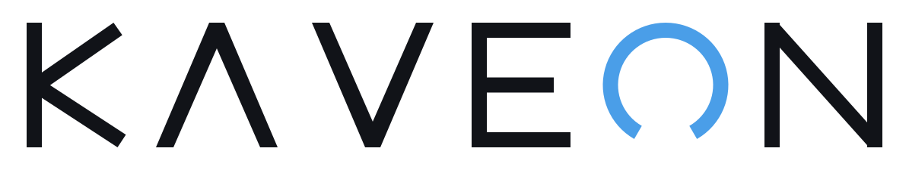
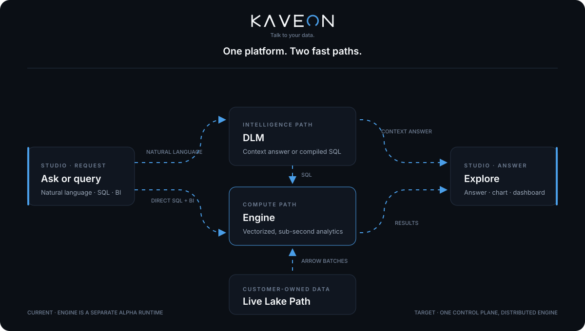
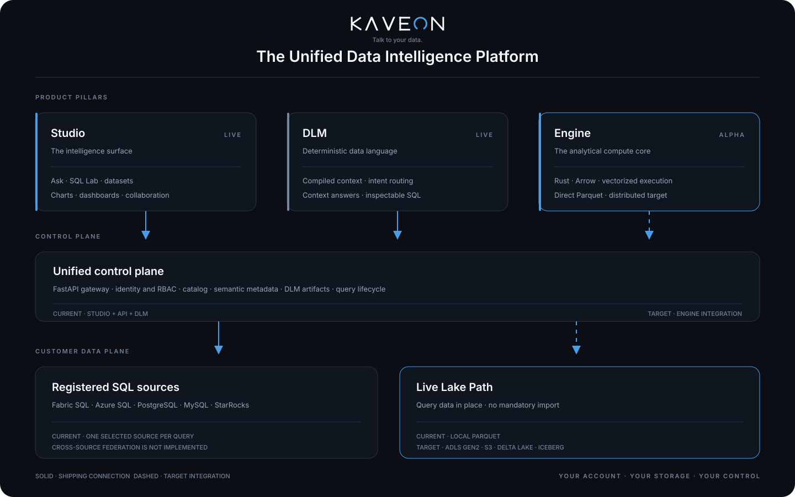

<div align="center">

<picture>
  <source media="(prefers-color-scheme: dark)" srcset="docs/reference/kaveon-logo-dark.svg">
  
</picture>

### One platform to ask, compute, and explore

Kaveon combines a columnar analytical engine, deterministic data intelligence, and a complete BI studio—while keeping data in the systems you own.

[](https://github.com/PruthviProdduturi/Kaveon/actions/workflows/engine.yml)
[](https://github.com/PruthviProdduturi/Kaveon/actions/workflows/ci.yml)
[](LICENSE)
[](https://kaveon.vercel.app)

[**Open Kaveon**](https://kaveon.vercel.app) · [**Read the docs**](https://kaveon.vercel.app/docs) · [**Architecture**](ARCHITECTURE.md) · [**Project status**](STATUS.md)

</div>

<div align="center">
  
</div>

## Three pillars, one system

| Pillar | Responsibility | Current state |
|---|---|---|
| **Kaveon Engine** | Vectorized Rust query engine over Arrow `RecordBatch` data; direct local Parquet reads, SQL, CLI, and HTTP server | Alpha |
| **Kaveon DLM** | Deterministic dataset context compilation and natural-language-to-SQL routing without an LLM | Integrated in the Python API |
| **Kaveon Studio** | Next.js analytics experience for questions, SQL, datasets, charts, and dashboards | Live preview |

The product direction is direct lakehouse analytics: read Parquet, Delta Lake, and Iceberg from local storage, ADLS Gen2, and S3 without an import step. Today, the Rust Engine reads local Parquet; cloud object stores and table formats are planned and must not be confused with shipped support.

## Why Kaveon

- **One intelligence surface.** Ask a question, inspect the generated SQL, explore the result, and publish a dashboard without changing products.
- **Deterministic by design.** The DLM compiles dataset metadata and value context, then follows inspectable rules rather than probabilistic token generation.
- **Data stays yours.** Kaveon queries registered databases today and is being built to read customer-owned lakehouse storage directly.
- **Engine and platform modes.** Run the Rust Engine as a standalone analytical database, or pair it with DLM and Studio for the full experience.
- **Honest maturity.** Implemented, experimental, and target capabilities are separated in [STATUS.md](STATUS.md) and [ARCHITECTURE.md](ARCHITECTURE.md).

The deterministic DLM path requires no LLM. Kaveon's optional AI-assistant features can use configured hosted models; those are separate from DLM routing.

## How a question becomes an answer

```text
Question or SQL
      │
      ├── natural language ──► DLM context resolution ──► context answer or SQL
      │
      └── SQL ───────────────────────────────────────────────────────┘
                                                                       │
                                      registered source or Kaveon Engine
                                                                       │
                                               result rows / Arrow batches
                                                                       │
                                             answer, chart, or dashboard
```

The shipping web path is Studio → same-origin Next.js proxy → FastAPI/DLM → one selected registered SQL source. The Rust Engine currently has separate CLI and HTTP entry points; integrating it as the platform execution backend is target architecture.

## Engine quick start

Requires a current stable Rust toolchain.

```bash
cd engine
cargo run -p kaveon-cli -- --data-dir /path/to/parquet
```

Then query a file by its table name:

```sql
SELECT region, SUM(revenue)
FROM sales
GROUP BY region;
```

Run the Engine quality gates:

```bash
cd engine
cargo fmt --all -- --check
cargo clippy --workspace --all-targets -- -D warnings
cargo test --workspace
```

The Docker Compose topology previews coordinator/worker discovery. It does not yet distribute query fragments, shuffle data, or provide fault-tolerant execution.

## Platform quick start

Requires Node.js 22, pnpm, and Python 3.11. Copy `.env.example` to `.env` and configure the required connections first.

```bash
git clone https://github.com/PruthviProdduturi/Kaveon.git
cd Kaveon

pnpm install
pnpm --filter kaveon-studio dev

cd api
pip install -r requirements.txt
python main.py
```

Studio runs on `http://localhost:3000`; the API defaults to `http://localhost:8080`. See [DEPLOYMENT.md](DEPLOYMENT.md) for production topology and configuration.

## Architecture at a glance

<div align="center">
  
</div>

- [Full platform architecture](ARCHITECTURE.md)
- [Engine execution pipeline](docs/reference/kaveon-engine-pipeline.svg)
- [Deployment topology](docs/reference/kaveon-deployment-topology.svg)
- [DLM flow](docs/reference/kaveon-dlm-flow.svg)

## Current compatibility

| Data system | Current path | State |
|---|---|---|
| Local Parquet | Kaveon Engine direct read | Alpha |
| Microsoft Fabric SQL / Azure SQL | Studio + API connector | Available |
| PostgreSQL | Studio + API connector | Available |
| MySQL | API connector; not exposed in Studio's source-type picker | Available through API |
| StarRocks | Studio + API connector (MySQL protocol) | Available |
| Trino | No executable driver | Planned |
| ADLS Gen2 / S3 | Kaveon Engine direct read | Planned |
| Delta Lake / Iceberg | Kaveon Engine table-format reader | Planned |

Each current platform query targets one selected data source; cross-source federated execution is not implemented.

## Repository map

```text
Kaveon/
├── engine/       Rust analytical engine, server, CLI, Python binding, and benchmarks
├── studio/       Next.js 15 / React 19 intelligence and BI surface
├── api/          FastAPI platform API and deterministic DLM
├── packages/     Shared TypeScript packages
├── infra/        Azure infrastructure as code
├── docs/         Guides, architecture references, and technical papers
├── scripts/      Operational and data utilities
└── demo/         Demonstration data tooling
```

## Documentation

| Start and operate | Technical depth |
|---|---|
| [Product architecture](ARCHITECTURE.md) | [DLM white paper](docs/whitepaper-dlm.md) |
| [Current status](STATUS.md) | [DLM curation](docs/whitepaper-dlm-curation.md) |
| [Deployment](DEPLOYMENT.md) | [Adaptive context routing](docs/whitepaper-adaptive-context-routing.md) |
| [Security](SECURITY.md) | [Deterministic NL→SQL](docs/whitepaper-nl-to-sql.md) |
| [Contributing](CONTRIBUTING.md) | [Product strategy](docs/product-strategy.md) |

The complete documentation map, including API and configuration references, is in [docs/README.md](docs/README.md).

## License

Kaveon is available under the [MIT License](LICENSE). MIT permits use, modification, distribution, and commercial use subject to preserving its copyright and license notice; it does not require separate consent.
