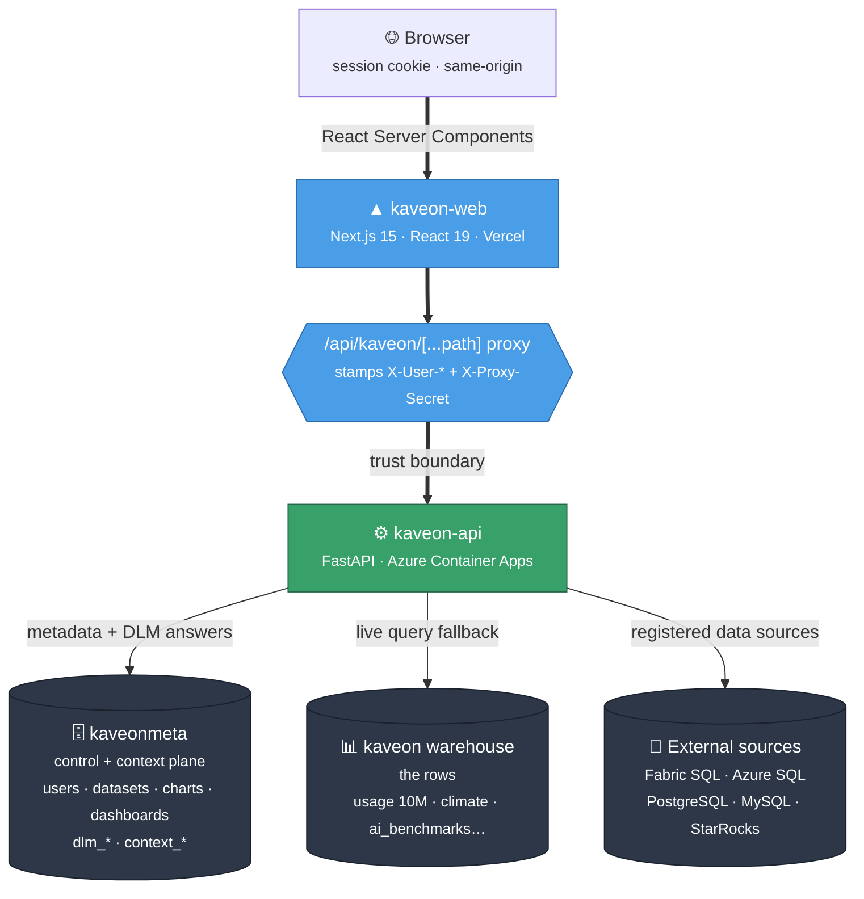
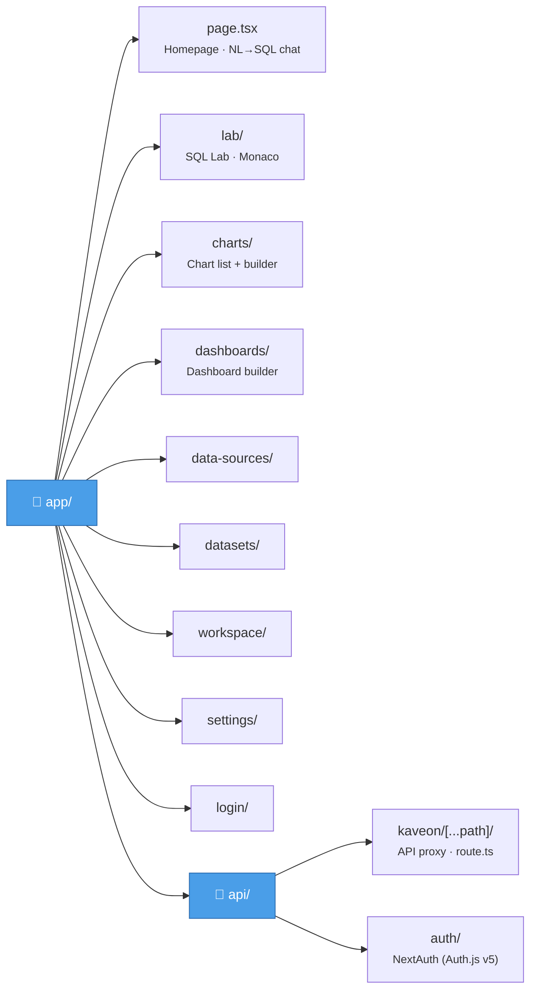
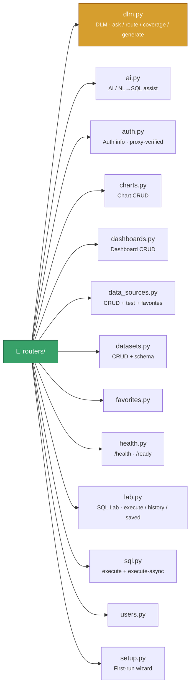

# Kaveon — System Architecture

## Overview

Kaveon is a monorepo containing two applications:

| Application | Path | Runtime |
|-------------|------|---------|
| `kaveon-web` | `apps/kaveon-web` | Next.js 15, React 19, TypeScript |
| `kaveon-api` | `apps/kaveon-api` | FastAPI, Python 3.11 |

The package manager is **pnpm workspaces**. Shared packages live under `packages/`.

---

## Request Flow



All browser traffic hits the Next.js app. The API is never exposed to the browser directly; the proxy route is the only ingress. Metadata and precomputed **DLM** answers live in the small `kaveonmeta` plane; the `kaveon` warehouse holds the rows and is touched only on a live-query fallback.

---

## Frontend: kaveon-web

**Stack**: Next.js 15, React 19, TypeScript (strict mode), `echarts-for-react`, Monaco Editor, react-grid-layout.

### App Router structure



### Key utilities

| File | Purpose |
|------|---------|
| `utils/nlToSql.ts` | Template-based NL→SQL engine |
| `utils/echartsTheme.ts` | Dark/light theme application for ECharts |
| `utils/msalFetch.ts` | Authenticated fetch wrapper |
| `utils/querySemaphore.ts` | Client-side query concurrency control |
| `components/charts/ChartBuilderContext.tsx` | Chart type registry, SQL generation, builder state |
| `components/charts/chartPluginRegistry.ts` | Plugin system for custom chart types |
| `components/chat/InlineChart.tsx` | Chat-embedded ECharts renderer |
| `components/dashboards/DashboardCanvas.tsx` | react-grid-layout canvas |

### Theming

CSS variables drive all colors. No hardcoded values in components.

```css
var(--primary)          /* #4A9EE8 — brand blue */
var(--bg-surface)       /* card / panel background */
var(--bg-elevated)      /* modal / dropdown background */
var(--text-primary)
var(--text-muted)
var(--border)
var(--shadow-sm)
```

ECharts charts receive theme tokens through `applyChartTheme(option, isDark)` in `utils/echartsTheme.ts`. This merges axis, legend, tooltip, and background styles before the option is passed to `ReactECharts`.

---

## Backend: kaveon-api

**Stack**: FastAPI, Python 3.11, pyodbc, psycopg2, pymysql, azure-identity.

### Router layout



### Middleware

| Module | Role |
|--------|------|
| `middleware/auth.py` | Reads `X-User-*` headers, validates `X-Proxy-Secret` |
| `middleware/permissions.py` | Role gate (`require_min_role("Analyst")`) |
| `middleware/rate_limit.py` | Sliding-window rate limiter (120 SQL/min per user, Redis-backed when `REDIS_URL` is set) |

### Connection pool

`database/pool.py` maintains per-database `ConnectionPool` instances:

- **Fabric SQL / Azure SQL** — `FabricSQLConnection` (pyodbc + Azure AD token via `DefaultAzureCredential`)
- **PostgreSQL** — `PostgreSQLConnection` (psycopg2, password or Azure AD Managed Identity)
- **MySQL / StarRocks** — `MySQLConnection` (pymysql, password or Azure AD Managed Identity)

Stale connections are detected by error pattern matching and discarded rather than recycled. The pool retries once on transient socket errors (`08S01`, `10054`, `ssl connection has been closed`, etc.).

SQL generated in T-SQL dialect is translated for PostgreSQL/MySQL targets by `adapt_sql()` before execution (handles `TOP N → LIMIT`, `ISNULL → COALESCE`, bracket quoting, etc.).

---

## Auth: Identity Layer

### NextAuth (Auth.js v5)

Configured in `auth.ts`. Providers activate via environment variables:

| Env var prefix | Provider | Status |
|----------------|---------|--------|
| `GITHUB_ID` / `GITHUB_SECRET` | GitHub OAuth | Production |
| `AUTH_MICROSOFT_ENTRA_ID_ID` / `_SECRET` / `_ISSUER` | Microsoft Entra ID | Local + Production |
| `GOOGLE_ID` / `GOOGLE_SECRET` | Google OAuth | Not configured |

All routes except `/login`, `/api/auth`, and Next.js internals are protected by the middleware in `middleware.ts`.

Role assignment is environment-driven: emails listed in `AUTH_ADMIN_EMAILS` (comma-separated) receive the `Admin` role; everyone else gets `Viewer`.

### Proxy identity model

The Next.js proxy route (`/api/kaveon/[...path]/route.ts`) is the trust boundary:

1. Browser sends a request with the session cookie.
2. The route handler calls `auth()` server-side to read the verified session.
3. It stamps the FastAPI request with:
   - `X-User-Email`
   - `X-User-Name`
   - `X-User-Role`
   - `X-Proxy-Secret` (shared secret from `KAVEON_PROXY_SECRET`)
4. FastAPI validates the secret and extracts identity from these headers.

The browser cannot forge identity because it cannot set the proxy secret, and kaveon-api rejects requests that lack a valid secret.

---

## Database: Neon Postgres (Metadata)

Neon Postgres stores all application metadata: users, data sources, datasets, charts, dashboards, favorites, query history, saved queries.

Schema files:
- `apps/kaveon-api/schema.sql` — primary (SQL Server syntax for Azure SQL metadata variant)
- `apps/kaveon-api/schema_postgresql.sql` — Postgres/Neon variant
- `apps/kaveon-api/schema_mysql.sql` — MySQL variant

The metadata DB is configured via `METADATA_DATABASE`, `METADATA_ENDPOINT`/`METADATA_HOST`, and `METADATA_DB_TYPE` environment variables. Connection credentials flow through `METADATA_USER` / `METADATA_PASSWORD` for Postgres/MySQL, or via `DefaultAzureCredential` for Fabric/Azure SQL.

---

## Deployment

| Service | Platform | Config |
|---------|----------|--------|
| `kaveon-web` | Vercel (kaveon.vercel.app) | `apps/kaveon-web/vercel.json` |
| `kaveon-api` | Azure Container Apps (kaveon-api.calmbeach-fe7df67b.westus2.azurecontainerapps.io) | `infra/bicep/` |
| Metadata DB | Neon Postgres | External managed service |
| Container Registry | Azure Container Registry (kaveonacr.azurecr.io) | `infra/bicep/` |

### Key environment variables

**kaveon-web (Vercel)**

```
AUTH_SECRET              # openssl rand -base64 32
GITHUB_ID / GITHUB_SECRET
AUTH_MICROSOFT_ENTRA_ID_ID / _SECRET / _ISSUER
AUTH_ADMIN_EMAILS        # comma-separated
API_URL                  # kaveon-api public URL
KAVEON_PROXY_SECRET      # shared secret with kaveon-api
```

**kaveon-api (Azure Container Apps)**

```
KAVEON_PROXY_SECRET
METADATA_DATABASE
METADATA_ENDPOINT        # Fabric/Azure SQL: ODBC server endpoint
METADATA_HOST            # Postgres/MySQL: hostname
METADATA_PORT
METADATA_USER
METADATA_PASSWORD
METADATA_SSLMODE
METADATA_DB_TYPE         # fabric_sql | azure_sql | postgresql | mysql
DATAWAREHOUSE_ENDPOINT   # fallback for unregistered data sources
REDIS_URL                # optional: enables Redis-backed rate limiting
```

---

## Azure Infrastructure

IaC templates live in `infra/bicep/`. Modules cover:

| Resource | Module |
|----------|--------|
| Azure Container Registry (`kaveonacr.azurecr.io`) | `infra/bicep/modules/acr.bicep` |
| Azure Container Apps (kaveon-api) | `infra/bicep/modules/container-apps.bicep` |
| Azure PostgreSQL Flexible Server | `infra/bicep/modules/postgresql.bicep` (migration target) |
| Azure Key Vault | `infra/bicep/modules/keyvault.bicep` |
| Log Analytics Workspace | `infra/bicep/modules/log-analytics.bicep` |

Auth uses Azure App Registration (`Kaveon`) with Managed Identity on the Container App for passwordless access to Key Vault and Azure SQL.

---

## Health Endpoints

```
GET /health    # checks metadata DB connectivity
GET /ready     # returns 200 only if the API can serve traffic
```

These are distinct intentionally: `/health` reports dependency state; `/ready` signals load-balancer readiness.
