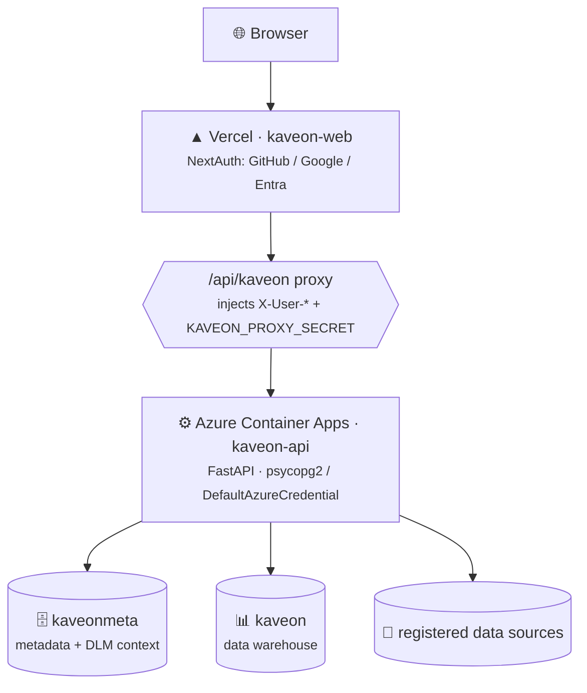

# Deploy Kaveon — Vercel + Azure Container Apps + Azure PostgreSQL

The production cloud stack:



Both `kaveonmeta` (metadata + DLM/context) and `kaveon` (warehouse) live on one **Azure
Database for PostgreSQL Flexible Server (PG 18)**. IaC for all Azure resources lives in
`infra/bicep/`. The Container App pulls its image from `kaveonacr.azurecr.io`.

> **Note:** production authenticates to Postgres with **Entra ID / Managed Identity tokens —
> no stored password** (Container App MI granted the `kaveon_api` role). The `METADATA_USER` /
> `METADATA_PASSWORD` path below is for a password-auth deployment (e.g. a fresh self-host);
> for MI auth, leave both unset and grant the Container App's identity DB access instead.

---

## 1 · Azure PostgreSQL — metadata + warehouse

1. Create an **Azure Database for PostgreSQL Flexible Server** (PG 18), then two databases on
   it: `kaveonmeta` (control plane + DLM context) and `kaveon` (data warehouse).
2. Apply the schema to the metadata DB via `psql`:
   ```
   \i apps/kaveon-api/schema_postgresql.sql
   ```
3. Set `METADATA_SSLMODE=require` (already the default). For MI auth, grant the Container App's
   managed identity access and add `AAD_DATABASES=kaveon` so the warehouse pool uses tokens too.

*(Self-hosting elsewhere? Any managed Postgres works as the metadata store — point `METADATA_HOST`
at it. The two-database split is recommended but a single DB also works.)*

---

## 2 · Azure Container Registry

Build and push the API image:

```bash
az acr build \
  --registry kaveonacr \
  --image kaveon-api:latest \
  apps/kaveon-api
```

Or push via GitHub Actions (see `.github/workflows/deploy.yml`).

---

## 3 · Azure Container Apps

Deploy the Bicep environment:

```bash
az deployment group create \
  --resource-group kaveon-rg \
  --template-file infra/bicep/environments/production.bicep \
  --parameters @infra/bicep/environments/production.parameters.json
```

Set the required secrets on the Container App:

| Secret / env var | Value |
|---|---|
| `KAVEON_PROXY_SECRET` | `openssl rand -hex 24` |
| `METADATA_HOST` | Azure PG host (e.g. `kaveon-db.postgres.database.azure.com`) |
| `METADATA_DATABASE` | `kaveonmeta` |
| `AAD_DATABASES` | `kaveon` (route the warehouse pool through token auth) |
| `METADATA_USER` / `METADATA_PASSWORD` | *(omit for Managed Identity auth; set for password auth)* |
| `METADATA_DB_TYPE` | `postgresql` |
| `METADATA_SSLMODE` | `require` |
| `WEB_URL` | your Vercel URL (CORS) |

Health check: `GET https://kaveon-api.calmbeach-fe7df67b.westus2.azurecontainerapps.io/api/health` → `{"status":"ok"}`.

---

## 4 · Vercel — frontend

1. **https://vercel.com** → **New Project** → import this repo.
2. **Root Directory:** `apps/kaveon-web`.
3. **Environment Variables:**

   | Variable | Value |
   |---|---|
   | `API_URL` | your Container Apps URL |
   | `KAVEON_PROXY_SECRET` | **same** value set on the Container App |
   | `AUTH_SECRET` | `openssl rand -base64 32` |
   | `AUTH_URL` | your Vercel URL |
   | `AUTH_ADMIN_EMAILS` | your email (gets Admin) |
   | `GITHUB_ID` / `GITHUB_SECRET` | GitHub OAuth App (callback `https://<vercel-url>/api/auth/callback/github`) |
   | `GOOGLE_ID` / `GOOGLE_SECRET` | Google OAuth (callback `https://<vercel-url>/api/auth/callback/google`) |
   | `AUTH_MICROSOFT_ENTRA_ID_ID` / `_SECRET` / `_ISSUER` | Microsoft Entra App Registration |

---

## 5 · Wire them together

1. **Container App** → set `WEB_URL` to your Vercel URL → redeploy.
2. **GitHub OAuth App** → add callback `https://<vercel-url>/api/auth/callback/github`.
3. **Microsoft Entra App Registration** → add redirect URI `https://<vercel-url>/api/auth/callback/microsoft-entra-id`.

---

## 6 · Verify

1. Open your Vercel URL → sign in → land as Admin.
2. **Data Sources → + Add Data Source** → add a PostgreSQL/MySQL/StarRocks/Fabric/Azure SQL source.
3. **SQL Lab** → pick the source → `SELECT 1` to confirm connectivity.
4. **Homepage** → type a question → confirm NL→SQL chart renders.

---

### Auth flow

The browser only ever talks to Vercel. `/api/kaveon/*` reads the NextAuth session server-side and forwards `X-User-*` headers to the Container App, stamped with `KAVEON_PROXY_SECRET`. The API trusts those headers only when the secret matches — nothing is spoofable and no token is handled in the browser.
