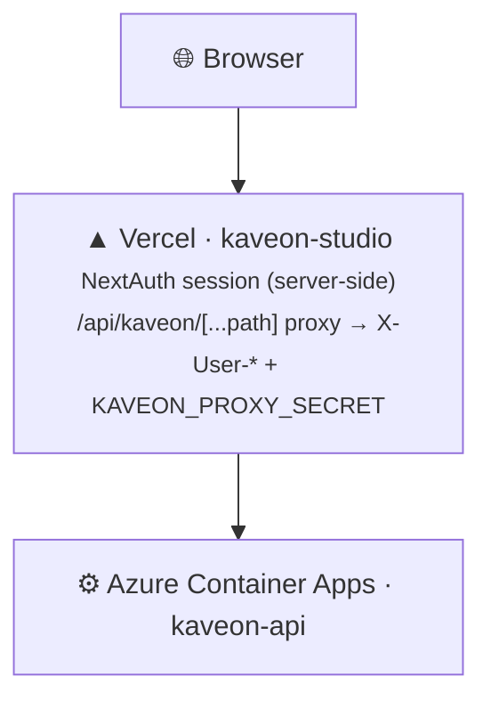

# Deploying kaveon-studio to Vercel

`kaveon-studio` (Next.js 15) deploys to Vercel. `kaveon-api` runs on Azure Container Apps, backed by Azure PostgreSQL (`kaveonmeta` + `kaveon`) — see [deploy-vercel-azure-postgres.md](deploy-vercel-azure-postgres.md) for the full two-service deploy.

## Prerequisites

- Vercel account linked to the `Kaveon` GitHub repo
- A reachable `kaveon-api` over HTTPS (Azure Container Apps)
- At least one OAuth provider configured (GitHub, Google, and/or Microsoft Entra ID)

## 1 · Link the project

```bash
cd studio
vercel link --yes
```

Set **Root Directory** to `studio`. Note: `studio/vercel.json` overrides the install with `npm install --legacy-peer-deps` — pnpm fails inside Vercel's build sandbox with `ERR_INVALID_THIS`, so the install is pinned to npm.

## 2 · Set environment variables

```bash
# Auth (required)
vercel env add AUTH_SECRET production               # openssl rand -base64 32
vercel env add AUTH_URL production                  # https://<your-project>.vercel.app
vercel env add AUTH_ADMIN_EMAILS production         # comma-separated

# OAuth providers (configure at least one)
vercel env add GITHUB_ID production
vercel env add GITHUB_SECRET production
vercel env add GOOGLE_ID production
vercel env add GOOGLE_SECRET production
vercel env add AUTH_MICROSOFT_ENTRA_ID_ID production
vercel env add AUTH_MICROSOFT_ENTRA_ID_SECRET production
vercel env add AUTH_MICROSOFT_ENTRA_ID_ISSUER production  # https://login.microsoftonline.com/<tenant>/v2.0

# API proxy (required)
vercel env add API_URL production                   # https://kaveon-api.<env>.azurecontainerapps.io
vercel env add KAVEON_PROXY_SECRET production       # must match kaveon-api
```

## 3 · Deploy

### Manual

```bash
cd studio
vercel --prod
```

### Automation status

The checked-in GitHub deployment workflow currently deploys the API only. Studio deployment remains the explicit `vercel --prod` operation above until a verified Vercel job or native Git integration is configured.

Config: [`studio/vercel.json`](../../studio/vercel.json).

## 4 · Wire up OAuth callbacks

**GitHub OAuth App:**
```
https://<your-project>.vercel.app/api/auth/callback/github
```

**Google OAuth → Authorized redirect URIs:**
```
https://<your-project>.vercel.app/api/auth/callback/google
```

**Microsoft Entra App Registration → Authentication → Web → Redirect URIs:**
```
https://<your-project>.vercel.app/api/auth/callback/microsoft-entra-id
```

## 5 · Wire up CORS on kaveon-api

Set `WEB_URL` on the Container App to `https://<your-project>.vercel.app` and redeploy.

## Architecture



The API is not on Vercel. Serverless functions cannot hold a persistent pyodbc connection pool; the API needs a long-lived process for the warm-pool + heartbeat behaviour.
