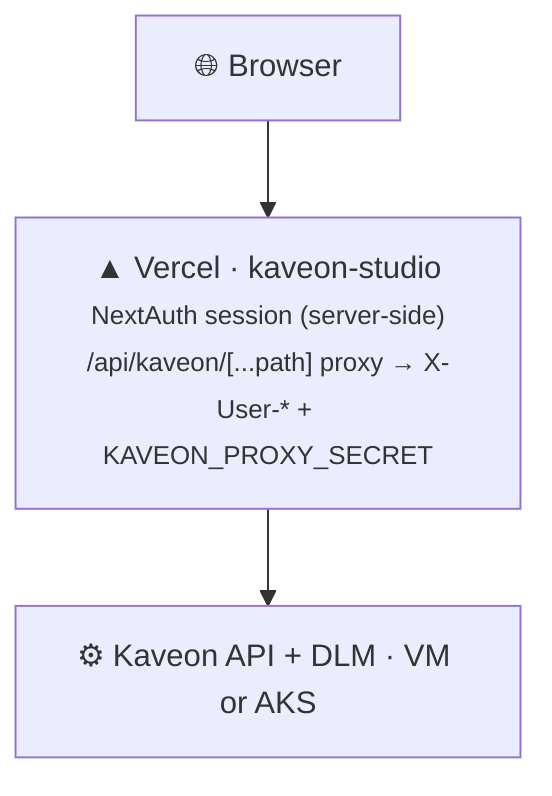

# Deploying kaveon-studio to Vercel

`kaveon-studio` (Next.js 15) is an optional Vercel hosting path for the Studio frontend. The API and DLM run as long-lived containers on the chosen VM or AKS deployment, and KaveonDB stores product records in the configured local or ADLS-backed system store. PostgreSQL is not required.

## Prerequisites

- Vercel account linked to the `Kaveon` GitHub repo
- A reachable `kaveon-api` over HTTPS (VM, AKS, or another supported container host)
- At least one OAuth provider configured (GitHub, Google, and/or Microsoft Entra ID)

## 1 · Link the project

```bash
cd studio
vercel link --yes
```

Set **Root Directory** to `studio`. Note: `studio/vercel.json` overrides the install with `npm install --legacy-peer-deps` — pnpm fails inside Vercel's build sandbox with `ERR_INVALID_THIS`, so the install is pinned to npm.

## 2 · Set environment variables

```bash
# Auth (required)
vercel env add AUTH_SECRET production               # openssl rand -base64 32
vercel env add AUTH_URL production                  # https://<your-project>.vercel.app
vercel env add AUTH_ADMIN_EMAILS production         # comma-separated

# OAuth providers (configure at least one)
vercel env add GITHUB_ID production
vercel env add GITHUB_SECRET production
vercel env add GOOGLE_ID production
vercel env add GOOGLE_SECRET production
vercel env add AUTH_MICROSOFT_ENTRA_ID_ID production
vercel env add AUTH_MICROSOFT_ENTRA_ID_SECRET production
vercel env add AUTH_MICROSOFT_ENTRA_ID_ISSUER production  # https://login.microsoftonline.com/<tenant>/v2.0

# API proxy (required)
vercel env add API_URL production                   # https://<your-api-host>
vercel env add KAVEON_PROXY_SECRET production       # must match kaveon-api
```

## 3 · Deploy

### Manual

```bash
cd studio
vercel --prod
```

### Automation status

The checked-in CI workflow validates the Studio build. Deploy Studio with the linked Vercel project or `vercel --prod`; deploy the API, DLM and Engine through the VM or AKS runbook before pointing `API_URL` at them.

Config: [`studio/vercel.json`](../../studio/vercel.json).

## 4 · Wire up OAuth callbacks

**GitHub OAuth App:**
```
https://<your-project>.vercel.app/api/auth/callback/github
```

**Google OAuth → Authorized redirect URIs:**
```
https://<your-project>.vercel.app/api/auth/callback/google
```

**Microsoft Entra App Registration → Authentication → Web → Redirect URIs:**
```
https://<your-project>.vercel.app/api/auth/callback/microsoft-entra-id
```

## 5 · Wire up CORS on kaveon-api

Set `WEB_URL` on the API host to `https://<your-project>.vercel.app` and redeploy.

## Architecture


```mermaid
flowchart TD
    B["🌐 Browser"]
    V["▲ Vercel · kaveon-studio<br/><small>NextAuth session (server-side)<br/>/api/kaveon/[...path] proxy → X-User-* + KAVEON_PROXY_SECRET</small>"]
    A["⚙️ Kaveon API + DLM · VM or AKS"]
    B --> V --> A
```

The API is not on Vercel. Serverless functions cannot hold KaveonDB and Engine bridge processes, query admission, or the warm connection pools; the API and Engine need a long-lived VM or container deployment.
