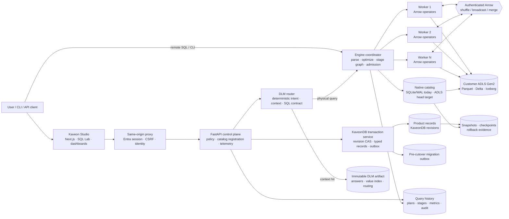
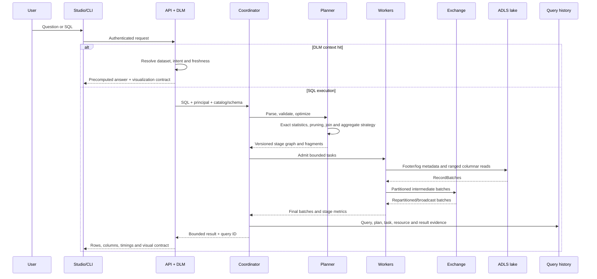
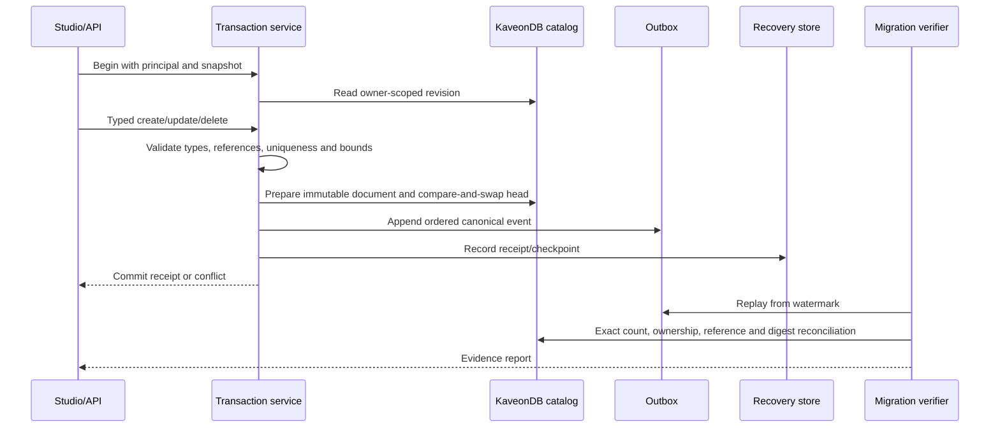
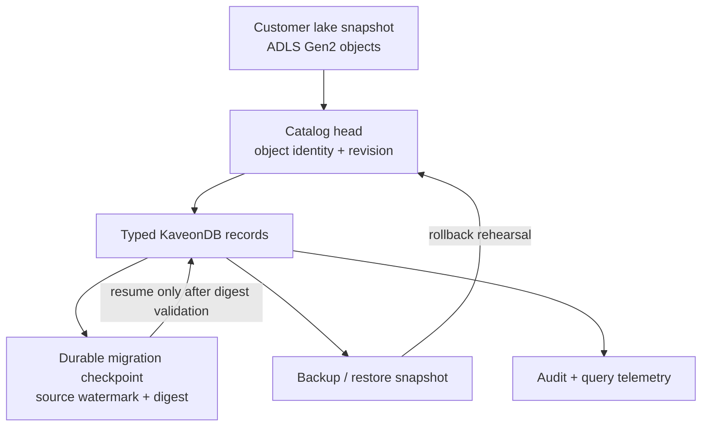

# Kaveon connected architecture

This is the target operating architecture for Kaveon. It shows how a request
travels from Studio to a deterministic context answer, a distributed analytical
query, or a transactional product-record operation. **Implemented**, **Alpha**,
and **Target** labels are intentional: a diagram must not turn a roadmap
boundary into a shipped guarantee.

## System topology

### Plane responsibilities

| Plane | Owns | Does not own |
|---|---|---|
| Experience | Sessions, SQL Lab, dashboards, charts, CLI presentation | Trusted identity asserted by a browser header |
| Control | Authentication, authorization, source registration, DLM routing, query records | Distributed operator execution |
| Context | Compiled answers, value indexes, freshness and clarification state | Arbitrary SQL correctness |
| Transaction | Typed product records, revisions, uniqueness/reference checks, ordered events | A claim of general PostgreSQL compatibility until all gates pass |
| Compute | Parsing, optimization, stages, workers, Arrow exchange, spill and retry | Product UI state or source credentials |
| Data | Customer-owned Parquet/Delta objects and immutable snapshots | Kaveon-owned copies of customer rows |
| Evidence | Metrics, audit, checkpoints, snapshots and rollback receipts | Silent success when evidence is missing |

## Analytical query lifecycle

The correctness invariant is: every worker receives a coordinator-resolved
snapshot and fragment; pruning can remove data only when metadata proves it is
irrelevant; exchange retries are idempotent; a failed or unavailable stage
fails the query rather than returning a partial result. Context answers bypass
the scan only when the artifact is ready and fresh.

## Transaction lifecycle

A transaction receipt is not evidence of PostgreSQL retirement. The runtime has
direct typed KaveonDB mutations for product-record families and does not fall
back to PostgreSQL once a family is cut over. Context cache is deliberately
rebuilt, and legacy AI configuration requires an explicit delete-or-secret-store
disposition. Retirement still requires all 16 families to reconcile, zero
outbox lag, a write fence, shadow-read parity, restart recovery, backup/restore,
rollback, and a verified PostgreSQL-unavailable rehearsal. Until those live
gates pass, PostgreSQL remains the deployment authority and rollback source.

## Storage and recovery boundaries

ADLS object publication is create-only and must be reconciled byte-for-byte.
Checkpoints are bounded, integrity-checked and resumable. A missing or corrupt
evidence artifact is a failed gate, never an implicit pass.

## Current versus target boundary

| Capability | Current position | Target acceptance evidence |
|---|---|---|
| DLM context | Retirement mode compiles bounded state from Engine scans, publishes one immutable ADLS artifact, and serves its verified routing, values and answers without PostgreSQL fallback | Freshness, ambiguity, and answer parity corpus on every release and live AKS artifact qualification |
| Distributed SQL | Coordinator/workers, binder, streamed Arrow exchange, columnar aggregates with spill, joins, retry with forced-worker-loss evidence, admission queue, result cache; three benchmark tiers running (`../qualification/benchmark-program.md`) | Completed benchmark rounds, spill under skew, adaptive planning, sustained soak |
| Transactions | Typed product-record protocol with revisions and checkpointed migration tooling | General row DML, isolation, durable WAL-equivalent recovery and crash testing |
| Lake storage | Parquet, Delta (v1 checkpoints) and Iceberg on ADLS Gen2 with workload identity; S3 implemented and unqualified; plain Parquet directories not yet tables | Multi-format snapshot qualification and object-store performance evidence |
| PostgreSQL replacement | Direct reads/mutations, 16-family replay and reconciliation, durable ADLS checkpoints, write fencing and strict evidence runners are implemented; live retirement is not yet qualified | One fresh immutable AKS run passes every gate, then PostgreSQL is scaled to zero while its PVC/snapshot remain through the rollback window |
| Operations | Bicep/Helm deployment materials, immutable image references and bounded rehearsal tooling | Recreate-from-zero on a clean subscription and verified live backup/restore |

The architecture is deliberately honest: Kaveon can be a unified product with
one user experience while its analytical and transactional paths mature at
different rates. The integration contract is explicit so a faster query path
does not silently weaken transactional correctness.
